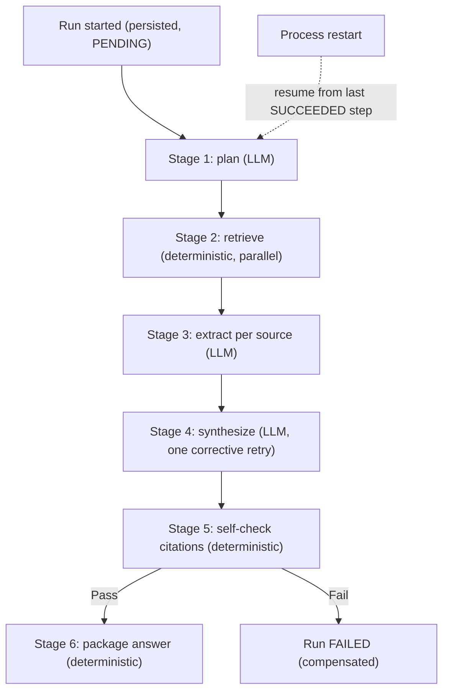

# Agents and workflows

## Problem

Single-turn tool calling (see [structured output and tool-calling reliability](structured-output-and-tool-calling-reliability.md))
answers "did this one model response produce a valid action." An agentic workflow is a different
problem: a task that takes multiple LLM-involving steps, runs for minutes rather than seconds, and
has to survive the process it's running in going down mid-execution. The design question isn't
"can the model call a tool" — it's how much control over *what happens next* gets handed to the
model versus fixed by the orchestrator, because that single decision determines whether the system
is resumable, inspectable, and cost-bounded, or a black box that either finishes or silently loses
its progress.

## Key concepts

- **Autonomous agent loop vs orchestrated pipeline**: an agent loop lets the model decide, at every
  step, what to do next — flexible, but the model's decision *is* the control flow, so nothing
  outside it can predict or resume a run mid-way. An orchestrated pipeline fixes the sequence of
  steps in advance and gives the model judgment only *within* a step, not over which step runs next.
- **Deterministic vs judgment steps**: not every step needs an LLM call. Retrieval, citation-marker
  validation, and result packaging are lookups or mechanical checks; only steps that require
  interpreting ambiguous input genuinely need one.
- **Persisted, resumable state**: each step's status, input, output, attempts, and cost recorded as
  it completes, so a run interrupted by a process restart can resume from its last completed step
  instead of restarting from zero or silently losing work.
- **Compensation**: what a workflow does when a step exhausts its retries — not an "undo" of an
  external side effect (most workflow steps are read-only or computational), but a clean, terminal
  failure state with a recorded reason, instead of a partial or fabricated result presented as
  complete.
- **Bounded autonomy**: a hard cap on LLM calls (or steps, or cost) per run, enforced by the
  orchestrator rather than trusted to the model to self-limit — the agentic equivalent of a
  [retry budget](../resilience/timeout-and-retry-budgets.md): an unbounded loop against a dependency
  that can be wrong or slow is a cost and availability risk, not just an inconvenience.

## Design



This diagram answers: *why is the model's autonomy scoped to the content of a stage, and not to
whether there's a next stage at all?* Each box after the first is a persisted `WorkflowStep` row,
recorded before it runs and marked done only on success — that's what makes the dashed resume arrow
possible: a restart re-enters the same entry point, skips every step already `SUCCEEDED`, and
continues from the next one. If the model instead chose the sequence of stages itself, "resume from
the last completed step" would have no fixed meaning — there'd be no stable step index to resume
*to*, only a transcript to somehow replay. The model still exercises real judgment inside stages 1,
3, and 4; it just never decides whether stage 5 runs, because that decision needs to be predictable
from outside the model to be resumable at all.

## Trade-offs

- **Hand-rolled state machine vs a workflow-engine library.** A library (a Temporal-style engine,
  or a general state-machine framework) buys built-in persistence, replay, and retry tooling, at the
  cost of a new dependency and a new failure surface to operate. A hand-rolled state machine is more
  code up front but stays easy to reason about end-to-end. The signal: how many distinct workflow
  *types*, not runs, does the system need? One or two fixed pipelines don't justify a general
  engine's machinery; a system that needs many dynamically composed workflow shapes will eventually
  reinvent most of what the library already solved.
- **Linear pipeline with in-stage retry vs a cyclic graph with a feedback edge.** A cycle (a
  self-check stage looping back to re-trigger synthesis) more directly models "retry until this
  passes," but complicates persistence: does a second attempt at a stage become a new step row,
  breaking a fixed step index, or overwrite the first, losing its audit trail? Keeping the pipeline
  strictly linear — bounding the retry *inside* the stage that needs it — trades the ability to
  retry across a stage boundary for a persistence model that stays simple to resume and inspect.
## Failure modes

- **LLM calls where a lookup would do.** Routing a mechanical check — does citation marker `[3]`
  correspond to a source that was actually extracted — through another model call adds cost,
  latency, and a new way to be wrong, for a question that's a deterministic lookup.
- **No cap on calls or steps per run.** Without an enforced ceiling, a workflow that plans too many
  sub-questions, or hits a dependency that keeps returning retryable-looking errors, can consume
  unbounded cost before anyone notices — the same denial-of-wallet risk an unbounded
  [retry loop](../resilience/timeout-and-retry-budgets.md) poses, scaled to a whole run.
- **Treating a multi-minute run as a single synchronous call.** With no persisted per-step state, a
  process restart mid-run doesn't just delay the result — it loses all completed work, forcing a
  full restart instead of a resume.
- **Retrying every exception uniformly.** A timeout or rate limit is worth retrying with backoff; a
  malformed-response parse failure or a programming error is not — retrying it only delays an
  inevitable failure.

## Operational considerations

Track cost, attempts, and duration per *stage*, not only per run — a failure rate that spikes in one
specific stage points at a different problem than a failure rate that rises uniformly across every
stage of every workflow type, and a single run-level metric hides which one you're looking at.
Track resumed-vs-completed-from-scratch run counts too; a system where most runs are resuming after
a restart is telling you something about process stability that a success/failure count won't show.

## Example

A stage runner that persists state before executing and distinguishes retryable from fatal failure:

```java
Step step = repository.markRunning(runId, stageName);
try {
    Object output = stage.execute(input);
    repository.markSucceeded(step, output);
} catch (TransientException e) {
    if (attempt < maxRetries) retryWithBackoff(stage, input, attempt + 1);
    else repository.markFailed(step, e, "retries exhausted");
} catch (Exception e) {
    repository.markFailed(step, e, "non-retryable"); // fails fast, no wasted retry
}
```

## Interview questions

- What's the difference between a model having autonomy over a step's content versus autonomy over
  workflow control flow, and why does that distinction determine whether a run is resumable?
- When would you reach for a workflow-engine library instead of hand-rolling a state machine for an
  agentic system?
- How would you decide whether a given workflow step actually needs an LLM call?
- What's the denial-of-wallet risk in a multi-step agentic workflow, and how would you bound it?

## Further experiments

`ai-engineering-lab` implements exactly this design:
[ADR-0010](https://github.com/Fragudev/ai-engineering-lab/blob/ec822bca9df3aee3dc6857705dcddd171a669211/docs/adr/0010-agent-orchestration.md)
covers the explicit state machine, the deterministic-vs-LLM breakdown per stage, stage-level
persistence, resumability via a startup-triggered resumer, and the enforced per-run LLM-call budget —
including the reasoning for keeping the pipeline linear instead of cyclic, which is the exact
trade-off this topic makes explicit.
