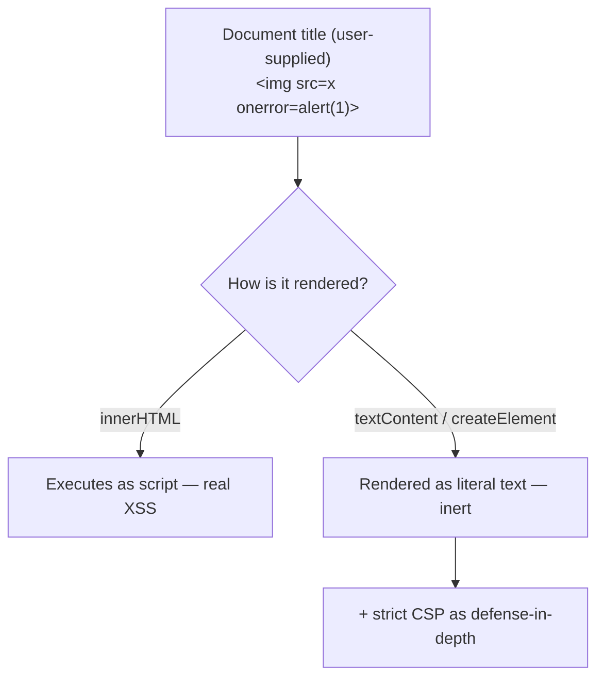

# AI security

## Problem

Conventional threat modeling (STRIDE, trust boundaries between a client and a server) still applies
to an LLM-based system, but it doesn't cover the whole surface: a model's own output is untrusted
data the moment it might contain anything an attacker influenced, and that's a trust relationship
conventional web application security doesn't usually have to reason about at all. [Prompt
injection](prompt-injection.md) covers the input side of that problem. This topic covers the rest of
the surface conventional threat modeling misses — what happens to a model's *output* once it leaves
the model, and the network-egress risk a tool with real external access introduces — using two real,
concretely different failures as the anchor rather than a generic checklist.

## Key concepts

- **Untrusted output, not just untrusted input.** A model's output can contain anything its input
  did, including content an attacker planted upstream (a malicious document title, an injected
  instruction reflected back). Any code path that renders model output, or any other user-influenced
  string, as markup or executes it in any interpreter is a real vulnerability the moment that
  content isn't provably safe — this is a standard web-application concern (stored XSS, injection)
  that becomes newly relevant wherever an LLM system introduces a fresh path for untrusted content to
  reach a rendering or execution context.
- **A tool with real network egress is a new SSRF surface.** A tool the model can call that makes an
  outbound network request (fetching a URL, calling an external API) can be coaxed into requesting
  destinations the system never intended — internal services, cloud metadata endpoints, private IP
  ranges — the same class of risk any user-controllable URL introduces, just triggered through a
  model's tool call instead of a form field.
- **A mitigation that's moot today can still be a real, planned gap.** A specific risk can be
  structurally absent right now (a tool that performs zero real network egress) without the
  mitigation being unnecessary — it becomes necessary the moment a tool that *does* make outbound
  calls is added, and naming that dependency explicitly is what keeps the mitigation from being
  silently forgotten when the tool actually ships.
- **Never trust client-side sanitization alone.** The durable fix for untrusted output isn't a
  sanitizer that tries to clean dangerous content — sanitizers miss cases — it's never treating
  untrusted content as markup or code in the first place (rendering as text, using safe APIs), backed
  by a defense-in-depth control (a strict Content-Security-Policy) that holds even if a sanitization
  assumption elsewhere turns out to be wrong.

## Design



This diagram answers: *why does the rendering method matter more than trying to sanitize the input
first?* Because sanitization is a filter that has to correctly anticipate every dangerous pattern,
and history is full of sanitizer bypasses that looked safe until they weren't. Rendering via
`textContent`/`createElement` isn't filtering dangerous content — it structurally never interprets
the string as markup at all, regardless of what it contains. The CSP header on top is the second,
independent layer: even if some other code path someday reintroduces an `innerHTML` call by mistake,
a strict `script-src 'self'` with no `unsafe-inline` still blocks the injected script from executing.
Neither layer alone is presented as sufficient — the diagram's point is that the safe-rendering
choice is the real fix, and CSP is what catches a regression of it.

## Trade-offs

- **Safe rendering (never treat untrusted content as markup) vs a sanitizing library.** Never
  parsing untrusted content as markup at all is stronger — there's no filter to bypass — but it means
  giving up rich formatting (Markdown, HTML snippets) unless a specific, carefully scoped renderer
  with HTML disabled is added later. A sanitizing library allows richer formatting immediately, at
  the cost of depending on it correctly anticipating every dangerous pattern, a property that
  degrades as new bypass techniques are found.
- **Building SSRF mitigations before any tool has real network egress vs building them when the
  first such tool ships.** Building the allowlist and response limits ahead of need is defensive but
  speculative if nothing makes outbound calls yet. Deferring is reasonable scope management as long
  as the dependency is named explicitly (a new tool with real egress *must* ship with these
  mitigations) — the risk is only in deferring it silently, where the gap gets forgotten.

## Failure modes

- **Assuming output is safe because the input path is defended.** A system with strong prompt-
  injection defenses on the input side can still ship a real vulnerability on the output side if
  anything renders model output, or any other attacker-influenced string, as markup without thinking
  about it — these are genuinely separate trust boundaries, and defending one says nothing about the
  other.
- **A stored-XSS path found through an unexpected field.** The vulnerability doesn't have to come
  from model output directly — a document title, a filename, any user-supplied string reaching a
  rendering path unsafely is the same class of bug, often found in a place nobody was specifically
  looking because attention was focused on "the AI part."
- **Deferring an SSRF mitigation and forgetting why.** A mitigation named as "moot for now" becomes a
  real, unaddressed gap the moment a tool with outbound calls ships, if nothing ties the mitigation's
  existence to that tool's arrival.
- **Relying on CSP as the only control.** A strict CSP protects against script execution
  specifically — it doesn't substitute for never parsing untrusted content as markup in the first
  place; skipping that discipline because "CSP will catch it" trusts a second layer to do a first
  layer's job.

## Operational considerations

Any code path that renders a user-influenced or model-influenced string is worth a standing
regression test asserting it never reintroduces unsafe rendering (an `innerHTML` call, an unescaped
template interpolation) — this is cheap to pin once and catches a regression at the exact point it
would otherwise ship silently, long before it's found by an actual attacker or a manual audit.

## Example

Safe rendering that structurally can't execute untrusted content as script, regardless of its
contents:

```javascript
const titleEl = document.createElement('span');
titleEl.textContent = document.title; // never interpreted as markup, whatever it contains
listItem.appendChild(titleEl);
// Never: listItem.innerHTML = document.title;
```

## Interview questions

- Why is a model's output a distinct trust boundary from its input, and why does defending the input
  side say nothing about the output side?
- Why is "never render untrusted content as markup" a stronger fix than a sanitizing library, and
  what does it cost?
- What makes a tool with real network egress a new SSRF surface, even if the model itself has no
  direct network access?
- How would you keep a mitigation named as "not needed yet" from becoming a silently forgotten gap
  once the condition that makes it necessary actually occurs?

## Further experiments

`ai-engineering-lab`'s
[threat model](https://github.com/Fragudev/ai-engineering-lab/blob/ec822bca9df3aee3dc6857705dcddd171a669211/docs/threat-model.md)
documents T8 (insecure output handling) as a real, found-and-fixed stored-XSS path — through a
document title, not model output directly — fixed by moving every rendered value to
`textContent`/`createElement` and adding a strict CSP, both pinned by regression tests; T4 (SSRF
through a tool with network egress) is documented as a real, named, currently-moot gap, explicit
about exactly which future change would make it live.
