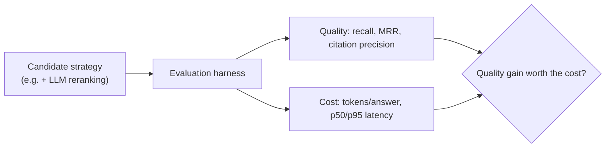

# Cost/latency trade-offs

## Problem

Almost every reliability or quality improvement covered elsewhere in this category —
[retrieval/reranking](retrieval-reranking.md)'s LLM-based reranker, [structured output's](structured-output-and-tool-calling-reliability.md)
retry-with-feedback loop, [agents and workflows](agents-and-workflows.md)'s multi-stage pipelines —
buys its improvement with additional model calls, and additional model calls are the two resources
an LLM system spends the least predictably: tokens (cost) and latency. Treating these as
afterthoughts to measure once something's already built means discovering the real cost of a design
decision only after it's shipped, when changing it is expensive — the [evaluation](evaluation.md)
harness's job is making that cost visible *before* the decision is locked in, not after.

## Key concepts

- **Every added model call is a cost-and-latency decision, not just a quality one.** LLM-based
  reranking roughly doubles model calls on a request (one for ranking, one for generation);
  retry-with-feedback adds a call per correction attempt; an agentic workflow's planning and
  extraction stages each cost their own call. Each of these is a legitimate trade for better output —
  but it's a trade, and the cost side needs to be measured, not assumed acceptable because the
  quality side looks good in isolation.
- **A hard cap is a cost control, not just a reliability one.** A per-run limit on LLM calls (see
  [agents and workflows](agents-and-workflows.md)'s bounded autonomy) exists as much to bound cost as
  to prevent a runaway loop — an unbounded agentic workflow against a paid provider is a direct,
  uncapped cost exposure, the same "denial of wallet" risk framing that applies to unbounded uploads
  or unbounded conversation length.
- **Recorded/fixture-backed measurement isolates cost decisions from live-model variance.** Comparing
  two strategies' token cost and latency against a deterministic fixture provider makes the
  comparison about the strategies themselves, not about which run happened to hit a slower moment on
  a live model server — necessary for the comparison to be repeatable and trustworthy across runs.
- **The report has to show the trade explicitly, not just the win.** A profile comparison that only
  reports quality metrics (recall, precision) without the corresponding cost and latency numbers next
  to them hides exactly the information needed to decide whether a quality gain is worth its price —
  the trade-off only becomes a real decision once both sides are visible in the same table.

## Design



This diagram answers: *why does a cost/latency decision need to go through the same harness as a
quality decision, rather than being measured separately after the fact?* Because the two numbers only
mean something as a pair — "recall improved by 8%" is not evaluable on its own; "recall improved by
8% at 2x the tokens and roughly double the p95 latency" is. Measuring quality and cost through the
same run, against the same profile, on the same dataset, is what keeps the comparison honest — a
quality number from one measurement and a cost number from an unrelated, differently-scoped
measurement can't be combined into a real decision.

## Trade-offs

- **A cheaper strategy that's "good enough" vs the most accurate available strategy.** The most
  accurate option (a cross-encoder reranker, an LLM self-check on every generation) is rarely the
  cheapest, and "most accurate" only matters relative to what the application actually needs — a
  strategy that's measurably worse on paper but well within the quality bar the application requires,
  at a fraction of the cost, is very often the right choice. The discipline is measuring both sides
  before deciding, not defaulting to either "cheapest possible" or "most accurate possible" without
  evidence either is actually warranted.
- **A hard per-run cost cap vs unbounded flexibility.** A hard cap (max LLM calls per workflow run,
  max retry attempts) bounds worst-case cost predictably, at the cost of occasionally cutting off a
  legitimately complex task that would have needed more calls to complete well. No cap gives every
  task as many calls as it needs, at the cost of a single pathological input (or a bug that triggers
  a loop) being able to consume unbounded cost with nothing to stop it — the asymmetry between these
  two failure directions (a slightly truncated result vs unbounded spend) is usually what decides in
  favor of a cap, tuned generously enough that legitimate tasks rarely hit it.

## Failure modes

- **Shipping a quality improvement without measuring its cost.** A design decision justified purely
  by "the output looks better" without a token-cost or latency number attached means the actual
  price of that improvement is discovered only once it's running against real (and possibly paid)
  traffic — far more expensive to reconsider at that point than before it shipped.
- **No cap on LLM calls per request or per run.** The direct cost-exposure version of an unbounded
  retry loop or an unbounded agentic workflow — every uncapped call is uncapped spend against
  whatever provider is backing the system, with nothing to stop a pathological case from consuming
  far more than any legitimate case would need.
- **Comparing quality across strategies measured under different conditions.** A quality number from
  one run and a cost number from an unrelated run, on different data or different infrastructure,
  produces a comparison that looks rigorous but isn't actually measuring the same trade-off.

## Operational considerations

Track tokens-per-request and p50/p95 latency as first-class, per-strategy metrics in production, not
only in the offline evaluation harness — a strategy that measured well against the golden dataset can
still behave differently against real traffic's actual query distribution, and the gap between
offline measurement and live behavior is itself worth monitoring, not assumed to hold indefinitely.

## Example

A profile comparison that puts the quality/cost trade-off in one table, not two separate reports:

```text
Profile           Recall@5   Cite prec.   p95 (ms)   Tokens/answer
dense-only        0.31       n/a          420        180
hybrid             0.35       n/a          510        190
hybrid-rerank-llm  0.38       n/a          890        410   <- ~2x tokens, ~2x p95, for +3pt recall
```

## Interview questions

- Why does an added model call need to be evaluated as a cost-and-latency decision, not just a
  quality decision?
- What's the argument for a hard cap on LLM calls per request or per run, beyond preventing an
  infinite loop?
- Why does comparing quality and cost need to come from the same measurement run, rather than two
  separate ones?
- How would you decide whether a quality improvement (like reranking) is worth its added cost for a
  specific application?

## Further experiments

`ai-engineering-lab`'s evaluation harness reports exactly this pairing —
[`docs/ai-evaluation.md`](https://github.com/Fragudev/ai-engineering-lab/blob/ec822bca9df3aee3dc6857705dcddd171a669211/docs/ai-evaluation.md)
§4's profile comparison puts recall, citation precision, p95 latency, and tokens-per-answer in one
table per profile specifically so a reranking or fusion choice can be justified — or reversed — by
the trade-off it actually produces; its threat model names the workflow LLM-call cap
(`ai.workflow.max-llm-calls-per-run`) explicitly as a denial-of-wallet mitigation, the cost side of
the same coin as the quality-and-reliability framing in
[agents and workflows](agents-and-workflows.md).
