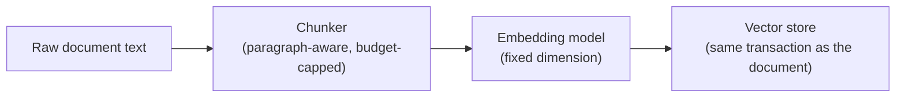

# Embeddings

## Problem

An embedding model turns text into a vector such that semantic similarity becomes geometric
distance — but committing to one lets slip past two decisions that are expensive to reverse:
where the vectors live (a dedicated vector database vs a general-purpose store with a vector
extension), and what the chunk boundaries feeding the model actually are, since a badly chunked
input degrades embedding quality no matter how good the model is. Both decisions get baked into a
schema and a corpus that's expensive to migrate, which makes them worth getting right up front
rather than treating "just pick an embedding model" as the whole decision.

## Key concepts

- **Vector dimension as a schema commitment.** The embedding model chosen determines the vector's
  dimensionality, and that dimensionality is part of the storage schema (an index built for
  N-dimensional vectors). Changing the embedding model later means re-embedding the entire corpus
  and rebuilding the index — not a config change, a migration.
- **Dedicated vector database vs a general store with a vector extension.** A dedicated vector store
  (Qdrant, Weaviate, Milvus) offers better recall and latency at large scale and purpose-built
  tooling, at the cost of being a second datastore alongside whatever holds the rest of the
  application's data — introducing a cross-store consistency problem (a document and its vectors can
  now diverge if one write succeeds and the other doesn't). A general-purpose store with a vector
  extension keeps everything in one transactional boundary, at the cost of scaling and query
  performance that a dedicated store handles better at real scale.
- **Index choice trades build cost for query behavior.** An approximate-nearest-neighbor index
  (HNSW) is memory-hungry and slower to build than alternatives (IVFFlat), but doesn't need a
  representative training set to perform well — an IVFFlat index built before enough real data exists
  to train it well produces quietly degraded recall, not an error, which makes it a dangerous default
  for a corpus that starts empty and grows.
- **Chunking happens before embedding, and its quality caps the embedding's usefulness.** An
  embedding model embeds whatever text it's given — it has no way to know a chunk boundary split a
  sentence in half or merged two unrelated paragraphs together. Chunking strategy (see
  [RAG architecture](rag-architecture.md)) is a genuinely separate decision from embedding model
  choice, but a bad one silently caps how good the embeddings can ever be, regardless of model
  quality.

## Design



This diagram answers: *why does the chunking step matter for embedding quality, when the embedding
model itself never changes based on chunk boundaries?* Because the model embeds exactly the text
it's handed, with no visibility into whether that text is a coherent unit of meaning — a chunk that
splits a sentence produces an embedding for a sentence fragment, indistinguishable to the model from
an embedding for a genuinely coherent thought. The chunker's output is the actual input the
embedding model reasons over; no amount of embedding-model quality corrects for handing it
incoherent text.

## Trade-offs

- **A dedicated vector database vs a general-purpose store with a vector extension.** The dedicated
  store wins on recall and latency at scale and gives purpose-built operational tooling — worth it
  once the corpus size and query volume actually justify it. The general-purpose store avoids a
  second datastore and the cross-store consistency problem that comes with it (a document and its
  vectors written in one transaction, with no reconciliation job needed for partial failures) — the
  right default while corpus size and query load haven't demonstrated that a dedicated store's
  performance edge is actually needed.
- **HNSW vs IVFFlat.** HNSW costs more memory and slower index builds but performs well from an empty
  index onward. IVFFlat is cheaper to build and query at scale but needs a representative training
  set — building it against a mostly-empty corpus produces an index that looks fine but silently
  under-recalls once real data arrives, a failure mode that doesn't announce itself as an error.
- **Fixed-size, paragraph-aware chunking vs semantic (embedding-based) chunking.** Semantic chunking
  — splitting where meaning actually shifts, typically using the embedding model itself to detect the
  shift — produces better-bounded chunks, at the cost of an embedding call just to decide *how* to
  chunk, roughly doubling embedding load before the real embedding step even runs. Fixed-size,
  paragraph-aware chunking is far cheaper and avoids splitting mid-sentence, at the cost of packing
  topically unrelated paragraphs into the same chunk purely because they fit a character budget —
  the right default until retrieval-quality measurement (see [Evaluation](evaluation.md)) actually
  shows it's costing real recall.

## Failure modes

- **Changing the embedding model without planning the migration.** Since the vector dimension is a
  schema commitment, swapping models without re-embedding the full corpus and rebuilding the index
  leaves old and new vectors in incompatible spaces — similarity comparisons between them are
  meaningless, not just less accurate.
- **An IVFFlat index trained on a near-empty corpus.** Produces a working-looking index with quietly
  poor recall once real data volume arrives — the danger is specifically that this doesn't surface
  as an error, only as retrieval that mysteriously misses relevant results.
- **Treating chunking as an afterthought to the "real" embedding decision.** A team that spends real
  effort choosing and evaluating an embedding model, then chunks with an arbitrary fixed character
  count with no paragraph awareness, caps retrieval quality on the cheaper, less-scrutinized half of
  the pipeline.
- **A second datastore for vectors adopted before it's needed.** Introduces a cross-store consistency
  problem (orphaned vectors, chunks with no embeddings, a delete that half-succeeds) to solve a
  performance problem that hasn't actually been observed at the corpus's current scale.

## Operational considerations

Verify the loaded embedding model's dimension against the schema at startup, not at first use — a
dimension mismatch that only surfaces when the first real query runs produces a failure mode (query
errors, or worse, silently wrong similarity scores) that looks nothing like its actual cause,
compared to a clear, immediate startup failure naming the mismatch directly.

## Example

Verifying the embedding dimension matches the schema before the application accepts traffic:

```java
int actualDimension = embeddingProvider.embed("dimension-check").length;
if (actualDimension != schemaConfiguredDimension) {
    throw new IllegalStateException(
        "Embedding model produces %d-dim vectors, schema expects %d — reindex required"
            .formatted(actualDimension, schemaConfiguredDimension));
}
```

## Interview questions

- Why is the embedding model's vector dimension a schema commitment rather than a runtime
  configuration value?
- What's the risk of building an IVFFlat index against a corpus that starts nearly empty?
- Why does chunking quality cap embedding usefulness, even when the embedding model itself is
  unchanged?
- How would you decide between a dedicated vector database and a general-purpose store with a vector
  extension for a given system?

## Further experiments

`ai-engineering-lab` implements both halves of this:
[ADR-0003](https://github.com/Fragudev/ai-engineering-lab/blob/ec822bca9df3aee3dc6857705dcddd171a669211/docs/adr/0003-persistence-and-vector-store.md)
covers choosing PostgreSQL with pgvector over a dedicated vector database (single transactional
boundary for documents and vectors together) and HNSW over IVFFlat, with the embedding model and
dimension fixed and verified at startup; its chunking strategy is covered separately in
[ADR-0006](https://github.com/Fragudev/ai-engineering-lab/blob/ec822bca9df3aee3dc6857705dcddd171a669211/docs/adr/0006-chunking-strategy.md),
which explicitly names semantic chunking's cost (doubling embedding load) as the reason it chose the
cheaper, paragraph-aware alternative first.
