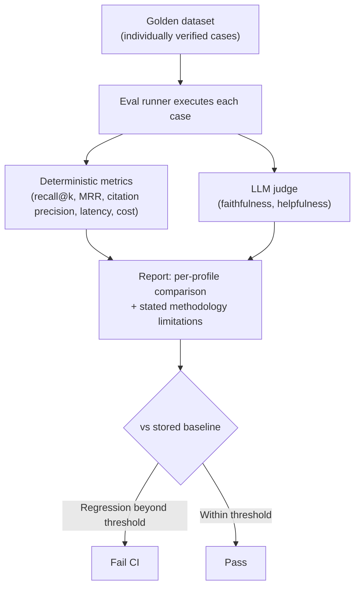

# Evaluation

## Problem

An LLM-based system's output is non-deterministic and "correct" is usually a matter of degree —
recall, precision, faithfulness — not a pass/fail assertion a traditional unit test can express.
That makes the ordinary question "did this change make things better or worse" surprisingly hard to
answer: a prompt tweak, a retrieval config change, or a model swap can silently regress quality with
every existing test still green, because none of those tests were measuring the thing that actually
changed. Evaluation exists to turn "I think this looks better" into a repeatable, versioned
measurement — the same discipline a test suite gives regular code, applied to a system whose outputs
can't be asserted equal.

## Key concepts

- **Golden dataset**: a small, individually verified, versioned set of test cases with known-correct
  expected references (which chunks should be retrieved, whether a query should be answerable at
  all). Individually verified matters more than large: a metric computed against an unverified gold
  reference is meaningless no matter how sophisticated the metric.
- **Deterministic metrics**: recall@k, MRR, citation precision/recall, latency percentiles, and token
  cost — computed by comparing the system's actual output against the golden dataset, with no model
  involved. Cheap, reproducible, and free of the reliability problems the system under test has.
- **LLM-as-judge**: a secondary model call that scores qualities a deterministic metric can't reach —
  faithfulness, helpfulness — at the cost of inheriting a model's own unreliability, which is why it
  needs to be disclosed as a weaker signal, not presented as ground truth.
- **Undefined vs zero**: when a metric has no basis to compute (no citation was attempted at all),
  reporting it as `NaN`/"n/a" rather than `0.00` matters — collapsing "we never got a citation-worthy
  match" into the same number as "we got matches and they were all wrong" corrupts every trend or
  regression comparison built on top of it.
- **Regression gating**: an automated job that compares a fresh run's metrics against a stored
  baseline and fails past a defined threshold — distinct from a descriptive comparison report that
  only informs a human who has to remember to read it.

## Design



This diagram answers: *why compute deterministic metrics at all, instead of just asking a judge model
to score everything?* Because a judge call is itself an unreliable LLM call — using it for something
a lookup can already answer (did the correct chunk get retrieved, does this citation marker resolve)
would make the harness's own trustworthiness depend on the exact reliability problem it exists to
measure. The judge is reserved for the qualities that genuinely need interpretation and can't be
computed from data the harness already has, and the report says so explicitly rather than letting a
reader assume every number in it carries the same confidence.

## Trade-offs

- **A small, individually verified golden dataset vs a larger auto-generated one.** A large,
  auto-generated set gives broader coverage but no way to trust any single gold reference without
  re-checking it — and every metric computed against a wrong reference is worse than no metric,
  because it looks authoritative. A small set where every case's expected answer was individually
  checked against the real corpus is more trustworthy per case, even if it covers fewer scenarios.
  The signal: can you pull one number from the report and trust it without re-verifying its source
  case yourself?
- **LLM judge vs deterministic-only metrics.** Deterministic metrics are free and fully reproducible
  but blind to qualities like whether an answer is actually helpful, not just cited correctly. A
  judge reaches those qualities at the cost of adding a second unreliable model call to the
  measurement itself — worth it only when the report is explicit that judge scores carry a named,
  weaker confidence than the deterministic numbers next to them.
- **Regression gating vs a descriptive-only report.** Gating catches a silent quality regression
  automatically, but needs a trusted baseline and a threshold tuned so it neither cries wolf on
  normal noise nor stays silent on a real drop. A descriptive report is safer to start with — no risk
  of a false-positive build failure — but only works if someone reliably reads it before every
  change ships, which doesn't scale past a very small team.

## Failure modes

- **Trusting the golden dataset without individually verifying it.** A gold reference that's stale or
  was never checked against the real corpus invalidates every downstream metric silently — the
  report still produces confident-looking numbers computed against a wrong answer key.
- **Reporting an undefined metric as zero.** Collapsing "no citation was attempted" into `0.00` makes
  it indistinguishable from "citations were attempted and wrong," which corrupts any trend line or
  regression check built on that number without anyone noticing the metric was never real.
- **Treating a judge model's score as ground truth.** Especially dangerous when the judge is a
  smaller or locally hosted model — its own quality gaps become invisible if its score is presented
  with the same confidence as a deterministic metric instead of a named, weaker signal.
- **No deterministic fixture for CI.** An evaluation harness that only runs against a live model
  server produces different numbers on every run for reasons unrelated to the code change being
  tested — a regression gate needs a fixture-backed, deterministic provider so its numbers are
  stable run-to-run, kept separate from a live run whose job is measuring quality against reality.

## Operational considerations

Commit every report with the date, model, and hardware it was generated on. A metric with no record
of what produced it can't be trusted or reproduced months later when someone asks "did this actually
get worse, or did we just change how we measure it" — the report needs to answer that on its own,
without relying on anyone's memory of the run.

## Example

Distinguishing an undefined metric from a genuinely zero one:

```java
double precision = citedTotal == 0
    ? Double.NaN   // no citation attempted — genuinely undefined, not zero
    : (double) citedCorrect / citedTotal;
```

## Interview questions

- Why is a small, individually verified golden dataset generally more trustworthy than a larger,
  auto-generated one?
- What's the risk of treating an LLM judge's score as equivalent to a deterministic metric?
- Why does it matter whether an undefined metric is reported as `NaN`/"n/a" rather than `0.00`?
- What does it take to run an evaluation harness reproducibly enough to gate CI on it, as opposed to
  running it once against a live model to check current quality?

## Further experiments

`ai-engineering-lab` implements this evaluation harness end-to-end:
[`docs/ai-evaluation.md`](https://github.com/Fragudev/ai-engineering-lab/blob/ec822bca9df3aee3dc6857705dcddd171a669211/docs/ai-evaluation.md)
covers the golden dataset (28 individually verified cases), the deterministic-vs-judge metric split
with its stated methodology limitations, and the nightly CI regression job — including a real
finding (§8) from comparing RAG profiles under a live model run, the exact kind of result this
harness exists to produce honestly rather than assert by construction.
