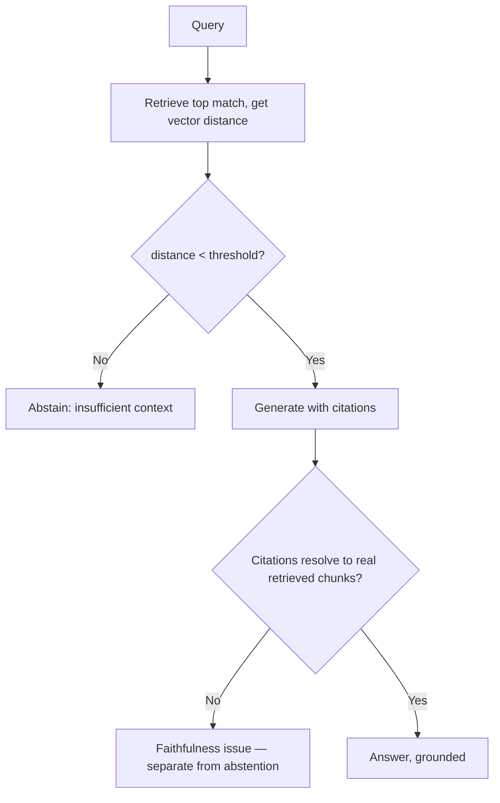

# Hallucination mitigation

## Problem

[RAG architecture](rag-architecture.md) names the abstention gate as the mechanism that stops a
model from generating a confident answer when retrieval found nothing relevant. What that topic
doesn't cover is how to actually *calibrate* that gate — a threshold picked without measuring it
against a real embedding model's actual distance distribution is a guess wearing the shape of a
safety mechanism, and a guessed threshold can fail in either direction: too loose, and the model
hallucinates from irrelevant context; too strict, and the system abstains on questions it could have
answered correctly. Both failure directions look identical from outside the gate — "the system
declined or made something up" — until the threshold is actually measured.

## Key concepts

- **The vector-distance gate measures corpus coverage, not factual completeness.** An abstention gate
  built on retrieval distance answers "does this corpus contain anything relevant to this query," not
  "does the corpus state this specific fact." A query that's topically within the corpus's domain but
  whose exact answer isn't stated anywhere in it can retrieve at a distance nearly identical to a
  genuinely answerable query — the gate was never designed to catch that case, and expecting it to is
  a category error about what the signal actually measures.
- **A threshold needs two real reference points, not one.** A single measured cluster (e.g., only
  answerable-query distances) doesn't tell you where the boundary should sit — the threshold needs to
  be calibrated against the gap *between* a cluster of genuinely answerable queries and a cluster of
  genuinely off-corpus ones, with the threshold placed inside that gap.
- **Recorded/fixture-based testing can validate the mechanism without validating the calibration.** A
  test suite that exercises the abstention gate against deterministic, hash-seeded fixture embeddings
  proves the gate's logic works — it says nothing about whether the *threshold value* is correct
  against a real embedding model's actual distance distribution, which only a live measurement can
  show.
- **Faithfulness is a separate concern from retrieval sufficiency.** Even with a well-calibrated
  abstention gate, a model can still generate a claim that isn't actually supported by the retrieved
  context it was given — this is what [LLM-as-judge evaluation](evaluation.md) and citation
  verification exist to catch, a genuinely different mitigation from the retrieval-side gate.

## Design



This diagram answers: *why are there two separate checks — one before generation, one after — rather
than one gate that covers both?* Because they catch different failure classes. The pre-generation
gate answers "is there anything in this corpus worth generating from at all" using a signal
(retrieval distance) that's cheap and available before any generation happens. The post-generation
check answers "did the model actually stick to what was retrieved," a question the pre-generation
signal has no way to answer, because it's evaluated before generation even occurs. A system with only
the first check can still hallucinate content unsupported by genuinely relevant retrieved context; a
system with only the second has already paid the cost of generating from context that may never have
been sufficient in the first place.

## Trade-offs

- **A stricter threshold (favors abstention) vs a looser one (favors answering).** A stricter
  threshold reduces the risk of generating from marginally relevant context, at the cost of
  abstaining on borderline-relevant real queries a human would consider answerable. A looser
  threshold answers more queries but risks generating from context that doesn't actually support a
  good answer. The right placement sits inside the measured gap between answerable and off-topic
  distance clusters, closer to whichever side the application's cost asymmetry favors — a medical or
  financial application should weight toward abstention; a low-stakes internal tool can weight
  toward answering.
- **A single global threshold vs a per-corpus one.** A single fixed threshold is simpler to reason
  about as long as the corpus stays reasonably homogeneous — different retrieval configurations can
  still share it if they read from the same candidate pool. A corpus heterogeneous enough that one
  distance scale stops making sense would need per-domain calibration — not worth building before
  there's real evidence a single threshold is failing.

## Failure modes

- **Trusting an unmeasured threshold.** A threshold inherited from a default, a blog post, or an
  earlier phase's guess, never checked against the actual embedding model and corpus in production,
  can be badly miscalibrated in either direction without any error surfacing — it just quietly
  abstains too often or hallucinates too often, and nothing about the system's behavior announces
  which.
- **Validating the gate only against fixture/recorded embeddings.** A test suite passing against
  deterministic, hash-seeded embeddings proves the *logic* is correct; it proves nothing about
  whether the *threshold value* is right for a real embedding model, whose actual distance
  distribution can differ enormously from what a fixture produces.
- **Treating retrieval-topic-relevance as a proxy for factual-answerability.** A query that's
  topically within the corpus's domain but whose specific fact isn't documented anywhere can pass a
  distance-based gate at nearly the same rate as a genuinely answerable query — the gate isn't wrong,
  it's answering a narrower question than "can this be correctly answered," and treating it as a
  complete hallucination-prevention mechanism on its own overstates what it does.
- **No faithfulness check after generation.** Even a well-calibrated retrieval gate doesn't prevent a
  model from generating a claim not actually supported by the context it was given — skipping a
  post-generation check leaves that entire failure class uncaught.

## Operational considerations

Track abstention rate as its own trended metric, not just answer quality — a rising abstention rate
can mean the corpus's coverage is genuinely shrinking relative to real query patterns, or it can mean
the threshold has drifted out of calibration (an embedding model update, a corpus composition
change) — either way it's a signal worth investigating on its own, not something to notice only when
users start complaining the system won't answer things it used to.

## Example

Calibrating a threshold from measured answerable vs off-topic distance clusters, not a guess:

```text
Answerable queries (28 cases):  distance range 0.30–0.47
Off-topic control queries (4):  distance range 0.60–0.69

Threshold: 0.55 — inside the gap, closer to the answerable side
so a borderline-relevant real query is more likely to get an answer
than a false abstention, while staying clear of the off-topic cluster.
```

## Interview questions

- Why does a retrieval-distance abstention gate not protect against a query that's topically
  in-corpus but whose specific answer isn't documented anywhere?
- What's the risk of validating an abstention gate only against fixture or recorded embeddings,
  rather than a real embedding model?
- How would you calibrate an abstention threshold from real measurement, rather than picking a
  round number?
- Why does hallucination mitigation need both a pre-generation gate and a post-generation
  faithfulness check, rather than either one alone?

## Further experiments

`ai-engineering-lab` measured and recalibrated exactly this:
[ADR-0013](https://github.com/Fragudev/ai-engineering-lab/blob/ec822bca9df3aee3dc6857705dcddd171a669211/docs/adr/0013-rag-abstention-threshold.md)
covers discovering, via a real live run against `bge-m3`, that an unmeasured 0.6 threshold made the
pipeline abstain on every answerable query — and the real measurement (answerable queries clustering
0.30–0.47, off-topic controls 0.60–0.69) that recalibrated it to 0.55, including the finding that the
gate's "unanswerable" test category is topically in-corpus and therefore not what the gate is
designed to catch.
