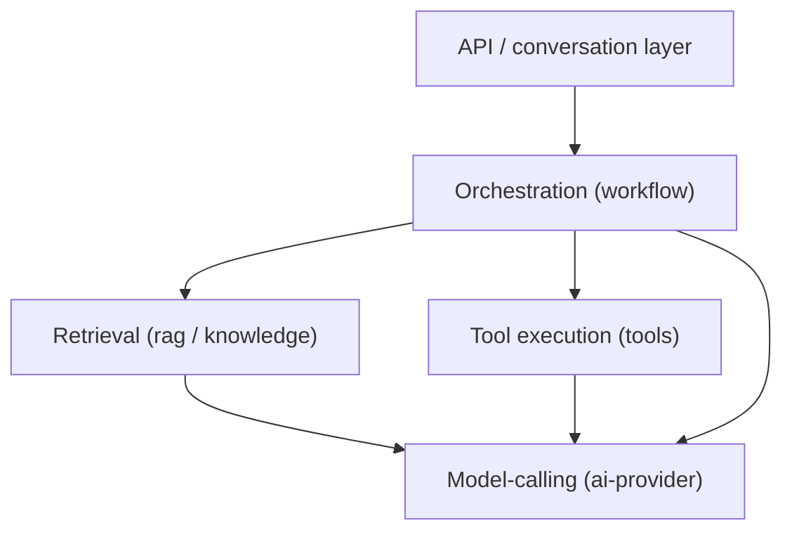

# LLM application architecture

## Problem

[Modular monolith vs microservices](../architecture/modular-monolith-vs-microservices.md) covers
the deployment-topology decision generically. This is the layer beneath it, specific to LLM-based
systems: even inside a single deployable, which are the seams worth enforcing as real module
boundaries? An LLM application has several genuinely distinct concerns — calling a model, retrieving
context, executing tools, orchestrating multi-step work — that are easy to let collapse into one
undifferentiated "call the LLM" layer, and that collapse is exactly what makes the system hard to
change later: swapping a model provider, adding a second retrieval strategy, or adding a new tool
each end up touching code that has nothing to do with the change being made.

## Key concepts

- **Provider abstraction as the first boundary.** Model-calling (which provider, which model, retry/
  fallback behavior, structured-output handling) sits behind one interface the rest of the system
  calls — everything downstream depends on "get a completion," never on a specific provider's SDK or
  response shape. This is the seam that makes a model swap, or supporting two providers side by side,
  a contained change instead of a system-wide one.
- **Retrieval as its own concern, not folded into generation.** Retrieval (search, fusion, reranking)
  has its own failure modes, its own tuning knobs, and its own testable contract — a query in,
  ranked results out — completely independent of what happens with those results afterward. Modules
  that let retrieval logic leak into the code that assembles a prompt make retrieval untestable in
  isolation and impossible to swap without touching generation.
- **Tool execution as its own concern, separate from the model deciding to call a tool.** The model
  requesting a tool call and the system actually executing it (validating arguments, authorizing,
  timing out, persisting the result) are different responsibilities — see
  [structured output and tool-calling reliability](structured-output-and-tool-calling-reliability.md)
  for why conflating them is a reliability and security problem, not just an architectural
  preference.
- **Orchestration as a distinct layer from any single capability.** Multi-step work (see
  [agents and workflows](agents-and-workflows.md)) coordinates retrieval, generation, and tool
  execution without being any of them — a workflow module that reaches directly into another
  capability's internals instead of its public API collapses the same boundary that made each
  capability independently testable in the first place.

## Design



This diagram answers: *why does everything eventually route through one model-calling module,
instead of each capability calling its own model client?* Because "call the model" carries concerns —
which provider, retry behavior, structured-output validation — that are identical regardless of
*why* a capability needs a completion. If retrieval, tools, and orchestration each called a model
client directly, a provider swap or a retry-policy change would mean finding and updating every one
of those call sites instead of one module. The arrows converging on `Provider` are the concrete
payoff of the abstraction: every capability above it can change independently of how model-calling
itself works underneath.

## Trade-offs

- **Enforced module boundaries vs one flexible layer.** Enforcing that cross-module communication
  only happens through a public API or an event (build-time checked, not just a convention) makes
  the boundaries real rather than aspirational, at the cost of upfront ceremony — an internal package
  per module, an explicit public surface to design. A single flexible layer is faster to write
  initially but degrades the moment two concerns start reaching into each other's internals, which
  tends to happen quietly, one convenient shortcut at a time, until nothing is actually separable
  anymore.
- **A provider abstraction now vs adding one when a second provider is actually needed.** Building the
  abstraction before it's needed is speculative if the system will only ever use one provider — but
  retrofitting it after generation, retrieval, and tools have all directly coupled to one provider's
  SDK is a much larger, riskier change than building the seam early, especially since the interface
  needed (get a completion, handle structured output) is small and doesn't grow much with time.

## Failure modes

- **Retrieval logic embedded in the prompt-assembly code.** Makes retrieval untestable without
  standing up whatever assembles prompts, and makes swapping a retrieval strategy (adding hybrid
  search, changing fusion) require changes in a place that has nothing conceptually to do with
  retrieval.
- **Every capability calling the model provider's SDK directly.** A provider swap, or adding retry/
  fallback behavior, means finding and changing every call site instead of one module — the exact
  cost the provider-abstraction boundary exists to avoid.
- **Orchestration reaching into another module's internal state instead of its public API.** Breaks
  the same isolation that made the called module independently testable and swappable — the
  orchestration layer becomes coupled to implementation details it was never meant to know about.
- **No enforcement mechanism for the boundaries.** Boundaries documented as a convention, with
  nothing (a build-time check, a lint rule) actually preventing a cross-module internal reach, erode
  quietly — the first violation looks like a harmless shortcut, and nothing stops the second or the
  tenth.

## Operational considerations

A module's public API surface is worth reviewing on its own, separate from reviewing the feature
that prompted the change — a public method added because one specific caller needed it, without
asking whether it belongs on the module's stated responsibility, is how a module's boundary quietly
grows to cover things it was never meant to own.

## Example

A capability depending only on the provider abstraction's interface, never a specific provider:

```java
public interface ChatProvider {
    ChatResponse complete(ChatRequest request);
}

// RagPipeline, ToolCallingChatService, and WorkflowEngine each depend on ChatProvider —
// none of them know or care whether it's backed by LM Studio, OpenAI, or a recorded fixture.
```

## Interview questions

- Why does it matter whether retrieval logic lives inside the code that assembles a prompt, or in
  its own module?
- What specifically does a provider abstraction make cheap that a system without one makes expensive?
- Why should tool execution be architecturally separate from the model's decision to call a tool?
- How would you enforce that module boundaries stay real over time, rather than eroding into
  convention nobody follows?

## Further experiments

`ai-engineering-lab` is structured exactly this way:
[ADR-0002](https://github.com/Fragudev/ai-engineering-lab/blob/ec822bca9df3aee3dc6857705dcddd171a669211/docs/adr/0002-modular-monolith.md)
covers the module-boundary decision (Spring Modulith, build-time enforced, public API or domain
event as the only cross-module contact) and names the specific modules this produces — `ai-provider`,
`rag`, `knowledge`, `tools`, `workflow` — each matching one of the concerns this topic separates.
