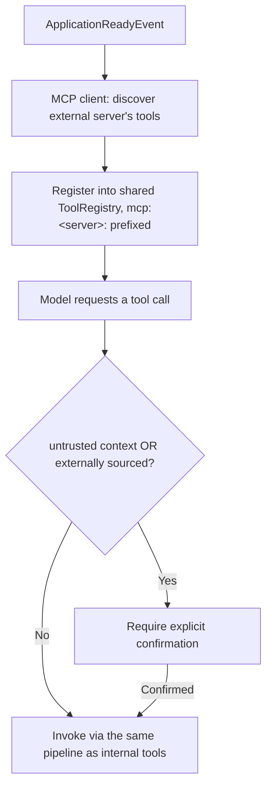

# MCP

## Problem

The Model Context Protocol standardizes how a model-facing application discovers and invokes tools
across a process boundary — acting as a server (exposing its own tools to external consumers) and
as a client (consuming another party's tools). That breaks two assumptions most internal tool
systems bake in without thinking about them: a tool registry built once, from a fixed list, at
application startup; and a tool's implementation being code the application's own team wrote and
reviewed. An MCP-sourced tool is discovered at runtime, over a network handshake, and its
implementation runs in a process the application doesn't control — the design problem is extending
a tool-calling system to accept that without blocking startup on a third party's availability, and
without silently trusting an external tool the same way the application trusts its own code.

## Key concepts

- **MCP server vs MCP client**: server means exposing this application's own tools for another
  system to discover and call; client means this application discovering and calling another
  system's tools. The two roles carry different design problems and are usually implemented
  independently, even in a system that plays both roles.
- **Runtime discovery vs construction-time registration**: an internal tool registry is typically
  built once, from an injected list, when the application starts. An MCP client's tools aren't
  known until a handshake with an external server completes, which can happen after startup or not
  at all, so the registry has to accept late, optional registrations instead of a closed set.
- **Trust boundary shift**: [prompt injection](prompt-injection.md)'s tool-authorization concern is
  about a call the model was *manipulated* into making. An MCP-client tool carries a distinct risk
  independent of that: the call's arguments leave the process to code this application doesn't
  control, true from the very first, cleanly triggered invocation.
- **Namespacing**: prefixing externally sourced tool names (e.g. `mcp:<server-name>:<tool-name>`) so
  a tool pulled in from an external server is never confused with a built-in one in registries,
  audit logs, or a confirmation UI.
- **Federation**: whether a server re-exposes tools it pulled in as a client to whoever connects to
  it in turn — a genuine "are we now vouching for this third party's tool" question, not a free
  feature.

## Design



This diagram answers: *why does an externally sourced tool get gated unconditionally, instead of
reusing the existing "confirm only when context is untrusted" rule that already covers prompt
injection?* Because the two gates defend against different things. The untrusted-context gate exists
to catch a call the model was talked into making by something it read; by design it lets a turn's
first, trusted-context call through ungated, because nothing untrusted has entered the conversation
yet. An MCP-client tool doesn't get that pass — its risk is that the call reaches a process this
application never wrote or reviewed, which is true on the very first call regardless of what's in
context. Reusing the existing gate would under-protect exactly the case it was never built for;
adding a second, unconditional condition keeps the two risks — a manipulated call and an
inherently-external one — from being conflated into one control that fits neither well.

## Trade-offs

- **Eager discovery at construction vs discovery on a startup-ready event.** Discovering an external
  server's tools during construction is simpler to reason about, but makes startup depend on that
  server's availability — a dependency this application doesn't operate and can't guarantee is up.
  Deferring discovery to a "the app is now ready" event keeps startup independent of any single
  external peer, at the cost of a registry that must support registration after construction. The
  signal: if every other external dependency already degrades gracefully rather than blocking boot,
  MCP should follow the same convention, not be the exception.
- **Unconditional confirmation vs the same context-dependent gate as internal tools.** Confirming
  every MCP-client call adds friction even on servers that turn out reliable and benign; reusing the
  internal gate is frictionless but leaves the very first call — nothing untrusted in context yet —
  completely ungated for a tool outside the application's control. Given the cost of under-gating
  here is a call to an unreviewed external process, I'd gate every MCP-client tool unconditionally
  and accept the friction, relaxing it only for a specific server someone has actually evaluated —
  not as a blanket default once external tools stop feeling novel.
- **Federating (re-exposing pulled-in client tools through your own server) vs not.** Federation
  grows the server's surface automatically, but means every consumer of your server implicitly
  trusts a third party's tool through you, without you having decided what that vouching means.
  Defaulting to not re-exposing is the safer start; open it only once there's an actual policy for
  what re-exposure implies.

## Failure modes

- **Assuming the tool registry stays a fixed, construction-time set.** Bolting runtime MCP discovery
  onto a registry designed to be built once and never mutated produces either a startup that blocks
  on an external server, or discovered tools that silently fail to register.
- **Gating an MCP-client tool the same way as an internal one.** Treating "confirm only if context is
  untrusted" as sufficient for every tool source under-gates the specific risk MCP introduces, which
  exists independent of context trust.
- **No naming distinction between internal and externally sourced tools.** Without a visible prefix,
  an operator reading a tool-invocation log can't tell at a glance whether a given call executed the
  application's own code or reached a third-party process — the distinction that matters most during
  an incident.
- **Federating without a trust policy.** Re-exposing a client-discovered tool through your own server
  by default quietly extends trust from every consumer of your server to every external tool you've
  connected to as a client — a transitive relationship nobody explicitly decided to create.

## Operational considerations

Log both tool discovery events and tool invocations with the originating server's identity attached
— not just the tool name. During an incident, the first question is almost always "did this call run
our code or someone else's," and a log line that only names the tool, not its source, can't answer
that without cross-referencing the registry state at the time.

## Example

The gating decision made explicit, independent of how the tool is invoked once past it:

```java
boolean requiresConfirmation = conversationState.untrusted()
    || toolDefinition.alwaysRequiresConfirmation(); // true for every MCP-client-sourced tool
if (requiresConfirmation && !userConfirmed) {
    return ToolCallOutcome.awaitingConfirmation(toolDefinition.name());
}
toolInvoker.invokeOrThrow(toolDefinition, arguments);
```

## Interview questions

- Why does an MCP-client-sourced tool need a different confirmation policy than an internal tool,
  even in a turn where nothing untrusted has entered context yet?
- How would you extend a tool registry that's normally built once at startup to support tools
  discovered dynamically at runtime, without making startup depend on an external server?
- What's the risk of federating — re-exposing a third-party tool you consumed as an MCP client
  through your own MCP server — and how would you decide whether to allow it?
- How would you make an incident investigation able to tell, from logs alone, whether a tool call
  executed internal code or reached an external process?

## Further experiments

`ai-engineering-lab` implements both the server and client roles:
[ADR-0011](https://github.com/Fragudev/ai-engineering-lab/blob/ec822bca9df3aee3dc6857705dcddd171a669211/docs/adr/0011-mcp-tool-exposure-boundaries.md)
covers the discovery-on-ready-event design, the unconditional confirmation gate for client-sourced
tools, and the decision not to federate; its
[threat model](https://github.com/Fragudev/ai-engineering-lab/blob/ec822bca9df3aee3dc6857705dcddd171a669211/docs/threat-model.md)
documents this as T9 — a malicious or compromised external MCP server — as a threat distinct from
the prompt-injection cases covered in [prompt injection](prompt-injection.md).
