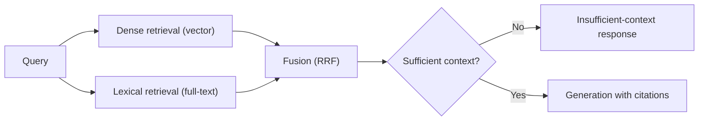

# RAG architecture

## Problem

An LLM's parametric knowledge is frozen at training time and can't be selectively updated per
document, per tenant, or per day — retrieval-augmented generation fixes that by fetching relevant
text at query time and putting it in the prompt, but "put retrieved chunks in the prompt" is not by
itself an architecture. The real design problem is what to do when retrieval finds nothing relevant,
how to make a claim traceable back to its source, and where the orchestration boundary sits between
retrieval, generation, and the rest of the application — get those wrong and the system either
hallucinates confidently or refuses to answer things it actually knows.

## Key concepts

- **Retrieval**: turning a query into a search over an indexed corpus — typically dense (vector
  similarity over embeddings) and, for domains with exact terminology, lexical (full-text search)
  as a complementary signal.
- **Fusion**: combining ranked results from multiple retrieval signals into one ranking — Reciprocal
  Rank Fusion (RRF) is a common choice because it combines rankings, not raw scores, which sidesteps
  the problem of vector-similarity scores and full-text-relevance scores not being on comparable
  scales.
- **Citation attribution**: tying each claim in the generated answer back to the specific retrieved
  chunk that supports it, so a reader can verify the answer instead of trusting it.
- **Abstention gate**: an explicit check that decides "the retrieved context doesn't actually support
  an answer" and returns a stated "insufficient context" response instead of letting the model
  generate an answer from its parametric knowledge alone while looking like it's grounded in the
  retrieved documents.

## Design



This diagram answers: *why does dense retrieval alone routinely miss the queries technical
documentation needs it most for?* Dense retrieval measures semantic similarity, which is weak
precisely on exact identifiers — a class name, a config key, an error code — because an embedding
model's notion of "similar" doesn't reliably rank an exact string match above an unrelated sentence
that happens to share general topic. Lexical search is the complementary signal that catches exactly
those cases, and fusing rankings rather than picking one signal is what makes the combination robust
instead of just picking a winner per query type by hand.

The abstention gate is the second design decision the diagram makes explicit: retrieval *always*
returns something (a top-k search has no concept of "nothing relevant exists"), so an architecture
without an explicit sufficiency check has no way to distinguish "retrieved the right context" from
"retrieved the least-bad match to a query nothing in the corpus actually answers" — both flow into
generation identically unless something checks.

## Trade-offs

- **Dense-only vs hybrid retrieval.** Dense-only is simpler to operate (one index, one scoring
  function) and works well for conceptual, paraphrase-tolerant queries. Hybrid adds a second index
  and a fusion step, but is the right default for any corpus where users search for exact
  identifiers — which most technical documentation corpora are. The signal: if a meaningful fraction
  of real queries contain a proper noun, code identifier, or exact phrase, hybrid retrieval earns its
  added complexity.
- **Cross-encoder reranking vs no reranking.** A cross-encoder reranking step (scoring
  query-document pairs jointly, more expensive than the initial retrieval but more accurate) improves
  precision on the top results at the cost of added latency and a second model to serve. Worth it
  when retrieval precision directly gates answer quality and the corpus is large enough that fusion
  alone leaves too much noise in the top-k; not worth it for small corpora where fusion already
  surfaces the right chunks reliably.
- **Strict abstention vs graceful degradation.** A strict abstention gate protects against
  hallucination but frustrates users on queries just outside a hard sufficiency threshold — a softer
  design (answer, but flag low confidence) trades some hallucination risk for fewer unhelpful
  refusals. The right choice depends on the cost of a wrong answer versus the cost of an unnecessary
  refusal for that specific application.

## Failure modes

- **No abstention gate at all.** The model always generates an answer from whatever was retrieved,
  including near-irrelevant top-k results on queries the corpus doesn't actually cover — this
  produces confident, plausible-sounding answers that are wrong, which is worse for user trust than a
  visible "I don't know."
- **Citations that don't verify.** Generating prose that references sources without a mechanism
  tying each claim to the specific chunk it came from means citations exist as decoration, not as a
  verification tool — a user can't actually check whether the cited source supports the claim next to
  it.
- **Treating retrieval as a solved, static component.** Chunking strategy, embedding model choice,
  and fusion weights all interact with the actual corpus and query distribution — a retrieval setup
  tuned once at launch degrades silently as the corpus grows or the query mix shifts, with no
  application-level error to signal it.

## Operational considerations

Retrieval quality needs to be measured with numbers a team can track over time — recall@k, citation
precision, abstention accuracy on a golden query set — not judged qualitatively per spot-check. A
regression here is silent by default: the system doesn't throw an error when retrieval quality drops,
it just starts answering worse.

## Example

Reciprocal Rank Fusion combining two rankings by rank position, not raw score:

```python
def rrf_score(rank, k=60):
    return 1 / (k + rank)

fused = {}
for rank, doc_id in enumerate(dense_ranking):
    fused[doc_id] = fused.get(doc_id, 0) + rrf_score(rank)
for rank, doc_id in enumerate(lexical_ranking):
    fused[doc_id] = fused.get(doc_id, 0) + rrf_score(rank)
```

## Interview questions

- Why does dense retrieval alone tend to underperform on technical documentation specifically?
- What problem does an abstention gate solve that retrieval quality alone can't fix?
- Why fuse rankings (RRF) instead of combining raw similarity and relevance scores directly?
- How would you measure whether a RAG system's retrieval quality has regressed over time?

## Further experiments

`ai-engineering-lab` implements this architecture end-to-end:
[ADR-0007](https://github.com/Fragudev/ai-engineering-lab/blob/c75ecf5f0923528915624d6aa7e2b8e551bda2cc/docs/adr/0007-hybrid-retrieval-and-fusion.md)
covers hybrid retrieval and RRF fusion in detail, and
[ADR-0008](https://github.com/Fragudev/ai-engineering-lab/blob/c75ecf5f0923528915624d6aa7e2b8e551bda2cc/docs/adr/0008-rag-pipeline-architecture.md)
covers orchestration, citation attribution, and the abstention gate — including the specific
trade-offs made for a corpus of technical documentation, which is the exact case this topic
describes.
