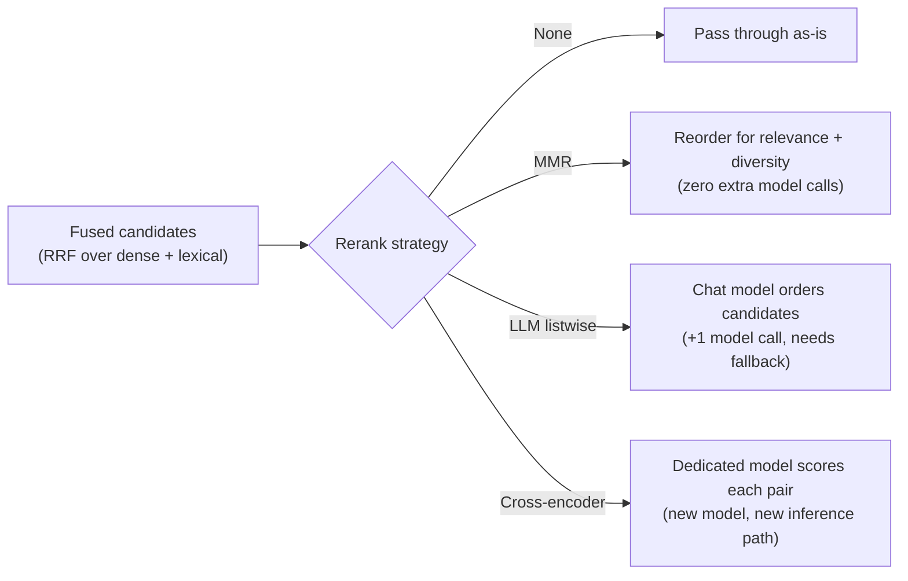

# Retrieval / reranking

## Problem

[RAG architecture](rag-architecture.md) covers fusing dense and lexical retrieval into one ranking.
Fusion alone often isn't the final ranking a generation step should see — the top-k results from
fusion can be redundant (several near-duplicate chunks crowding out distinct ones) or simply
imprecisely ordered relative to what a more expensive, more accurate ranker would produce. Reranking
is a second pass over an already-fused candidate set, and the real design problem is that the most
accurate reranking technique (a cross-encoder model) isn't free — it's a real model dependency with
its own latency and infrastructure cost — which means the actual decision is what reranking quality
is achievable with what's already in the system's model stack, not just "should we rerank."

## Key concepts

- **Reranking is downstream of fusion, working from the same candidate pool.** Fusion decides which
  chunks make the candidate set and their initial order; reranking reorders that same set using a
  different, usually more expensive, signal — it doesn't retrieve anything new, only reorders what
  fusion already found.
- **Maximal Marginal Relevance (MMR)**: greedily picks each next result to maximize relevance while
  minimizing similarity to results already selected — trades pure relevance ranking for reduced
  redundancy, using only the embeddings retrieval already computed. Zero additional model calls.
- **LLM-based listwise reranking**: sends the query and numbered candidates to a chat model, asking
  for a relevance ordering back. A real, usable technique that needs no new model in the stack if a
  chat model is already available — but it roughly doubles model calls on every reranked request (one
  for ranking, one for the eventual generation), and depends on the model reliably following a
  plain-text instruction, which means it needs a defined fallback (the original fused order) for when
  the response can't be parsed.
- **Cross-encoder reranking**: the textbook, most accurate approach — a model trained specifically to
  score a query-document pair jointly, rather than comparing independently computed embeddings. Not
  free: it's a dedicated model, a new inference path, and infrastructure that exists solely for
  reranking, worth adopting once measurement shows the cheaper alternatives aren't accurate enough,
  not adopted reflexively because it's the most accurate option in the abstract.

## Design



This diagram answers: *why are there three reranking options instead of just adopting the most
accurate one?* Because "most accurate" and "available in this system's model stack" are different
questions — a cross-encoder is the accuracy ceiling but requires a model dependency many systems
don't already have; MMR and LLM-based reranking are both real, working techniques buildable entirely
from what a RAG system already has (embeddings and a chat model), at a lower accuracy ceiling than a
cross-encoder but zero-to-moderate added infrastructure. The right branch for a given system depends
on what's already in its stack and what a measured evaluation shows about whether the cheaper
options are good enough.

## Trade-offs

- **MMR vs LLM-based reranking.** MMR costs nothing beyond what retrieval already computed
  (embeddings) and directly addresses redundancy, but doesn't improve relevance ranking beyond what
  fusion already produced — it only reduces near-duplicate crowding. LLM-based reranking can improve
  relevance ordering itself, using the same reasoning capability the system already has for
  generation, but doubles model calls on every reranked request and needs a defined fallback for
  unparsable responses. The signal: is the actual problem redundant near-duplicates in the top-k, or
  is fusion's *ordering* itself imprecise? MMR fixes the former; only LLM or cross-encoder reranking
  addresses the latter.
- **Adopting a cross-encoder vs staying with MMR/LLM reranking.** A cross-encoder is measurably more
  accurate but is a new model dependency and inference path built solely for this one purpose — real
  infrastructure commitment for a system that doesn't already need a second model. Staying with
  MMR/LLM reranking avoids that commitment, accepting a lower accuracy ceiling until evaluation
  evidence (not intuition) shows the gap actually matters for the corpus and query mix in question.
- **Reranking at all vs trusting fusion's order.** Reranking, in any form, adds latency and
  (for LLM-based) cost on every request. Skipping it entirely is the cheapest option and is fine when
  fusion's top-k is already precise enough for the generation step to work from — worth measuring
  against a golden dataset (see [Evaluation](evaluation.md)) rather than assumed either way.

## Failure modes

- **LLM-based reranking with no fallback for malformed output.** A chat model asked to produce a
  relevance ordering can produce output that doesn't parse cleanly — treating that as a hard failure
  instead of falling back to the fused order turns a reranking optimization into an availability
  risk for the whole request.
- **Assuming MMR improves relevance ranking.** MMR optimizes for diversity against already-selected
  results, not for finding a better ordering by pure relevance — expecting it to fix an imprecise
  fusion ranking, rather than a redundancy problem, misdiagnoses which technique actually addresses
  the observed symptom.
- **Adopting a cross-encoder before measuring whether the cheaper alternatives are actually
  insufficient.** Committing to a new model dependency on the assumption that "more accurate" always
  justifies its cost skips the step that would show whether MMR or LLM reranking already closes the
  gap that matters for the real corpus and query distribution.
- **Filtering candidates by an absolute fused score instead of reranking.** A fused ranking score
  (from RRF or similar) reflects rank position, not calibrated relevance — thresholding on it can't
  distinguish "nothing relevant exists in this corpus" from "here's the best of what's genuinely
  there," which is a different problem reranking doesn't solve either (see [RAG
  architecture](rag-architecture.md)'s abstention gate for the actual fix).

## Operational considerations

Track reranking's actual effect on the final answer, not just on the intermediate ranking — a
reranking strategy that reliably changes which chunks reach generation but doesn't measurably
improve citation precision or recall in the evaluation harness is adding latency and cost for a
result the generation step wasn't actually sensitive to.

## Example

LLM-based listwise reranking with an explicit fallback for unparsable output:

```java
Optional<List<Integer>> ordering = llmReranker.rank(query, candidates);
List<Chunk> reranked = ordering
    .map(order -> reorderByIndices(candidates, order))
    .orElse(candidates); // falls back to the fused order — never fails the request over this
```

## Interview questions

- What does reranking actually reorder, and why doesn't it retrieve anything new?
- Why does MMR not improve relevance ranking, even though it changes which chunks end up at the top
  of the list?
- What's the real cost of LLM-based listwise reranking compared to MMR, and what does that cost buy?
- How would you decide whether a cross-encoder reranker is worth adopting for a given system?

## Further experiments

`ai-engineering-lab` builds two real reranking strategies instead of a placeholder:
[ADR-0007](https://github.com/Fragudev/ai-engineering-lab/blob/ec822bca9df3aee3dc6857705dcddd171a669211/docs/adr/0007-hybrid-retrieval-and-fusion.md)
covers MMR and LLM-based listwise reranking (both selectable per named `RagProfile`), the explicit
fallback-on-unparsable-output design for the LLM strategy, and the reasoning for not adopting a
cross-encoder — no such model is in the project's stack, named as the natural next candidate only if
evaluation shows the cheaper strategies underperforming.
