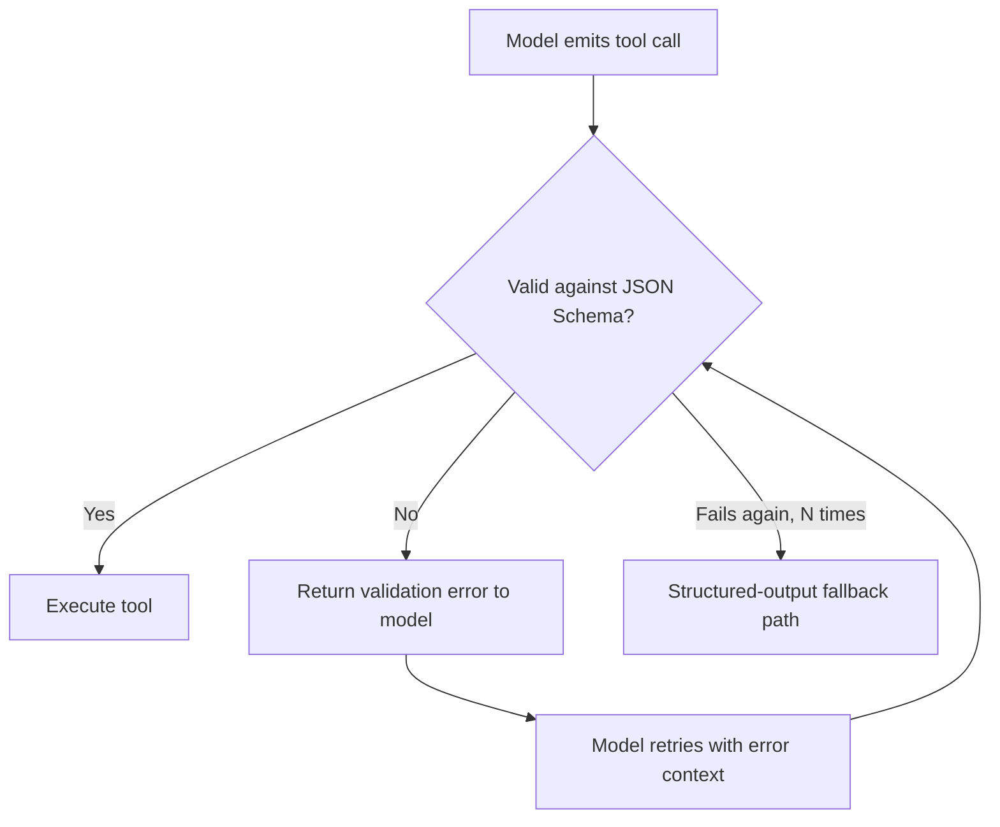

# Structured output and tool-calling reliability

## Problem

Tool calling asks an LLM to produce syntactically valid, schema-conforming JSON as part of natural-
language generation — and models, especially smaller or locally hosted ones, fail at this more often
than API documentation examples suggest: malformed JSON, missing required fields, wrong types,
plausible-sounding but non-existent tool names. Treating a tool call's output as trustworthy input to
a program (which is what it is) without validating and handling failure is the single most common
reliability gap in agentic systems.

## Key concepts

- **Native tool calling vs prompted structured output**: some model APIs offer a dedicated tool-
  calling mode with schema-constrained generation; others only support it by prompting the model to
  emit JSON and parsing the response. The reliability ceiling is fundamentally different between the
  two, which matters for provider abstraction (below).
- **JSON Schema validation**: checking a model's tool-call arguments against the tool's declared
  schema before executing anything — catching malformed or wrong-typed arguments before they reach
  application code that assumes they're valid.
- **Retry-with-feedback**: when validation fails, feeding the specific validation error back to the
  model and asking it to correct its own output, rather than just failing the request outright — this
  exploits the fact that a model can often fix a schema violation once it's told exactly what's
  wrong, even though it produced the violation in the first place.
- **Provider capability abstraction**: an interface layer that lets calling code request "structured
  output" without hardcoding whether the underlying model does that via native tool calling or via a
  prompted-JSON fallback — necessary because not every provider or locally hosted model supports
  native tool calling equally well.

## Design



This diagram answers: *what actually happens the first time a model gets a tool call wrong, and does
that mean the request fails?* No — the validation error is fed back as a correction prompt, not
surfaced as a caller-facing failure, because a model's schema violation is often a one-shot mistake
it can self-correct given specific feedback. The loop has a cap (N retries), because an unbounded
retry loop against a model that consistently can't produce valid output for this schema is the same
[retry-amplification problem](../resilience/timeout-and-retry-budgets.md) that applies to any
retried call — past the cap, the system needs an explicit fallback, not an infinite loop hoping the
next attempt works.

## Trade-offs

- **Native tool calling vs prompted JSON with a provider abstraction.** Native tool calling
  (schema-constrained generation, when the provider supports it well) is more reliable — the model is
  structurally constrained to emit valid JSON, not just asked to. Locally hosted or smaller models
  frequently don't support this reliably, forcing a prompted-JSON-plus-parsing fallback. A provider
  abstraction that exposes one interface to calling code, backed by either mechanism depending on
  what the underlying model actually supports, is the only way to write tool-calling application code
  once and have it work across both — hardcoding to one provider's native tool-calling API works
  until the system needs to run against a model that doesn't have it.
- **Retry-with-feedback vs fail-fast.** Retrying with the validation error fed back recovers from
  transient model mistakes without surfacing them to the caller, at the cost of added latency per
  retry. Fail-fast is simpler and faster on the happy path but treats every schema violation as a
  hard failure, which is wasteful when the model would likely have self-corrected given the specific
  error — the right choice depends on whether latency or reliability matters more for that specific
  tool call.

## Failure modes

- **Executing an unvalidated tool call.** The single most damaging mistake: passing model-generated
  arguments directly into a function call, a database query, or a shell command without schema
  validation first — this isn't just a reliability bug, it's a security boundary violation (see
  [prompt injection](prompt-injection.md)) if the arguments originated from anything an attacker could
  influence, including retrieved document content in a RAG pipeline.
- **Unbounded retry loops.** Retrying indefinitely against a model that structurally can't produce
  valid output for a given schema (wrong model for the task, an overly complex schema) burns latency
  and cost with no chance of success — the retry cap and fallback path in the diagram exist
  specifically to bound this.
- **Assuming tool-calling reliability transfers across models.** A retry/validation strategy tuned
  against one model's failure modes (e.g., a large hosted model that rarely errs) can be
  insufficient against a smaller local model with a much higher raw failure rate — reliability
  engineering here has to be measured per model, not assumed from provider marketing.

## Operational considerations

Track schema-validation failure rate per tool and per model as an explicit metric — a rising rate for
one specific tool usually means its schema or description needs to be clearer for the model, not that
the model has degraded; a rate that differs sharply between models is the concrete evidence needed to
decide whether a given model is fit for a given tool-calling workload at all.

## Example

Validation with a bounded retry-with-feedback loop:

```python
for attempt in range(max_retries):
    call = model.generate_tool_call(prompt, schema)
    errors = validate_json_schema(call.arguments, schema)
    if not errors:
        return execute_tool(call)
    prompt = append_validation_feedback(prompt, errors)
raise ToolCallValidationExhausted(tool=call.name, attempts=max_retries)
```

## Interview questions

- Why is validating a tool call's arguments not optional, even against a provider that claims
  reliable native tool calling?
- What does retry-with-feedback exploit about how models fail at structured output, and why does it
  need a cap?
- Why would a provider capability abstraction matter for tool calling specifically, more than for
  plain text generation?
- What's the security implication of executing an unvalidated tool call whose arguments could have
  been influenced by retrieved content?

## Further experiments

`ai-engineering-lab` implements exactly this reliability layer:
[ADR-0004](https://github.com/Fragudev/ai-engineering-lab/blob/c75ecf5f0923528915624d6aa7e2b8e551bda2cc/docs/adr/0004-ai-provider-abstraction.md)
covers the provider capability abstraction and its structured-output fallback, and
[ADR-0009](https://github.com/Fragudev/ai-engineering-lab/blob/c75ecf5f0923528915624d6aa7e2b8e551bda2cc/docs/adr/0009-tool-design-and-security-boundaries.md)
covers tool design, JSON Schema validation, and the security boundaries around tool execution —
including the exact dependency the tool-calling layer has on the provider abstraction's fallback
described above.
