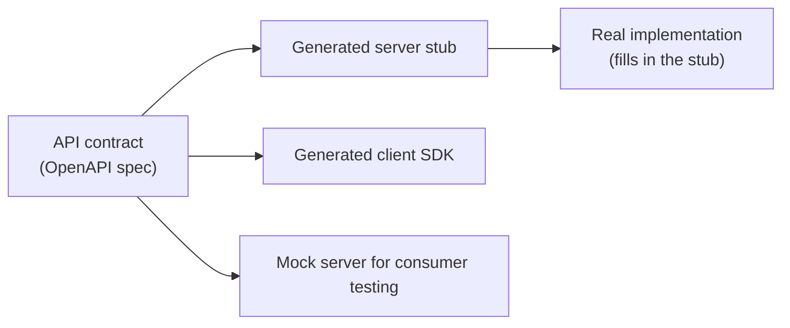

# API-first architecture

## Problem

Building an implementation first and deriving its API from whatever the code happens to expose
produces a contract shaped by internal implementation convenience, not by what a consumer actually
needs — and because nothing forced the contract to be considered explicitly, it tends to change
whenever the implementation does, breaking consumers who had no reason to expect an internal refactor
to affect them. API-first inverts that: the contract is designed and agreed on before implementation
starts, so the interface consumers depend on is a deliberate decision, not an accidental byproduct of
whatever the code ended up looking like.

## Key concepts

- **Contract-first, not code-first.** The API's shape (endpoints, request/response schemas, error
  formats) is specified — typically in a machine-readable format like OpenAPI — before the
  implementation is written, and that specification is what's reviewed, versioned, and agreed on
  with consumers, not the implementation's incidental surface.
- **The contract as the actual point of coordination between teams.** Once a contract is agreed on,
  a consuming team and a providing team can work in parallel — the consumer builds against the
  contract (often with a mock server generated from it), the provider implements to satisfy it,
  neither blocked waiting for the other's code to exist.
- **Breaking vs non-breaking changes need a definition, not a guess.** Adding an optional field is
  usually non-breaking; removing a field, changing a type, or making an optional field required is
  breaking — a contract-first workflow makes this distinction explicit and checkable (a schema diff)
  rather than something a consumer discovers by their integration failing after a deploy.
- **Generated code from the contract, not the reverse.** Client SDKs, server stubs, and validation
  logic can all be generated directly from the contract specification — this is what makes contract
  drift (the implementation silently diverging from the documented API) mechanically preventable
  instead of a documentation-discipline problem.

## Design



This diagram answers: *what does designing the contract first actually unlock, beyond documentation
existing earlier?* Everything downstream of the spec can be generated and start moving in parallel —
a consumer team can build and test against a mock server generated straight from the contract before
the provider has written a line of real implementation, and the provider's server stub is generated
from the same source, so there's no separate step where someone manually keeps the implementation in
sync with a description of it. Code-first architecture has no equivalent parallel starting point —
consumers wait for real endpoints to exist because there was never a machine-readable contract to
generate anything from.

## Trade-offs

- **API-first vs code-first.** API-first front-loads design effort (the contract has to be thought
  through, reviewed, and agreed on before any implementation code exists) and unlocks real
  parallelism between provider and consumer teams, at the cost of that upfront design taking real
  time and needing to be right before implementation starts — a wrong early guess still needs to be
  corrected, just earlier and more visibly than a code-first mistake would be. Code-first is faster
  to a first working version for a team with no other consumers yet, at the cost of the API shape
  being whatever the implementation happened to produce, with a full renegotiation needed the moment
  a second, external consumer arrives.
- **Generated code from the contract vs hand-written server/client code.** Generated code
  structurally can't drift from the contract — regenerating after a spec change is mechanical, not a
  discipline someone has to remember. Hand-written code gives more control over the specific
  implementation details (naming, structure) the generator's conventions might not match, at the
  real cost of manual synchronization between the contract and the code being a place drift can (and
  eventually will) creep in.

## Failure modes

- **A contract that exists but isn't the source of truth.** Writing an OpenAPI spec after the
  implementation, as documentation rather than as the thing implementation is generated from or
  validated against, gets exactly the drift problem API-first exists to prevent — the spec describes
  what the API was at the moment someone last updated it, not what it actually is.
- **No explicit breaking-change policy.** Without a clear, checkable definition of what counts as
  breaking, a change that looks small to the provider (tightening a field's validation, removing an
  undocumented-but-used field) can silently break every consumer depending on the old behavior, with
  no automated check catching it before it ships.
- **Designing the contract in isolation from real consumer needs.** A contract designed by the
  providing team alone, without the consuming team's actual use cases informing it, can end up just
  as implementation-convenience-shaped as a code-first API — API-first only delivers its real benefit
  when the contract design process genuinely includes the people who'll consume it.

## Operational considerations

Contract-diff checking (comparing a proposed spec change against the previously published version,
flagging breaking changes automatically) belongs in CI, not in manual review — a human reviewer can
miss a subtle breaking change (a newly required field, a narrowed enum) that a mechanical schema diff
catches every time.

## Example

A contract change caught as breaking by comparing schema versions, before it ever reaches a
consumer:

```yaml
# Before
properties:
  status: { type: string, enum: [PENDING, CONFIRMED, CANCELLED] }

# After — removing a value is breaking for any consumer that branches on it
properties:
  status: { type: string, enum: [CONFIRMED, CANCELLED] }
```

## Interview questions

- What does designing the contract before implementation actually unlock for provider and consumer
  teams working in parallel?
- Why does generating code from the contract prevent a class of drift that hand-written code doesn't?
- What makes a change "breaking," and why does that need an explicit, checkable definition rather
  than case-by-case judgment?
- What goes wrong if an API contract is written as documentation after implementation, rather than
  as the source implementation is generated from?

## Further experiments

Compare against [dependency management](dependency-management.md) — an API contract is, structurally,
the same idea as an interface owned by the stable side of a dependency: consumers depend on the
contract, never on the provider's specific implementation, so the provider is free to change its
internals as long as the contract holds.
