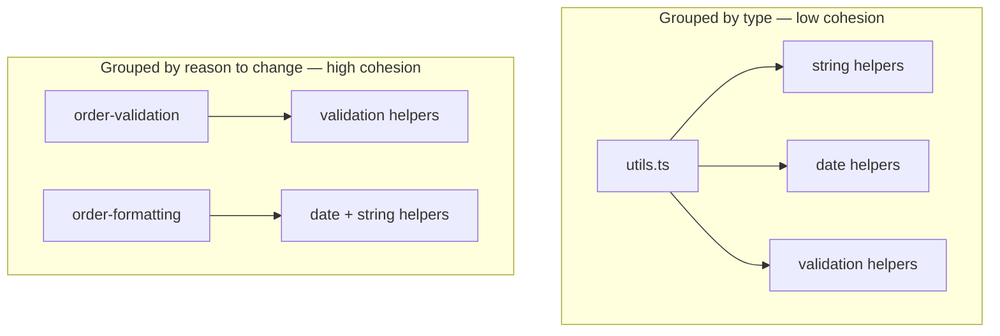

# Coupling and cohesion

## Problem

"Loose coupling, high cohesion" is repeated so often it stops meaning anything operationally.
Without a concrete way to detect either property, it becomes a justification applied after the fact
to whatever structure already exists, rather than a tool used to decide where a boundary should go
before the code is written.

## Key concepts

- **Coupling**: how much a change in one component forces a change in another. Types worth
  distinguishing:
  - *Data coupling* — components share data through a well-defined interface (a method signature).
    Cheapest form.
  - *Control coupling* — one component passes a flag that changes another's internal behavior
    (`process(data, mode="fast")`). The caller now needs to know the callee's internal branching.
  - *Common/shared coupling* — components share mutable state (a shared database table, a global).
    Most expensive: a change anywhere can silently break anywhere else.
  - *Temporal coupling* — correctness depends on call order that isn't expressed in any type or
    interface (`init()` must run before `process()`).
- **Cohesion**: whether the things grouped inside one module belong together. The useful kind is
  *functional cohesion* — everything in the module contributes to one well-defined task.
  *Temporal cohesion* — things grouped only because they happen at the same time ("startup tasks")
  — is a common trap: it looks organized but has no structural justification, so it accretes
  unrelated code indefinitely.

## Design

The two properties are not independent — they're the same design decision viewed from two sides.
Drawing a boundary around things with high functional cohesion (they change for the same reason)
automatically minimizes coupling at that boundary, because unrelated concerns aren't forced through
the same interface.

The practical heuristic I use: **group by what changes together, not by what looks similar.** A
"utils" module grouped by *type similarity* (all string helpers, all date helpers) has low
functional cohesion — a change to date formatting and a change to string parsing have nothing to do
with each other, but they now share a file and its coupling surface (imports, test setup, review
attention).



This diagram answers: *why does grouping by type produce worse coupling than grouping by change
reason?* Because in the "bad" grouping, a change to validation rules and a change to date display
format touch the same file for unrelated reasons — every change carries the review and regression
risk of the whole file, not just its own concern.

## Trade-offs

- **DRY vs coupling.** Deduplicating two pieces of similar-looking code into a shared function is
  only a win if they change for the *same* reason. If they're similar today but governed by
  different business rules, the shared abstraction becomes a coupling point that forces one caller's
  change to be negotiated against the other's — I'd rather tolerate two similar 10-line functions
  than one shared function with a branching parameter that started as "just one boolean flag."
- **Interface stability vs flexibility.** A narrow, stable interface minimizes coupling but can
  become a bottleneck if callers routinely need something just outside it — that's a signal the
  boundary itself is drawn wrong, not that the interface needs more parameters bolted on.

## Failure modes

- **Shared database as implicit coupling.** Two services with no direct dependency but a shared
  table are coupled anyway — a schema migration in one breaks the other, with no compiler or type
  system to catch it. This is the most common form of coupling that doesn't show up in a dependency
  graph.
- **Premature shared abstraction.** Extracting a shared interface after seeing two similar call
  sites, before a third exists to confirm the pattern, tends to couple both callers to a guess about
  their shared shape — one of them usually diverges later and the abstraction has to be broken open
  again.

## Operational considerations

Coupling that isn't visible in the import graph — shared databases, shared message schemas, shared
config — needs to be tracked deliberately (an architecture decision record, a schema registry) or it
only surfaces as an incident.

## Example

Control coupling versus data coupling in the same function:

```java
// Control coupling: caller must know the callee's internal branches
void process(Order order, String mode) {
    if (mode.equals("fast")) { /* ... */ } else { /* ... */ }
}

// Data coupling: caller passes what it means, callee decides how
void processImmediately(Order order) { /* ... */ }
void processWithValidation(Order order) { /* ... */ }
```

## Interview questions

- How would you detect hidden coupling in a codebase you've never seen before?
- Give an example where reducing duplication (DRY) made coupling worse, not better.
- What's the difference between coupling through an interface and coupling through shared state?
- How does a shared database between two "independent" services violate the point of splitting them?

## Further experiments

Git's own history is a coupling signal: files that are repeatedly modified in the same commit are
change-coupled even with zero import relationship between them — worth checking against
`git log --name-only` on a real repo before trusting a static dependency graph alone.
