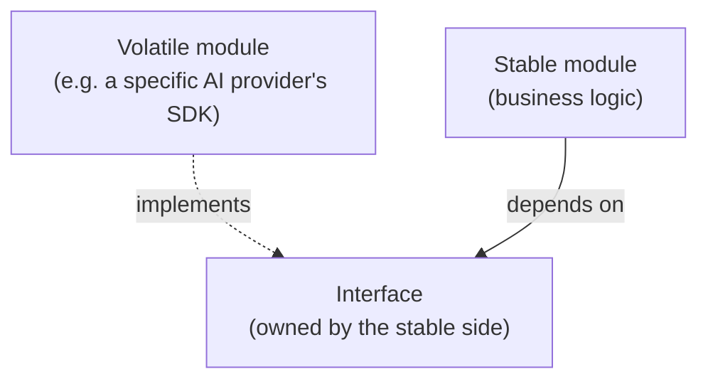

# Dependency management

## Problem

[Domain boundaries](domain-boundaries.md) draws lines around where code belongs. Dependency
management is about what's allowed to cross those lines, and in which direction — a boundary that
exists in the directory structure but has no enforced rule about which modules may depend on which
others degrades identically to having no boundary at all, just more slowly: one convenient shortcut
at a time, until every module depends on every other and the boundary is cosmetic.

## Key concepts

- **Dependency direction, not just dependency existence.** Two modules depending on each other is a
  different, worse problem than one depending on the other — a cyclic dependency means neither can be
  understood, tested, or changed independently, because understanding either fully requires
  understanding both. A one-directional dependency at least lets the depended-upon module be reasoned
  about in isolation.
- **Stable Dependencies Principle**: a module should depend only on modules more stable than itself
  (less likely to change), never the reverse. A frequently changing module depending on a rarely
  changing one is fine — the rare-changing module is a stable foundation. The reverse (something
  stable depending on something volatile) means every change to the volatile module risks rippling
  into code that was supposed to be a stable foundation.
- **Dependency inversion as the fix for an awkward direction.** When the "natural" dependency
  direction is wrong (a stable policy module needing something from a volatile implementation
  detail), introducing an interface owned by the stable side, implemented by the volatile side,
  inverts the compile-time dependency without changing the runtime call direction — the stable module
  depends only on its own interface, never on the volatile implementation.
- **Enforcement has to be mechanical, not conventional.** A dependency rule stated in documentation
  or a diagram, with nothing checking it at build time, is a convention every individual change can
  quietly violate without anyone noticing until the accumulated damage is a system where the
  documented rule and the actual code have diverged completely.

## Design



This diagram answers: *why does the interface belong to the stable side, not the volatile side that
actually implements it?* Because ownership of the interface determines which module's changes force
the other to change. If the volatile module owned the interface, the stable module would still
depend on something the volatile side controls — a redesign of the volatile module's own interface
would force the stable module to adapt, exactly the wrong-direction dependency this pattern exists
to eliminate. With the interface owned by the stable side, the volatile module has to conform to a
contract it doesn't control — its own internal churn (a new SDK version, a different provider
entirely) never needs to touch the stable module's code, only its own implementation of an interface
that hasn't changed.

## Trade-offs

- **Enforced boundaries (build-time checked) vs documented convention.** A build-time check (a
  module-boundary tool, an architecture-testing library) makes a violation a build failure, not a
  code-review judgment call — it costs setup effort and occasionally blocks a change that needs the
  rule itself reconsidered, but it's the only version that actually holds under time pressure, when a
  documented convention is exactly what gets skipped "just this once." A documented-only convention
  is cheaper to set up and more flexible in the moment, at the cost of degrading the first time
  someone reasonably decides a deadline matters more than the rule.
- **Dependency inversion vs accepting the awkward direction.** Introducing an interface to invert a
  dependency adds a layer of indirection — a real, if usually small, cost to trace through when
  reading the code. Accepting the natural (but wrong-direction) dependency is simpler to read
  directly, at the cost of coupling a stable module's fate to a volatile one's churn — worth
  inverting specifically when the volatile side's changes are frequent enough, or costly enough, that
  the indirection pays for itself in isolation gained.

## Failure modes

- **A cyclic dependency introduced for convenience.** Module A imports something from module B to
  avoid duplicating a small piece of logic, and B already depends on A for something else — neither
  module can be understood, tested, or reused independently anymore, and untangling the cycle later
  is far more expensive than the duplication it was meant to avoid.
- **A stable module depending on a volatile implementation detail.** Business logic that directly
  imports a specific provider's SDK types, instead of an interface it owns, means every change to
  that provider (a version bump, a provider swap) risks touching business logic that had no
  conceptual reason to know the provider existed.
- **A documented dependency rule with no enforcement.** The rule exists, is reasonable, and is
  routinely violated under deadline pressure because nothing catches the violation before it merges —
  the gap between the documented architecture and the real one grows invisibly until a reviewer
  eventually notices the diagram no longer describes the codebase.

## Operational considerations

A dependency-direction violation caught at build time names the exact two modules and the exact
disallowed edge — treat a red build here with the same seriousness as a failing test, not as a
formality to route around with a suppression, since the entire value of mechanical enforcement is
that it can't be silently ignored the way a documented rule can.

## Example

A stable module owning the interface a volatile implementation has to conform to, rather than
depending on the implementation directly:

```java
// Owned by the stable "billing" module
public interface PaymentProcessor {
    PaymentResult charge(Money amount, PaymentMethod method);
}

// The volatile module implements it — billing never imports Stripe's own SDK types
class StripePaymentProcessor implements PaymentProcessor { /* ... */ }
```

## Interview questions

- Why is a cyclic dependency worse than a one-directional dependency between two modules, not just
  differently structured?
- What does the Stable Dependencies Principle actually say about which direction a dependency should
  point, and why does violating it cause problems?
- Why does the interface in a dependency-inversion fix need to be owned by the stable side, not the
  volatile one?
- Why does an enforced, build-time dependency rule hold up better over time than a documented
  convention?

## Further experiments

`ai-engineering-lab`'s
[ADR-0002](https://github.com/Fragudev/ai-engineering-lab/blob/ec822bca9df3aee3dc6857705dcddd171a669211/docs/adr/0002-modular-monolith.md)
enforces module dependency direction at build time with Spring Modulith and ArchUnit rather than
relying on convention, specifically naming that boundary erosion "would be immediate and invisible"
if that enforcement were ever disabled to unblock a change — the exact failure mode this topic's
"enforcement has to be mechanical" concept describes.
