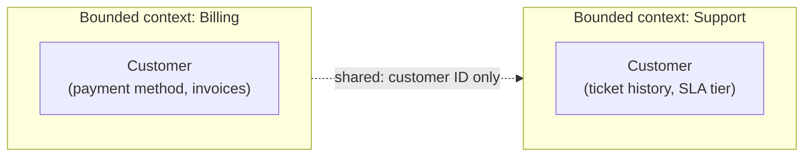

# Domain boundaries

## Problem

[Coupling and cohesion](coupling-and-cohesion.md) gives the mechanical vocabulary for detecting a
good boundary. This is the question one level up: where should a boundary go in the first place,
before there's code to measure coupling against? The common failure isn't drawing a boundary badly —
it's drawing it around a technical layer (controllers, services, repositories) or an organizational
accident (whichever team happened to build a feature first) instead of around a coherent business
concept, which produces a system where every real feature cuts across every boundary that exists,
making the boundaries structural in name only.

## Key concepts

- **Bounded context**: a boundary around a specific, coherent area of the business, inside which a
  term means exactly one thing. "Customer" in a billing context (an account with payment history) and
  "customer" in a support context (a person with a ticket history) are legitimately different
  concepts that happen to share an English word — a bounded context is what lets each model "customer"
  the way that context actually needs, instead of forcing one shared definition that satisfies
  neither well.
- **Ubiquitous language**: the specific vocabulary shared between domain experts and the code inside
  one bounded context — a class, field, or method name that matches how the business actually talks
  about the concept, not a generic technical term. When code and business conversation use different
  words for the same thing, translating between them on every change is a real, ongoing tax.
- **A shared model spanning contexts is the actual anti-pattern.** One "Customer" entity used by
  every part of the system, accumulating fields each context needs (billing fields, support fields,
  marketing fields) until it represents no single coherent concept, is what domain boundaries exist
  to prevent — not by having no shared entities, but by only sharing what's genuinely the same
  concept everywhere it's used.
- **Boundaries drawn around technical layers vs around business capability.** A "controllers,"
  "services," "repositories" split organizes code by technical role, not by what the code is *for* —
  every real business feature ends up touching all three layers, so the layering provides no
  isolation for the thing that actually changes together: a business capability.

## Design



This diagram answers: *if both contexts need "customer" data, why not just share one Customer
model?* Because the two contexts don't actually need the same information about a customer — Billing
never needs ticket history, Support never needs payment methods — and a shared model that carries
both is coupling two contexts that would otherwise be free to evolve independently. What genuinely
needs to be shared is much smaller than the full concept: an identifier, so each context can look up
its own view of "this customer" without either owning the other's data. The boundary isn't "no
sharing" — it's sharing exactly the minimal thing both sides actually need, and nothing more.

## Trade-offs

- **One shared domain model vs a bounded context per business area.** A single shared model is
  simpler to build initially — one definition of "customer," no duplication, no translation between
  contexts. It degrades as the system grows: every new context's needs get bolted onto the same
  entity until it represents no one context well and every change risks breaking an unrelated one.
  Separate bounded contexts avoid that degradation, at the cost of real duplication (each context
  models its own version of shared concepts) and an explicit mechanism (an ID, an event) for the
  minimal data that does need to cross the boundary.
- **Coarse-grained contexts vs fine-grained ones.** Too few, too-broad contexts recreate the shared-
  model problem inside a nominally bounded area — the boundary exists on paper but doesn't actually
  constrain what accumulates inside it. Too many, too-narrow contexts fragment a genuinely cohesive
  business concept across boundaries that constantly need to coordinate, recreating cross-context
  coupling for concerns that were never really separate. The signal (same one
  [coupling and cohesion](coupling-and-cohesion.md) names): does a real business change tend to stay
  inside one context, or does it routinely require touching several at once?

## Failure modes

- **A "God entity" that every part of the system extends.** The concrete symptom of skipped domain
  boundaries: one entity (Customer, Order, User) accumulating fields and responsibilities from every
  context that touches it, until no single context can change it without risking every other
  context's behavior.
- **Boundaries organized by technical layer instead of business capability.** Every real feature
  cutting across all the layers means the layering provides no actual isolation for what changes
  together — a change to "how orders are fulfilled" touches the controller layer, the service layer,
  and the repository layer identically, so nothing about the layering contained the change to one
  place.
- **Translating vocabulary on every conversation.** When the code's terms don't match how domain
  experts describe the business, every design discussion needs an informal translation step — a
  reliable sign the ubiquitous language has drifted from (or was never built from) how the business
  actually talks about the problem.

## Operational considerations

A recurring cross-context coordination need — two teams frequently needing to change code in each
other's bounded context for what looks like one business change — is worth treating as a signal the
boundary itself might be drawn wrong, not just a process problem to route around with more
communication.

## Example

Sharing only the minimal identifier across a boundary, not the full model:

```java
// Billing context
record CustomerId(UUID value) {}
class BillingCustomer { CustomerId id; PaymentMethod method; List<Invoice> invoices; }

// Support context — its own model, sharing only the identifier
class SupportCustomer { CustomerId id; List<Ticket> tickets; SlaTier tier; }
```

## Interview questions

- Why can the same business term ("customer") legitimately mean different things in different parts
  of a system, and why is that not a modeling mistake?
- What's the concrete failure mode of one shared domain entity used across every part of a system?
- Why does organizing code by technical layer (controller/service/repository) fail to isolate what
  actually changes together?
- How would you tell whether a bounded context is drawn at the right granularity?

## Further experiments

`ai-engineering-lab`'s
[ADR-0002](https://github.com/Fragudev/ai-engineering-lab/blob/ec822bca9df3aee3dc6857705dcddd171a669211/docs/adr/0002-modular-monolith.md)
draws its module boundaries around business capability (`ai-provider`, `rag`, `knowledge`, `tools`,
`workflow`) specifically instead of technical layers, naming a layered controller/service/repository
split as rejected for exactly the reason above — every feature would cut across all of them, leaving
nothing structurally isolated.
