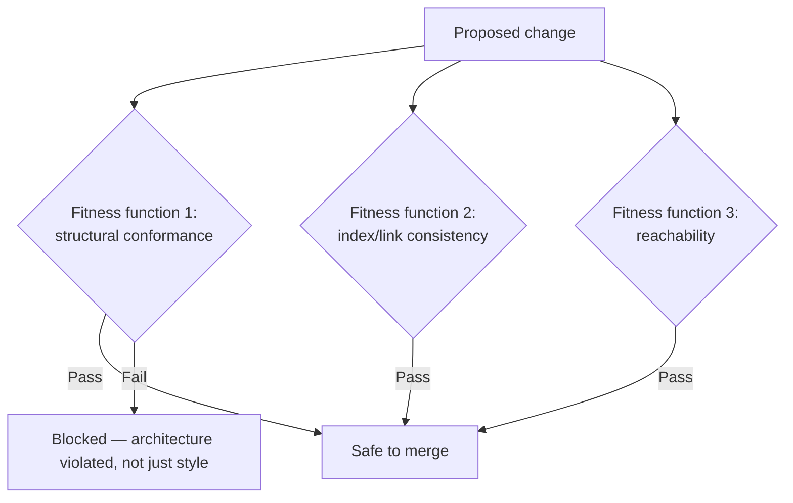

# Evolutionary architecture

## Problem

A big-design-upfront architecture treats correctness as something decided once, at the start, and
preserved by discipline afterward — which fails in practice because requirements, scale, and team
structure all keep changing after the design is "done," and nothing about a one-time design review
catches the moment reality diverges from what was decided. Evolutionary architecture treats
architectural fitness as an ongoing, continuously verified property instead of a point-in-time
decision — the real design problem is making "does the architecture still hold" a question the
system itself can answer mechanically, not one that only gets asked when someone happens to notice
something feels wrong.

## Key concepts

- **Fitness function**: an automated, objective test of some architectural property — module
  boundaries aren't violated, a specific latency budget holds, a security control is actually
  present — run continuously (in CI, or in production) rather than checked manually and
  occasionally. The term is deliberately borrowed from evolutionary biology: it's the mechanism that
  keeps the system "fit" for its environment as that environment changes.
- **Incremental, guided change vs a fixed blueprint.** Evolutionary architecture doesn't mean no
  design intent — it means the architecture is expected to change over time, and fitness functions
  are what guide that change safely: a proposed change either keeps every fitness function passing
  (safe to make) or breaks one (a signal to reconsider, not a hard stop by definition, but never a
  silent violation).
- **Different fitness functions for different properties, at different cadences.** Some properties
  need checking on every commit (module boundary violations, a broken link, a missing required
  section) — cheap, fast, run constantly. Others are meaningful only checked periodically or under
  specific conditions (a security scan, a load test) — the cadence should match how often the
  property can actually change and how expensive the check is, not be uniform across every fitness
  function.
- **A fitness function is only as good as its coverage.** A fitness function checks exactly what it
  checks — a suite that verifies structural conformance but never verifies content correctness (or
  vice versa) leaves the uncovered dimension free to drift with nothing to catch it, which is why a
  real evolutionary-architecture practice usually needs several fitness functions layered together,
  not one comprehensive check standing in for everything.

## Design



This diagram answers: *what actually distinguishes a fitness function from an ordinary test?* An
ordinary test checks that a specific piece of functionality behaves correctly; a fitness function
checks that a structural, architectural property holds regardless of which specific piece of
functionality changed — it's evaluated against every change, not written to verify one feature. The
diagram's three checks aren't testing what the change *does*; they're testing whether the change
kept the system's own stated shape intact, which is exactly the property big-design-upfront has no
mechanism to verify on an ongoing basis.

## Trade-offs

- **Investing in fitness functions vs relying on manual review.** Automated fitness functions catch
  every violation, every time, without depending on a reviewer noticing — real setup cost, and each
  one is its own thing to maintain as the system's real architecture legitimately evolves. Manual
  review costs less to set up and adapts instantly to a design intentionally changing, at the cost of
  being exactly as reliable as the reviewer's attention that day — which, across enough changes and
  reviewers, reliably misses things.
- **Broad, coarse fitness functions vs many narrow, specific ones.** A few broad checks are simpler
  to maintain but tend to have blind spots — properties the broad check wasn't specifically built to
  catch slip through it. Many narrow, specific fitness functions catch more precisely, at the cost of
  more individual checks to write, maintain, and keep from becoming a slow, unwieldy suite that
  itself becomes friction on every change.

## Failure modes

- **A fitness function nobody looks at when it fails.** The mechanical check exists and correctly
  fails on a real violation, but if the failure is routinely bypassed or ignored under deadline
  pressure, the fitness function provides no more protection than not having it — the value is
  entirely in the failure actually blocking the change, not just existing.
- **Fitness functions that only check what was easy to check.** A suite that verifies structural
  conformance because that's mechanically simple, while never verifying something harder to check
  automatically (semantic correctness, actual architectural intent), gives false confidence that
  "the checks pass" means the architecture is sound, when it only means the checked dimension is
  sound.
- **Treating a fitness function failure as a hard stop rather than a signal to reconsider.** Some
  failures genuinely mean "revert this change"; others mean "the fitness function itself needs to
  evolve, because the architecture legitimately changed on purpose" — conflating the two, and never
  revisiting a fitness function that's become outdated, turns evolutionary architecture back into a
  fixed blueprint wearing automation.

## Operational considerations

Fitness function failure needs to name the specific violation precisely — which file, which rule,
which boundary — the same way a good test failure does, not just "architecture check failed." A
vague failure trains people to treat the whole suite as noise to work around rather than a specific,
actionable signal about what actually broke.

## Example

This repository is itself a small, real example: `scripts/verify-content.js` is a set of fitness
functions run on every push, checking structural properties (template conformance, index
completeness, link resolution, reachability from the root) that have nothing to do with any single
topic's content and everything to do with whether the repository's own stated architecture — one
file per topic, indexed, reachable — still holds after a given change:

```bash
node scripts/verify-content.js
# FAIL: ai-engineering/foo.md: missing or out-of-order section "## Trade-offs"
# FAIL: ai-engineering/README.md does not link to ai-engineering/foo.md (index out of sync)
```

## Interview questions

- What specifically distinguishes a fitness function from an ordinary functional test?
- Why does cadence matter for a fitness function — why shouldn't every check run on every single
  commit?
- What's the risk of a fitness function that exists and correctly fails, but whose failures are
  routinely bypassed?
- How would you decide whether a fitness function's own failure means "revert the change" versus
  "the fitness function needs to be updated"?

## Further experiments

This repository's own `scripts/verify-content.js`, described in
[CONTRIBUTING.md](../CONTRIBUTING.md#automated-checks), is a working, inspectable example: three
layered fitness functions (template/naming conformance, index/link consistency, root reachability)
enforcing this repo's own stated structural architecture (see
[ADR-0001](../adr/0001-repository-structure.md)) on every push, with no manual review step required
to catch a structural violation.
