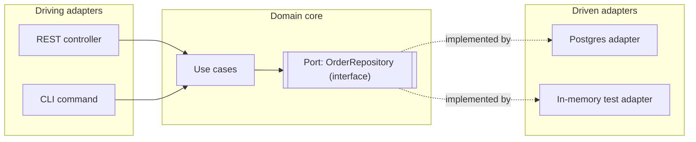

# Hexagonal / clean architecture

## Problem

Business logic written directly against a framework's classes (an ORM entity, a web controller
base class, an SDK client) works fine until you need to test it without that framework, or swap the
infrastructure it depends on. At that point every test needs a database, every unit test is
actually an integration test, and the domain rules are no longer readable independently of the
plumbing they're wired into.

## Key concepts

- **Ports**: interfaces the domain defines and owns — what it needs from the outside world
  (`OrderRepository`) or what it offers to it (`PlaceOrderUseCase`).
- **Adapters**: implementations of ports that talk to something concrete — a Postgres repository
  adapter, a REST controller adapter, a Kafka consumer adapter.
- **Driving (primary) adapters** call into the domain (a controller invoking a use case). **Driven
  (secondary) adapters** are called by the domain (a repository implementation).
- **Dependency inversion**: the domain defines the port interface; the adapter depends on the
  domain's interface, never the reverse. Source-code dependencies point inward, toward the domain,
  regardless of which direction control flows at runtime.

## Design



This diagram answers: *what has to change to swap Postgres for something else, or to test the
domain without a database at all?* Only the box on the right — a new implementation of
`OrderRepository`. The use case, the port interface, and every driving adapter are untouched, and
the in-memory adapter used in tests is not a mock framework standing in for the real one, it's a
real, small implementation of the same interface.

The domain core has zero imports from infrastructure libraries — no ORM annotations, no HTTP
framework types, no message broker client. If a domain class needs an `@Entity` annotation to
function, the boundary has already been crossed.

## Trade-offs

- **Indirection cost vs testability.** Every port adds an interface and at least one adapter class
  for what might otherwise be a direct call. For a small CRUD service with no meaningful business
  rules — validate and write to a table — this is pure overhead: there's no domain logic complex
  enough to be worth isolating, and the extra layer just adds files to navigate.
- **Where the payoff shows up**: when domain logic is genuinely non-trivial (pricing rules, workflow
  state machines, anything with edge cases worth unit-testing in isolation) or when the
  infrastructure is expected to change (swapping a vendor, adding a second delivery channel for the
  same use case). The signal I use: if you can describe the business rule without mentioning a
  database, a queue, or an HTTP verb, it belongs in the domain core, and that description not
  depending on infrastructure is exactly what hexagonal architecture is for.
- **Anemic domain risk.** Hexagonal architecture describes where logic *should* live, not that it
  will. It's possible to build a perfectly layered hexagon around a domain that's still anemic — all
  getters and setters, with the actual business rules living in a service class that just
  orchestrates calls. The architecture doesn't prevent this; only discipline about where behavior
  goes does.

## Failure modes

- **Leaky ports**: a port interface whose method signatures expose an infrastructure concept (an
  `OrderRepository.findByQuery(SqlSpecification spec)`) has technically satisfied the pattern's
  letter while violating its purpose — the domain now depends on the shape of a query language.
- **One port per method**: over-fragmenting into a port per operation instead of one per cohesive
  responsibility multiplies files without adding isolation — the goal is a meaningful seam, not a
  count of interfaces.
- **Over-applying it to simple services**: forcing this structure onto something with no real domain
  logic produces boilerplate that a reviewer has to navigate for no isolation benefit — see the
  trade-off above.

## Operational considerations

The domain core's test suite should never need a running database, broker, or HTTP server — that's
the operational signal the boundary is actually held: if a "unit test" of a use case needs
Testcontainers, either it's not a unit test or the boundary has already leaked.

## Example

```java
// Domain owns the port — no infrastructure import here
public interface OrderRepository {
    Optional<Order> findById(OrderId id);
    void save(Order order);
}

// Driven adapter depends on the domain's interface, not the other way round
@Repository
class PostgresOrderRepository implements OrderRepository {
    // JPA/JDBC details live here, entirely absent from the domain
}
```

## Interview questions

- What's the actual test for whether something belongs in the domain core versus an adapter?
- When would hexagonal architecture be the wrong choice for a service?
- How does dependency inversion here differ from just "using interfaces"?
- How would you unit-test a use case that depends on a repository port, without a real database?

## Further experiments

Compare against a service in `ai-engineering-lab` that has genuine domain complexity (retrieval
fusion, tool-call validation) versus one that's closer to CRUD — the difference in how much the
hexagonal structure earns its keep should be visible in the test suite shape alone.
