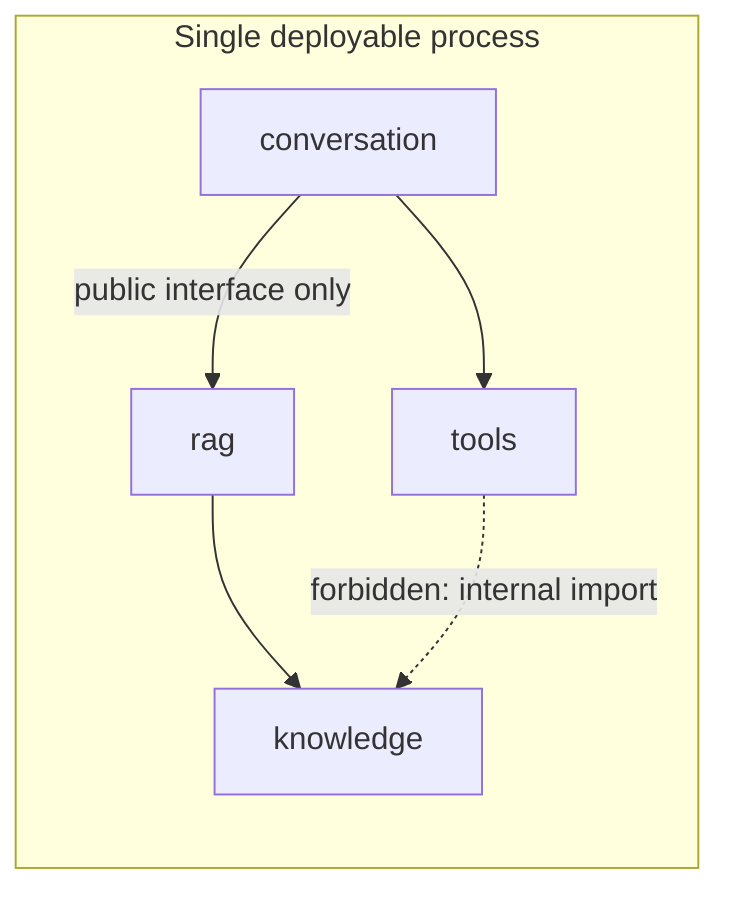

# Modular monolith vs microservices

## Problem

Teams reach for microservices by default, often before they have the organizational or operational
problem microservices solve. Others stay on an unstructured monolith long after module boundaries
have eroded, because nobody had to make them explicit. Both mistakes come from treating this as a
binary technology choice instead of asking what specific constraint — organizational, scaling, or
deployment — is actually being relieved.

## Key concepts

- **Deployability unit**: what ships together, and what can change without redeploying everything
  else.
- **Conway's Law**: system boundaries tend to mirror communication boundaries between the teams
  that build them, whether or not that's designed on purpose.
- **Boundary enforcement**: compile-time (a module system, a build tool that forbids illegal
  imports) versus runtime (a network call, a process boundary). A microservice enforces its
  boundary by construction; a monolith module only does if something makes it do so.
- **Blast radius**: how much of the system a single bug, deploy, or outage can take down.
- **Independent scaling**: whether a component's resource needs diverge enough from the rest of the
  system to justify scaling it separately.

## Design

A **modular monolith** is one deployable process internally divided into modules with enforced
boundaries — a module cannot reach into another module's internals, only through a declared public
interface. `ai-engineering-lab` uses Spring Modulith for exactly this: module boundaries are
verified at test time, so an illegal import fails the build, not a code review.



This diagram answers: *what actually differs between a modular monolith and "just a monolith"?* The
answer is the forbidden edge — the build fails if `tools` reaches into `knowledge`'s internals,
which is the same guarantee a network boundary gives you, without paying for the network.

A **microservices** architecture makes that boundary a process and network boundary instead of a
compile-time one: each service has its own deployment pipeline, its own datastore (usually), and
communicates over the network with all the failure modes that implies.

## Trade-offs

I default to a modular monolith and treat microservices as something you migrate *into* when a
concrete signal shows up, not something you start with:

- **Team size and ownership.** Below roughly 8–10 engineers, one deployable process with enforced
  module boundaries gives almost all the organizational benefit of microservices — clear
  ownership, no accidental coupling — without the operational tax. Past that, when multiple teams
  need to deploy the same area of the system on independent schedules without blocking each other,
  the process boundary starts paying for itself.
- **Divergent scaling needs.** If one component's load profile is 100x another's (a heavy async
  ingestion pipeline next to a light read API), splitting it out lets it scale — and fail —
  independently. If load is roughly uniform across the system, this signal doesn't apply.
- **Independent deploy cadence.** If one part of the system needs to ship multiple times a day
  while another is stable for months, coupling their deploys in one process is a real cost.
- **Polyglot requirement.** A genuine need for a different runtime (a Rust component for a
  performance-critical path) is a hard constraint a monolith can't satisfy at all.

None of these are "the system got big." Size alone is not a splitting signal — a large, well-bounded
monolith is easier to operate than a large number of poorly-bounded services.

## Failure modes

- **Distributed monolith**: services are split by process but still share a database, deploy in
  lockstep because of synchronous call chains, and can't be tested or released independently. This
  is strictly worse than either alternative — all the network latency and partial-failure surface
  of microservices, none of the independence.
- **Unenforced modular monolith**: module boundaries exist as a folder convention but nothing stops
  a developer from importing across them under deadline pressure. Without a mechanical check (a
  module system, an ArchUnit/Spring Modulith rule), boundaries decay to a big ball of mud within a
  few quarters.
- **Splitting along the wrong axis**: services split by technical layer (a "database service", an
  "API service") instead of by business capability create the maximum number of cross-service calls
  for the minimum organizational benefit.

## Operational considerations

A modular monolith has one deployment pipeline, one process to observe, and one failure domain to
reason about — on-call surface is smaller by construction. Microservices trade that for the ability
to fail, scale, and deploy independently, at the cost of needing distributed tracing, service
discovery, and a story for partial failure (see [`resilience/`](../resilience/README.md)) from day
one, not as an afterthought.

## Example

A Spring Modulith boundary check that fails the build on illegal cross-module access:

```java
@ApplicationModuleTest
class ModularityTests {
    @Test
    void verifiesModuleBoundaries() {
        ApplicationModules.of(Application.class).verify();
    }
}
```

## Interview questions

- When would you split a monolith into microservices? What's the first service you'd extract, and why?
- What signal, specifically, would tell you a modular monolith has stopped working?
- How do you prevent a microservices migration from becoming a distributed monolith?
- What does Conway's Law imply for a team that hasn't decided on an architecture yet?

## Further experiments

`ai-engineering-lab`'s [ADR on modular monolith vs microservices](https://github.com/Fragudev/ai-engineering-lab)
documents this decision made for a real system — worth comparing its stated signals against the
ones above.
