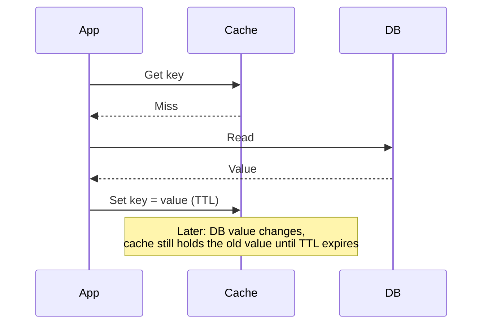

# Caching

## Problem

A cache trades correctness risk for speed — it's a second copy of data that can, by construction,
drift from the source of truth the moment the source changes. Every caching decision is really a
decision about how much staleness is acceptable for a given piece of data, and the classic quote
("there are only two hard things in computer science: cache invalidation and naming things") is a
joke precisely because invalidation is genuinely hard to get right, not because it's obscure —
getting it wrong doesn't crash anything, it just quietly serves wrong answers.

## Key concepts

- **Cache-aside (lazy loading)**: the application checks the cache first; on a miss, it reads from
  the source of truth and populates the cache for next time. Simple and only caches what's actually
  requested, at the cost of every cache miss paying full read latency, including the very first
  request for any given key.
- **Write-through**: every write goes to the cache and the source of truth together, synchronously —
  the cache is never stale relative to the last write, at the cost of every write paying the latency
  of updating both.
- **Write-behind (write-back)**: a write updates the cache immediately and the source of truth
  asynchronously, shortly after — fast writes, at the cost of a real window where the source of truth
  is behind the cache, and a real risk of losing the write entirely if the cache fails before the
  asynchronous write completes.
- **TTL vs explicit invalidation.** A time-to-live lets staleness bound itself automatically — no
  invalidation logic needed, at the cost of serving stale data for up to the full TTL even when the
  source changed a moment after the cache was populated. Explicit invalidation (deleting or updating
  the cache entry exactly when the source changes) keeps the cache fresher, at the cost of needing
  every write path that touches the underlying data to remember to invalidate the right keys — a
  real, easy-to-miss coupling between write paths and cache logic.

## Design



This diagram answers: *what specifically creates the staleness window a cache introduces, mechanically?*
The gap between when the cache was populated and when the underlying data actually changed — nothing
in the cache-aside pattern itself notices that change, because the cache was never told about it;
it only expires on its own schedule (the TTL) or on an explicit invalidation the write path has to
remember to trigger. This is the concrete mechanism behind "cache invalidation is hard": the cache
and the source of truth aren't linked by anything automatic, only by whatever discipline the
write path maintains to keep them in sync.

## Trade-offs

- **Cache-aside vs write-through.** Cache-aside only caches what's actually read, keeping the cache
  populated with genuinely requested data, but every miss (including the first request for any key)
  pays full latency. Write-through guarantees the cache is never behind the last write, at the cost
  of every write paying the latency of updating two places instead of one — worth it specifically
  when read-after-write freshness matters more than write latency.
- **TTL vs explicit invalidation.** A TTL is simple and self-healing — no invalidation logic can be
  missed because there's none to miss — at the cost of accepting up to a full TTL window of potential
  staleness even for data that changes rarely. Explicit invalidation minimizes staleness but adds a
  real coupling: every write path touching cached data now has an additional responsibility (find and
  invalidate the right cache keys), and a write path that's added later without that responsibility
  in mind is a silent staleness bug waiting to happen. I'd default to TTL alone and add explicit
  invalidation only for the specific keys where staleness has a named cost — every key given
  explicit invalidation is a permanent obligation on every write path that touches it, and paying
  that on keys where a short stale window was always acceptable buys nothing.
- **Caching computed/aggregated results vs raw rows.** Caching a raw row is simple to invalidate (one
  write, one cache key). Caching a computed or aggregated result (a count, a joined view) is more
  valuable per cache hit but harder to invalidate correctly, since the computation can depend on
  several underlying rows — any of which changing should, in principle, invalidate the cached result,
  and tracking that dependency correctly is real design effort.

## Failure modes

- **Cache stampede.** A popular key expires, and many concurrent requests all miss simultaneously,
  all fall through to the source of truth at once — the exact overload event the cache existed to
  prevent, triggered by the cache's own expiration. Mitigated by staggering TTLs (jitter, the same
  idea as [retry jitter](../resilience/timeout-and-retry-budgets.md)) or by having only one request
  repopulate the cache while others wait, rather than every concurrent miss hitting the source
  independently.
- **A write path that forgets to invalidate.** Under explicit invalidation, any write path added
  later without updating the invalidation logic silently serves stale data from that point forward —
  this doesn't error, it just quietly diverges from the source of truth with no signal anything is
  wrong.
- **Caching data whose staleness cost was never actually assessed.** Applying a TTL uniformly across
  all cached data, without asking whether a given piece of data's staleness has real user or business
  cost, risks caching something (an account balance, a permission grant) where a stale read has a
  cost far higher than the latency the cache was saving.

## Operational considerations

Cache hit rate alone isn't sufficient to monitor — track it alongside the source-of-truth's actual
load, since a caching layer that's technically hitting well but still leaving the source under heavy
load (because the cached keys aren't the ones actually driving traffic) isn't providing the
protection its hit-rate number suggests.

## Example

Preventing a cache stampede by having a single request repopulate the cache while others wait for
it, rather than every concurrent miss hitting the source independently:

```java
CompletableFuture<Value> future = inFlightLoads.computeIfAbsent(key,
    k -> CompletableFuture.supplyAsync(() -> loadFromSourceOfTruth(k)));
Value value = future.get(); // Concurrent callers for the same key share this one load.
cache.put(key, value, ttlWithJitter());
```

## Interview questions

- What mechanically creates a cache's staleness window, and why doesn't the cache "know" when the
  source of truth changes?
- What's the trade-off between cache-aside and write-through, in terms of read versus write latency?
- What is a cache stampede, and what specifically triggers it?
- How would you decide whether a given piece of cached data needs explicit invalidation instead of
  relying on a TTL alone?

## Further experiments

Compare against [timeout and retry budgets](../resilience/timeout-and-retry-budgets.md) — jitter as
a mitigation for synchronized retry spikes is the identical idea to jittering cache TTLs to avoid a
stampede: many independent actors (retries, or cache expirations) hitting the same resource at
exactly the same moment is the shared failure shape both mitigations exist to break up.
