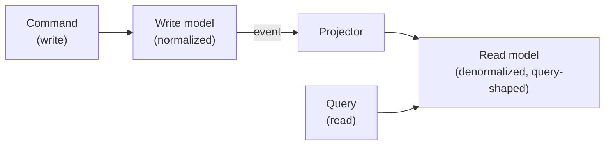

# Read/write models (CQRS)

## Problem

A single data model serving both writes and reads works fine until the two have genuinely different
needs — writes want a normalized shape that enforces invariants cheaply; reads want a shape that
answers a specific query fast, often denormalized, often aggregated across entities a normalized
write model spreads across many tables. Forcing one model to serve both means every read pays the
cost of joins and computation the write model was never optimized for, or every write pays the cost
of maintaining a shape it doesn't itself need — CQRS is the pattern for admitting these are different
problems and giving each its own model, at the cost of a new problem neither model alone had: keeping
two representations of the same data in sync.

## Key concepts

- **Command vs query separation.** A command changes state and returns nothing meaningful about the
  data's current shape (success/failure, an ID); a query reads state and changes nothing. CQRS takes
  this further than the usual command-query-separation principle in code — it splits the *data
  model*, not just the method signatures, so each side can be shaped, indexed, and scaled
  independently.
- **Write model optimized for correctness, read model optimized for the query.** The write model
  stays normalized, enforcing invariants (foreign keys, constraints) cheaply because it isn't
  carrying denormalized copies. The read model is shaped directly around what a specific query needs
  to answer fast — often pre-joined, pre-aggregated, sometimes duplicated across several read models
  if different queries need different shapes of the same underlying data.
- **Projection**: the mechanism that keeps the read model in sync with the write model — typically
  an event-driven process that reacts to write-model changes and updates the read model accordingly,
  the same mechanism [event-driven architecture](../distributed-systems/event-driven-architecture.md)
  uses to propagate state changes generally.
- **The read model is eventually consistent with the write model, by construction.** Because
  projection is asynchronous, there's always a real window where a fresh write hasn't yet reached the
  read model a query hits — this is the direct data-modeling cost of the pattern, not an
  implementation detail to eliminate, and it needs the same honest treatment as any other
  [eventual consistency](../distributed-systems/eventual-consistency.md) guarantee.

## Design



This diagram answers: *why can't the query just read the write model directly, skipping the
projection step entirely?* Because the write model's shape (normalized, invariant-enforcing) is
usually the wrong shape to query efficiently — answering the same question against it would mean
joins and aggregation on every read, exactly the cost CQRS exists to move out of the read path. The
projector is what pays that cost once, at write time (or asynchronously, shortly after), so every
subsequent read is cheap — the trade is real: the read model is only as fresh as the last projection
run, which is the eventual-consistency window every CQRS system has to design around, not avoid.

## Trade-offs

- **CQRS vs a single shared model.** A single model is simpler — one schema, one place data lives, no
  projection to build or keep correct. CQRS adds real complexity (a second model, a projection
  mechanism, an eventual-consistency window) in exchange for each side being optimized for its own
  concern instead of compromising for the other. The signal: does the read pattern's cost against
  the write model's natural shape (joins, aggregation, cross-entity queries) actually show up as a
  measured problem? CQRS is a response to a demonstrated cost, not a default architecture to reach
  for.
- **One read model vs several, each shaped for a specific query.** A single read model amortizes
  projection cost across every query it serves, but is a compromise the moment two queries want
  meaningfully different shapes of the same data. Multiple read models, each purpose-built for one
  query pattern, avoid that compromise at the cost of more projection logic to build and more copies
  of the data to keep in sync — worth it once a single read model's compromises are measurably
  costing real query performance for one of its consumers.

## Failure modes

- **Building CQRS before measuring that the single-model cost is real.** Splitting into two models
  and building a projection mechanism for a query pattern that a well-indexed single model would have
  served fine is real, avoidable complexity paid for a problem that didn't exist yet.
- **No visibility into projection lag.** A read model that's stale relative to the write model, with
  nothing tracking or surfacing how stale, means a user (or an internal caller) hitting the read
  model right after a write has no way to know whether what they're seeing reflects their own recent
  change — the same read-your-writes concern [replication](../distributed-systems/replication.md)
  covers for replica lag, applying identically here.
- **Treating the read model as authoritative.** Writing directly to a read model (a shortcut under
  deadline pressure) bypasses the write model's invariant enforcement entirely — the read model was
  never built to enforce correctness, only to answer queries fast, and the moment it's written to
  directly, that assumption silently breaks for every consumer relying on it staying merely a
  derived, disposable projection.

## Operational considerations

Projection lag (time between a write-model change and the corresponding read-model update) needs to
be a monitored, first-class metric — it's the number that tells whether "eventually consistent" is
holding to a reasonable bound or has quietly grown into a real staleness problem nobody's watching.

## Example

A projector reacting to a write-model event and updating a purpose-built read model:

```java
@EventListener
void onOrderCreated(OrderCreatedEvent event) {
    orderSummaryReadModel.upsert(new OrderSummary(
        event.orderId(), event.customerName(), event.totalAmount(), event.createdAt()));
    // Pre-joined, pre-computed — the read model never runs this join at query time.
}
```

## Interview questions

- Why does CQRS split the data model itself, not just the code path, between commands and queries?
- What real cost does a single shared model impose that CQRS exists to remove, and how would you
  measure whether that cost is actually significant enough to justify the pattern?
- Why is the read model's eventual consistency with the write model a designed-in property, not a
  bug to eliminate?
- What goes wrong if a read model is ever written to directly instead of only through projection?

## Further experiments

Compare against [event-driven architecture](../distributed-systems/event-driven-architecture.md)
(the mechanism a projector typically uses to react to write-model changes) and
[eventual consistency](../distributed-systems/eventual-consistency.md) (the precise guarantee a read
model's staleness needs to be stated against, the same way a saga's convergence does).
