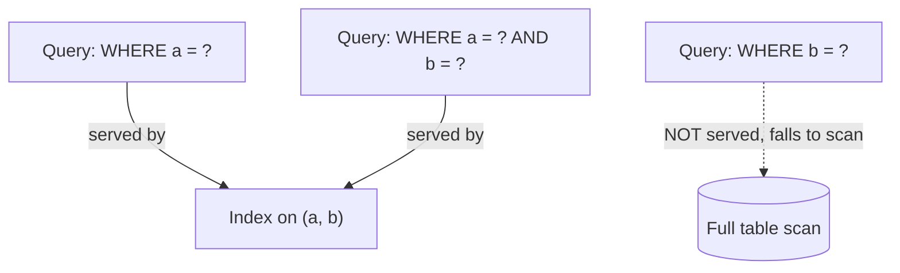

# Indexing trade-offs

## Problem

An index turns a slow scan into a fast lookup for the queries it supports — but it isn't free, and
"just add an index" isn't a universally safe answer. Every index adds write cost and storage, and an
index that doesn't match how the table is actually queried can sit there consuming both without ever
being used.

## Key concepts

- **B-tree index**: the default for most relational databases — a sorted structure supporting
  equality, range queries (`>`, `<`, `BETWEEN`), and ordered scans (`ORDER BY`) in
  `O(log n)`. The right default for most columns.
- **Hash index**: supports equality lookups only, no range queries, but with `O(1)` average lookup
  instead of `O(log n)` — a narrower tool that only pays off when the query pattern is exclusively
  equality and the table is large enough for the difference to matter.
- **Composite (multi-column) index**: an index on `(a, b)` supports queries filtering on `a` alone or
  on `a` and `b` together, but not on `b` alone — **column order in the index definition determines
  which query patterns it actually serves.**
- **Covering index**: includes every column a query needs, so the database can answer entirely from
  the index without a second lookup into the table's main storage (no "table access by row ID").
- **Write amplification**: every index on a table must be updated on every `INSERT`/`UPDATE`/`DELETE`
  affecting an indexed column — a table with five indexes pays roughly five times the index-maintenance
  cost per write compared to one with a single index.

## Design



This diagram answers: *why does an index on `(a, b)` not help a query that filters only on `b`?* A
composite index is a single sorted structure keyed first by `a`, then by `b` within each `a` value —
it's sorted the way a phone book is sorted by last name then first name: searching by first name
alone still means scanning the whole book, because the sort order never grouped entries by first
name at all. The fix isn't "add more indexes" reflexively — it's understanding that a composite
index's leading column is a hard constraint on which queries it serves, and adding a *separate*
index on `b` alone (with its own write cost) is the actual fix if `b`-only queries are common.

## Trade-offs

- **Read speed vs write cost.** Every index added speeds up the reads it matches and slows down every
  write that touches its columns. On a read-heavy table (a reporting table, a lookup table like the
  URL shortener's `links` table) this trade is easy — index generously. On a write-heavy table
  (an event-ingestion table, an audit log), each additional index directly reduces sustainable write
  throughput, and the signal to reach for is: does a query on this column run often enough, and is it
  slow enough without the index, to be worth the write cost on every single insert?
- **Composite index column order.** Given queries that sometimes filter on `a` alone and sometimes on
  `a AND b`, one index on `(a, b)` serves both. Given queries that filter on `a` alone and *separately*
  on `b` alone, two single-column indexes are needed — a single composite index can't serve both
  independent-column patterns no matter which order its columns are declared in.
- **Covering index vs storage cost.** A covering index avoids a second table lookup per row, which
  matters most for high-frequency queries returning many rows, but duplicates the covered columns'
  data into the index — worth it for a query that runs constantly, wasteful for one that runs rarely.

## Failure modes

- **Unused indexes silently taxing every write.** An index added for a query pattern that changed or
  was removed keeps paying its write cost indefinitely with zero read benefit — most databases expose
  per-index usage statistics (e.g., PostgreSQL's `pg_stat_user_indexes`), and an unused index found
  there is a straightforward, low-risk deletion.
- **Indexing every column "just in case."** Multiplies write cost across every index for a benefit
  that only a fraction of those indexes ever realize — the discipline should be adding an index in
  response to an observed slow query pattern, not preemptively per column.
- **Wrong composite column order for the actual query mix.** An index on `(created_at, user_id)` when
  most queries filter by `user_id` alone (and sometimes also by date range) serves almost none of
  them efficiently — the leading column should be the one most commonly used alone or as the primary
  filter, not the one that happens to be listed first in a schema diagram.

## Operational considerations

Query plan review (`EXPLAIN ANALYZE` or equivalent) on any query that shows up in a slow-query log is
the concrete way to know whether an index would actually help versus whether the query pattern itself
needs to change — adding an index without confirming the planner would use it for that query is a
guess, not a fix.

## Example

Composite index column order matched to the actual query:

```sql
-- Query pattern: filter by tenant_id always, sometimes also by status
CREATE INDEX idx_orders_tenant_status ON orders (tenant_id, status);

-- Serves: WHERE tenant_id = ?
-- Serves: WHERE tenant_id = ? AND status = ?
-- Does NOT serve: WHERE status = ? (alone) -- needs a separate index
```

## Interview questions

- Why doesn't a composite index on `(a, b)` help a query filtering only on `b`?
- How would you decide whether an index is worth its write cost on a high-throughput write table?
- What's a covering index, and when does it stop being worth the extra storage?
- How would you find and safely remove an unused index in production?

## Further experiments

The [URL shortener](../system-design/url-shortener.md)'s `links` table is a clean example of the
easy case — read-heavy, single-column primary-key lookups only, where indexing generously has almost
no downside; contrast against a write-heavy ingestion table to see the trade-off actually bite.
