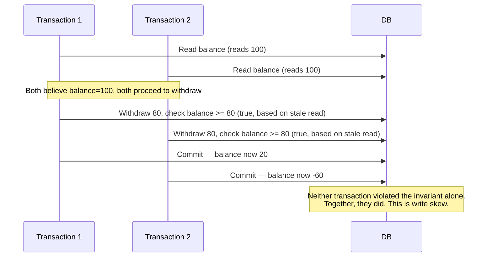

# Isolation levels

## Problem

Running transactions concurrently is necessary for throughput, but it opens the door to anomalies
that don't exist when transactions run one at a time: one transaction can see another's
in-progress, uncommitted, or inconsistent state. Isolation levels are a menu of how much of that
interference a database is allowed to expose, and "we use the default" is rarely an informed choice
— most relational databases default to something weaker than full isolation, silently.

## Key concepts

- **Dirty read**: reading another transaction's uncommitted write. Prevented by every isolation
  level above the weakest (`READ UNCOMMITTED`), which is why it's rarely seen in practice.
- **Non-repeatable read**: reading the same row twice within one transaction and getting different
  values, because another transaction committed a change in between.
- **Phantom read**: re-running the same range query twice within one transaction and getting a
  different *set* of rows, because another transaction inserted or deleted a matching row in
  between.
- **Write skew**: two transactions each read overlapping data, each make a decision based on what
  they read, and each commit a write that's individually valid but jointly violates an invariant
  neither transaction's own writes would have violated alone. The classic case a naive reading of
  "serializable prevents write skew" gets wrong is that even `SNAPSHOT ISOLATION` (which prevents
  the three anomalies above) does not prevent write skew — only true serializability does.
- **Standard levels** (ANSI SQL, weakest to strongest): `READ UNCOMMITTED`, `READ COMMITTED`,
  `REPEATABLE READ`, `SERIALIZABLE`. Not every database implements all four as distinct behaviors —
  PostgreSQL's `REPEATABLE READ` is actually snapshot isolation, which is stronger than the ANSI
  standard requires for that name.

## Design



This diagram answers: *why does "each transaction was individually correct" not guarantee the
database ends up in a valid state?* Both transactions read a consistent snapshot and made a locally
correct decision from it — the invariant violation only exists across the two transactions' combined
effect, which is exactly the class of bug that non-serializable isolation levels, including snapshot
isolation, do not protect against. Preventing this specific scenario requires either true
`SERIALIZABLE` isolation or an explicit application-level lock on the balance check.

## Trade-offs

- **Weaker isolation vs throughput.** Every step up in isolation level trades throughput for
  correctness guarantees — `READ COMMITTED` (a common default) allows non-repeatable reads and
  phantoms but has far less locking/validation overhead than `SERIALIZABLE`. The signal I use:
  default to `READ COMMITTED` for most application code, and reach for `SERIALIZABLE` (or explicit
  locking) only for the specific transactions where an invariant spans multiple rows or multiple
  reads within the same transaction — not as a blanket setting for the whole database.
- **Optimistic serializable (SSI) vs pessimistic locking to prevent write skew.** PostgreSQL's
  `SERIALIZABLE` uses serializable snapshot isolation — it detects conflicting concurrent
  transactions and aborts one, rather than blocking upfront. This avoids lock contention under low
  conflict rates but means the application must be prepared to retry an aborted transaction — a
  correctness-neutral but very real operational requirement that's easy to omit.

## Failure modes

- **Assuming snapshot isolation prevents write skew.** It doesn't — see the diagram above. A team
  that picks `REPEATABLE READ`/snapshot isolation believing it's "basically serializable" will ship
  this exact bug the first time an invariant depends on two related reads within one transaction.
- **Silent default weaker than assumed.** `READ COMMITTED` is the default isolation level for
  PostgreSQL, Oracle, and SQL Server — a team that never explicitly set an isolation level is very
  likely running with non-repeatable reads and phantoms possible, whether or not that was ever a
  deliberate choice.
- **Serialization failures treated as bugs instead of an expected control-flow case.** Under
  `SERIALIZABLE`, transaction aborts due to detected conflicts are a normal part of correct
  operation, not an error state — application code that doesn't retry on this specific failure
  silently drops legitimate transactions under concurrent load.

## Operational considerations

Serialization-failure/deadlock rate under `SERIALIZABLE` (or any pessimistic locking scheme) is a
metric worth tracking on its own — a rising rate under steady traffic indicates growing contention on
a specific set of rows, which is a capacity and data-model signal, not just noise to retry through.

## Example

Explicit locking to prevent the write-skew scenario above, without needing full `SERIALIZABLE`:

```sql
BEGIN;
SELECT balance FROM accounts WHERE id = $1 FOR UPDATE; -- locks the row
-- No other transaction can read-then-write this row until this one commits
UPDATE accounts SET balance = balance - 80 WHERE id = $1;
COMMIT;
```

## Interview questions

- Why doesn't snapshot isolation prevent write skew, and what does it take to actually prevent it?
- What's the practical difference between `READ COMMITTED` and `REPEATABLE READ` for application
  correctness?
- How should application code handle a serialization failure under `SERIALIZABLE` isolation?
- Give a concrete business scenario where write skew would cause a real incident.

## Further experiments

Compare against [optimistic vs pessimistic locking](optimistic-vs-pessimistic-locking.md) — isolation
levels are the database's built-in menu of guarantees; explicit locking strategies are what an
application reaches for when the chosen isolation level doesn't cover a specific invariant.
