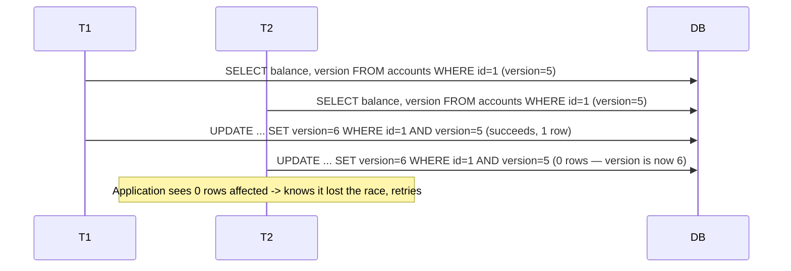

# Optimistic vs pessimistic locking

## Problem

When two transactions might update the same row concurrently, something has to prevent one from
silently overwriting the other's change (the classic **lost update**: T1 reads, T2 reads, T1 writes,
T2 writes — T2's write clobbers T1's without ever having seen it). The isolation level alone doesn't
automatically solve this for every case (see [isolation levels](isolation-levels.md)); the
application often needs to pick an explicit locking strategy on top.

## Key concepts

- **Pessimistic locking**: acquire a lock on the row before reading it for update, blocking any other
  transaction from touching it until the lock is released. Assumes conflict is likely enough to be
  worth preventing upfront.
- **Optimistic locking**: don't lock anything upfront; instead, detect at write time whether the row
  changed since it was read (via a version number or timestamp), and reject the write if it did.
  Assumes conflict is rare enough that paying the cost only when it actually happens is cheaper than
  paying a locking cost on every read.
- **Version column**: the standard optimistic-locking mechanism — an integer incremented on every
  update; the `UPDATE` statement's `WHERE` clause checks the version matches what was read, and the
  application checks whether any row was actually affected.

## Design



This diagram answers: *where does optimistic locking's safety actually come from, if nothing was
locked?* The `WHERE version=5` clause makes the update conditional on nothing having changed since
the read — T2's update simply matches zero rows once T1 has already advanced the version, and the
database's own atomic row-match-and-update is what closes the race, not any application-level check
run before the write. The application's job is only to notice zero rows were affected and decide
what to do next (usually: re-read and retry).

## Trade-offs

- **Contention rate is the deciding signal.** Pessimistic locking pays a cost on every transaction
  (acquiring and holding a lock) regardless of whether a conflict would have happened; optimistic
  locking pays nothing extra on the common case but pays a full retry cost on the rare case a
  conflict is detected. Under low contention (most rows are touched by at most one concurrent
  transaction), optimistic locking wins on throughput because it almost never pays the retry cost.
  Under high contention (many transactions racing for the same hot rows), optimistic locking causes
  repeated wasted work — read, compute, fail, retry, over and over — and pessimistic locking's
  upfront blocking becomes the more efficient choice because it avoids that wasted work entirely.
- **User experience under conflict.** Optimistic locking surfaces a conflict as a failure the caller
  must handle (retry silently, or show the user "this was updated by someone else, please retry") —
  appropriate when a human is in the loop and can meaningfully decide what to do with a stale view.
  Pessimistic locking hides the conflict from the losing party entirely (they just wait) — better
  when the operation is a short, automated step where blocking briefly is cheaper than surfacing a
  conflict to a caller unprepared to handle one.

## Failure modes

- **Optimistic locking without a retry loop.** Detecting the conflict (zero rows updated) and simply
  returning an error to the end caller, instead of re-reading and retrying automatically, pushes
  every transient race onto whoever's calling the code — for a background job or an internal service
  call, this usually should be an automatic retry, not a surfaced failure.
- **Pessimistic locking held too long.** A lock acquired at the start of a transaction that also does
  slow, unrelated work (an external API call, a long computation) before committing holds up every
  other transaction wanting that row for the full duration — the lock's blast radius is the entire
  transaction's wall-clock time, not just the actual write.
- **Deadlock from inconsistent lock ordering.** Pessimistic locking on multiple rows within one
  transaction, acquired in different orders by different code paths, produces classic deadlocks —
  T1 holds lock A and wants B, T2 holds B and wants A. Fixed by a consistent, system-wide lock
  acquisition order, not by retrying harder.

## Operational considerations

Track optimistic-lock conflict rate (how often the version check fails and a retry is needed)
separately from pessimistic lock wait time — a rising optimistic-conflict rate on a specific table is
a signal that table's access pattern has shifted toward higher contention than the optimistic
strategy was chosen for, and it may be time to switch that table's hot rows to pessimistic locking.

## Example

Optimistic locking with a version column and explicit retry:

```sql
UPDATE accounts SET balance = balance - 80, version = version + 1
WHERE id = $1 AND version = $2;
-- Application checks rows affected == 1; if 0, re-read and retry.
```

## Interview questions

- What specific race does a version column prevent that a plain `UPDATE ... WHERE id = $1` doesn't?
- Under what contention conditions does optimistic locking stop being the more efficient choice?
- What's the operational risk of holding a pessimistic lock across a slow external call?
- How would you diagnose a deadlock caused by inconsistent lock acquisition order?

## Further experiments

Compare against [idempotency](../distributed-systems/idempotency.md): a retried optimistic-locking
update needs to be safe to retry in the first place, which is the same underlying requirement
idempotency addresses for distributed retries — the version check here is a form of it applied
within a single database.
