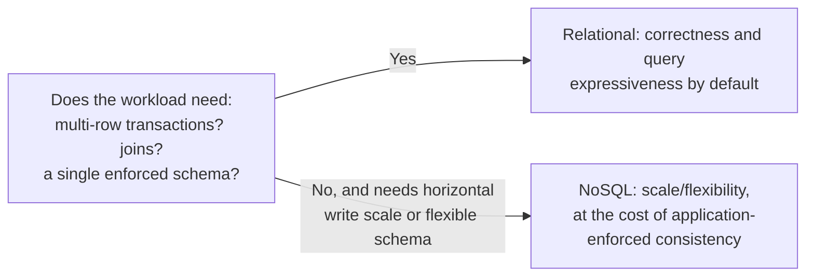

# Relational vs NoSQL

## Problem

"NoSQL scales better" was true enough, often enough, in the era it became conventional wisdom that
it calcified into a default — reached for before asking whether the actual workload has the specific
properties (schema volatility, write volume beyond what a single relational instance handles,
data that's naturally document- or graph-shaped) that make a non-relational store the right choice.
The real decision isn't "relational is old, NoSQL is modern" — it's whether the workload needs to
give up relational guarantees (multi-row transactions, join-based queries, a single enforced schema)
for something a relational database genuinely can't do at the scale or shape required.

## Key concepts

- **Schema-on-write vs schema-on-read.** A relational database enforces a schema at write time —
  invalid data is rejected before it's stored. A document store typically defers that enforcement to
  read time (or to application code) — more flexible for evolving data shapes, at the cost of every
  reader needing to handle documents that don't match the shape it expects.
- **Joins vs denormalization.** Relational databases make cross-entity queries (a join) a first-class,
  efficient operation. Most NoSQL stores either don't support joins or make them expensive, which
  pushes toward denormalizing data (duplicating it across documents) so a single query can answer
  without one — trading storage and write-time consistency effort for read-time simplicity.
- **Horizontal write scaling.** Many NoSQL stores (wide-column, some document stores) are designed
  from the ground up for horizontal write scaling across many nodes, a property relational databases
  historically had to bolt on. This matters specifically when write volume alone exceeds what a
  single (or leader-follower replicated) relational instance can sustain — not merely "at scale" in
  the abstract.
- **The specialized-store cost is a cross-store consistency problem, not a performance number.** The
  moment relational and non-relational data both need to represent the same real-world entity, split
  across two stores, a write to one without the other succeeding creates a real reconciliation
  problem — this cost applies even when the non-relational store's individual performance
  characteristics are genuinely better.

## Design



This diagram answers: *what's the actual decision criterion, if "NoSQL is more scalable" isn't
specific enough?* Whether the workload's correctness genuinely depends on multi-row transactions and
joins — if it does, a NoSQL store doesn't remove that need, it just moves the responsibility for
maintaining it (from the database's transaction manager to application code doing multi-document
consistency by hand), which is real, ongoing engineering cost, not a one-time trade. The right side
of the diagram is only clearly the answer when the workload's actual access pattern doesn't need
those guarantees in the first place — a workload that does need them and picks NoSQL anyway ends up
rebuilding a weaker version of what the relational database already provided.

## Trade-offs

- **A relational database as the single store vs a polyglot (relational + specialized) setup.**
  Keeping everything relational, even data that would fit a specialized store more naturally (vectors,
  graphs, wide time-series), avoids a cross-store consistency problem entirely — one transaction
  boundary covers everything. A polyglot setup gets better performance and tooling for each data
  shape's specialized store, at the cost of every write path that touches both needing its own
  reconciliation strategy for partial failure. The signal: does the specialized store's performance
  advantage matter at the workload's actual current scale, or is it solving a problem that hasn't
  been observed yet?
- **Enforced schema vs flexible schema.** A relational database's enforced schema catches invalid
  data before it's stored, at the cost of migration overhead every time the shape needs to change. A
  schema-on-read store defers that cost, letting the data shape evolve without a migration, at the
  cost of every consumer needing defensive handling for documents that don't match its expectations —
  worth it specifically when the data shape genuinely changes often and unpredictably, not as a
  general preference to avoid migrations.

## Failure modes

- **Adopting NoSQL for scale that hasn't been measured yet.** Choosing a specialized store because
  "relational databases don't scale," without measuring whether the actual workload's write volume
  or query pattern would exceed a well-tuned relational instance, buys real complexity (a second
  store, application-managed consistency) for a performance problem that may never materialize.
- **Losing transactional integrity silently.** Moving data that needs multi-row consistency (an
  order and its line items, a transfer between two account balances) into a store without
  multi-document transactions, without building the application-level consistency logic to replace
  what the database used to provide for free, produces a system that "works" until two concurrent
  writes interleave in a way the database would have prevented.
- **Denormalizing without a plan for keeping copies consistent.** Duplicating data across documents
  to avoid joins means every update to the original now has to propagate to every duplicate — skipped
  or half-done propagation produces silently stale, inconsistent copies with nothing flagging the
  divergence.

## Operational considerations

Track query patterns against the schema actually in production, not the schema as originally
designed — a relational schema that's accumulated years of denormalization workarounds to avoid
expensive joins is itself a signal the access pattern outgrew the original design, worth revisiting
deliberately rather than continuing to patch around.

## Example

A denormalized document trading join-time cost for write-time duplication — the NoSQL-side version
of the same information a relational join would otherwise compute:

```json
{
  "orderId": "o-123",
  "customerName": "Jane Doe",
  "customerEmail": "jane@example.com",
  "lineItems": [{"sku": "widget", "quantity": 2, "unitPrice": 9.99}]
}
```

## Interview questions

- What's the real decision criterion for choosing a specialized NoSQL store over a relational
  database, beyond "it scales better"?
- What does an application take on when it moves multi-entity consistency out of the database and
  into its own code?
- Why does denormalization trade write-time cost for read-time simplicity, and when is that worth
  it?
- How would you decide whether a workload's write volume actually justifies a store designed for
  horizontal write scaling?

## Further experiments

`ai-engineering-lab`'s
[ADR-0003](https://github.com/Fragudev/ai-engineering-lab/blob/ec822bca9df3aee3dc6857705dcddd171a669211/docs/adr/0003-persistence-and-vector-store.md)
is a real example of the opposite of the reflexive move: choosing PostgreSQL (with the pgvector
extension) as the single datastore over a dedicated, specialized vector database, specifically to
avoid the cross-store consistency problem a document-plus-vectors split would introduce — accepting
pgvector's lower ceiling at scale in exchange for one transactional boundary.
