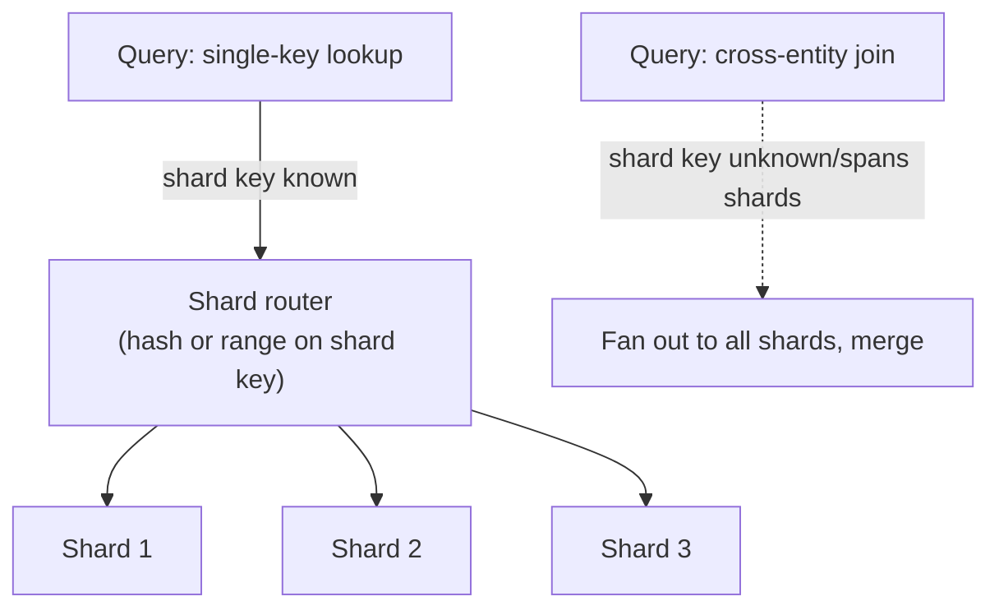

# Sharding

## Problem

[Replication](../distributed-systems/replication.md) scales read capacity by copying the same data
to more nodes — it does nothing for write capacity or total data volume, since every replica still
holds the entire dataset. Sharding solves the problem replication can't: splitting data itself across
nodes so no single node holds (or has to write) the whole dataset. That solves the scaling ceiling,
but introduces a new one: a query or transaction that needs data from more than one shard is no
longer a single-node operation, and the shard key chosen up front determines, largely irreversibly,
which queries stay cheap and which become expensive.

## Key concepts

- **Shard key**: the value used to decide which shard a given row lives on. Everything about
  sharding's success or failure traces back to this choice — it determines both load distribution
  across shards and which queries can be answered by touching a single shard versus requiring a
  cross-shard operation.
- **Hash-based vs range-based sharding.** Hash-based sharding (hash the key, mod by shard count)
  distributes load evenly but destroys any locality between related keys — a range query across
  adjacent values has to hit every shard. Range-based sharding keeps related keys together (useful
  for range scans) but risks a hot shard if writes concentrate in one part of the key range (e.g.,
  time-ordered IDs, where all recent writes land on the newest, single shard).
- **Cross-shard queries and transactions are expensive or unavailable.** A query joining data across
  shards, or a transaction that needs atomicity across rows on different shards, either isn't
  supported at all or requires a much more expensive coordinated operation than the single-shard
  case — sharding trades away the cheap, general-purpose querying a single database gives for free.
- **Resharding is the operation everyone underestimates.** Changing the number of shards means most
  keys map to a different shard than before — a full data migration, not a config change. This is
  the concrete cost behind "the shard key is largely irreversible": picking wrong doesn't surface
  until load grows unevenly, and fixing it means moving most of the dataset.

## Design



This diagram answers: *why does the same database schema produce cheap queries in one shape and
expensive ones in another, once sharded?* Because a query the router can resolve to exactly one
shard (it knows the shard key) is a single-node operation, no different in cost from an unsharded
database. A query that doesn't include the shard key — a join across entities that live on
different shards, a query filtering on something other than the shard key — has to fan out to every
shard and merge results in the application layer, which is both slower and loses the database's own
query optimizer's help across shards. The shard key choice is really a bet on which query shape the
workload needs to stay cheap.

## Trade-offs

- **Hash-based vs range-based sharding.** Hash-based gives even load distribution almost for free,
  at the cost of losing any locality — range scans and "nearby" queries become cross-shard fan-outs.
  Range-based preserves locality for range-heavy access patterns, at the real risk of a hot shard
  when writes aren't evenly distributed across the key range — a workload with monotonically
  increasing keys (timestamps, auto-increment IDs) is the classic case where naive range sharding
  concentrates all writes on one shard. The signal: does the workload's real query pattern need
  range locality, or is it dominated by single-key lookups that hash-based sharding serves just as
  well while avoiding the hot-shard risk?
- **Sharding now vs scaling vertically or via replication first.** Sharding solves a real ceiling
  (write throughput, total data volume beyond one node) but costs real complexity: cross-shard
  queries, a resharding plan, and application code that now has to be shard-aware. Vertical scaling
  or read replicas are simpler and solve a large fraction of real capacity problems without any of
  that complexity — worth exhausting those options, with real measurement showing they're
  insufficient, before sharding, since sharding is expensive to undo.

## Failure modes

- **A shard key chosen for convenience, not for the real query pattern.** A key that's easy to
  compute but doesn't match how the workload actually queries the data (e.g., sharding by a random
  UUID for even distribution, when almost every query filters by customer) turns nearly every real
  query into a cross-shard fan-out — the even distribution was bought at the cost of the thing that
  actually mattered.
- **A monotonic shard key under range-based sharding.** Time-ordered or auto-incrementing keys
  concentrate all new writes on whichever shard currently holds the newest range — this looks like
  sharding "not working" (one shard hot, the rest idle) when it's actually the shard key doing
  exactly what it was configured to do.
- **Underestimating resharding cost.** Treating "we'll just add more shards later" as a cheap lever
  ignores that changing shard count remaps most existing keys — a real data migration under load,
  not a quick operational change, and one that needs planning well before the current shard count is
  actually exhausted.

## Operational considerations

Per-shard load (write rate, storage, query latency) needs to be monitored individually, not just in
aggregate — an even aggregate load across the whole sharded cluster can hide one badly skewed shard
if the imbalance happens to be offset by underloaded shards elsewhere in the average, and that one
hot shard is exactly where the system will fail first under real peak load.

## Example

A cross-shard query becoming a fan-out-and-merge in application code, the real cost a single-shard
query avoids:

```java
List<Order> results = shards.parallelStream()
    .flatMap(shard -> shard.query("SELECT * FROM orders WHERE customer_id = ?", customerId).stream())
    .sorted(Comparator.comparing(Order::createdAt))
    .toList();
// A single-shard query (shard key known) skips this fan-out and merge entirely.
```

## Interview questions

- Why does the shard key determine which queries stay cheap and which become expensive, rather than
  sharding uniformly affecting all query cost?
- What's the risk of a monotonically increasing shard key under range-based sharding, specifically?
- Why is resharding considered an expensive, largely irreversible operation rather than a
  configuration change?
- How would you decide whether a workload actually needs sharding, versus scaling vertically or via
  read replicas first?

## Further experiments

Compare against [replication](../distributed-systems/replication.md) (scales reads, not writes or
total volume) and [consumer groups](../messaging/consumer-groups.md) — a Kafka partition key is the
same underlying idea (route by key to a fixed slice, own the ordering/locality trade-off it implies)
applied to a message stream instead of a data store.
