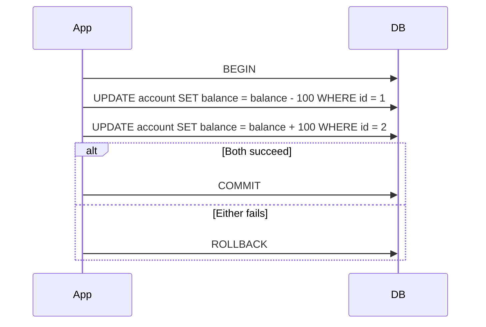

# Transactions

## Problem

A transaction's promise — a group of writes either all happen or none do, and concurrent
transactions don't corrupt each other's view of the data — is easy to state and easy to take for
granted right up until a system's transaction boundary stops matching its actual unit of business
work. The common failure isn't misunderstanding ACID in the abstract; it's drawing the boundary
wrong — too narrow (leaving a multi-step operation partially applied on failure) or assuming it
extends further than it does (across a network call to another service, where no database
transaction has ever reached).

## Key concepts

- **ACID**: Atomicity (all-or-nothing), Consistency (the database's own invariants — constraints,
  foreign keys — hold before and after), Isolation (concurrent transactions don't see each other's
  in-progress state — see [isolation levels](isolation-levels.md) for how much, exactly), Durability
  (a committed transaction survives a crash). Each is a distinct guarantee; a system can have strong
  atomicity and weak isolation at the same time, which is exactly what most databases' non-default
  isolation levels are.
- **Transaction boundary as a design decision, not a technical default.** What's included inside one
  transaction — one row update, or an entire multi-table business operation — is chosen, not
  inherent to the operation. Too narrow a boundary leaves related writes able to partially apply;
  too wide a boundary holds locks longer than necessary, increasing contention.
- **A transaction never spans a network call to another service.** No relational database's
  transaction extends across an HTTP call, a message publish, or a call to another service's own
  database — this is the exact gap the [transactional outbox](../messaging/outbox-pattern.md) pattern
  exists to bridge (a local commit plus a durably queued message, instead of assuming the remote call
  is somehow inside the same transaction).
- **Distributed transactions (2PC) exist but are rarely the right answer.** A two-phase commit
  protocol can make a transaction span multiple databases, at the cost of blocking all participants
  during the commit and coupling them to the same coordinator — see
  [eventual consistency](../distributed-systems/eventual-consistency.md) for why most systems that
  need multi-service consistency choose a saga over 2PC instead.

## Design



This diagram answers: *why does a transfer need to be one transaction instead of two independent
updates?* Because atomicity is what prevents the failure mode where the debit succeeds and the
credit fails (or vice versa) — without a shared transaction, a crash or error between the two updates
leaves the system in a state that violates its own invariant (total balance conserved) with no
built-in mechanism to notice or fix it. The boundary — everything between `BEGIN` and `COMMIT` —
is exactly what has to include both updates for atomicity to actually protect this specific
invariant; drawing it around only one update leaves the other outside its protection entirely.

## Trade-offs

- **A wide transaction boundary vs a narrow one.** A wide boundary (many writes in one transaction)
  guarantees atomicity across everything inside it, but holds locks for longer, increasing contention
  under concurrent load — other transactions touching the same rows wait longer. A narrow boundary
  reduces contention but means anything split across multiple transactions has no atomicity guarantee
  between them — a failure between the two leaves a partially applied state the application now has
  to detect and handle itself. The signal: does the business invariant genuinely require every
  included write to succeed or fail together? If yes, it belongs in one transaction regardless of
  contention cost; if the writes are independently valid, splitting them reduces lock contention with
  no correctness cost.
- **Distributed transactions (2PC) vs a saga.** 2PC gives real atomicity across multiple databases or
  services, at the cost of blocking every participant for the duration of the commit and coupling
  them all to a single coordinator — a genuinely fragile shape for independently deployable services.
  A saga (see [event-driven architecture](../distributed-systems/event-driven-architecture.md))
  avoids that coupling and blocking entirely, at the cost of a real window where participants
  disagree and a compensating action instead of a rollback — the near-universal choice for systems
  that need their participants to stay independently available.

## Failure modes

- **A transaction boundary narrower than the actual business operation.** Splitting a multi-step
  business operation across multiple transactions without a plan for partial failure leaves the
  system able to reach a state none of its individual transactions would have allowed, and nothing
  automatically detects or fixes it.
- **Assuming a transaction extends across a network call.** Code that performs a database write, then
  calls another service, implicitly assuming both succeed or fail together, has no such guarantee —
  the remote call is entirely outside the local database's transaction, and a failure after the
  local commit but before (or during) the remote call is a real, silent partial-failure state.
- **Long-held transactions under high concurrency.** A transaction held open longer than necessary
  (a slow external call made mid-transaction, an unnecessarily wide boundary) holds its locks for
  that entire duration, and under real concurrent load this can cascade into widespread contention
  well beyond the rows the transaction actually needed to touch.

## Operational considerations

Transaction duration (time between `BEGIN` and `COMMIT`/`ROLLBACK`) is worth tracking as its own
metric — a rising p99 is often the earliest signal of a transaction boundary that's grown to include
something it shouldn't (a slow external call, an unrelated write bundled in for convenience), well
before it manifests as the harder-to-diagnose symptom of unrelated queries mysteriously slowing down
under lock contention.

## Example

The transaction boundary matching exactly the operation's invariant — nothing more, nothing less:

```sql
BEGIN;
UPDATE account SET balance = balance - 100 WHERE id = 1 AND balance >= 100;
UPDATE account SET balance = balance + 100 WHERE id = 2;
COMMIT; -- Both succeed together, or neither does — no external call inside this boundary.
```

## Interview questions

- Why does atomicity require choosing which writes belong inside one transaction, rather than being
  automatic?
- Why doesn't a database transaction extend across a network call to another service, and what
  pattern bridges that gap?
- What's the trade-off between a wide and a narrow transaction boundary, in terms of contention
  versus partial-failure risk?
- Why do most systems needing consistency across multiple services choose a saga over a distributed
  (2PC) transaction?

## Further experiments

Compare against [the transactional outbox pattern](../messaging/outbox-pattern.md) — the concrete
mechanism for getting a reliable message publish inside the same local transaction as a database
write, without ever assuming the transaction itself extends to the remote consumer — and
[eventual consistency](../distributed-systems/eventual-consistency.md) for what replaces a single
cross-service transaction in practice.
