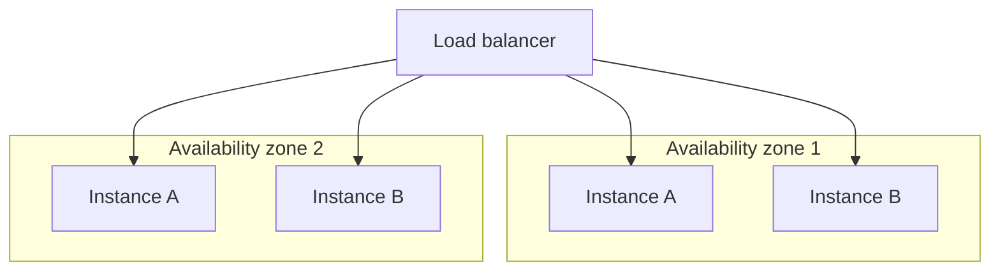

# Availability

## Problem

[SLOs vs SLIs](../observability/slos-vs-slis.md) covers setting and measuring an availability
*target*. This is the design problem one level down: what actually determines whether a system
*can* hit a given availability number in the first place, architecturally, before any target-setting
happens. Availability isn't a property that emerges from good intentions or careful coding — it's a
direct, calculable consequence of how many single points of failure exist and how correlated the
failures of redundant components actually are, and most availability shortfalls trace back to one of
those two things being wrong, not to a missing SLO.

## Key concepts

- **Single point of failure (SPOF)**: any component whose failure alone takes down the whole system,
  regardless of how healthy everything else is. Redundancy only removes an SPOF if the redundant
  copies can actually take over — a hot standby that's never been tested to fail over is a SPOF that
  hasn't failed yet.
- **Failure domain**: a boundary within which failures are correlated — a single availability zone, a
  single power circuit, a single top-of-rack switch. Redundancy within the same failure domain
  protects against component failure but not against the domain-wide event (a power outage, a rack
  failure) that takes out every redundant copy in that domain simultaneously.
- **Correlated vs independent failure.** Two replicas on the same physical host fail together far
  more often than the "N replicas, so we can tolerate N-1 failures" math assumes, because that math
  assumes independence — real redundancy needs to be spread across failure domains specifically to
  keep failures actually independent, not just numerically redundant.
- **Availability as a multiplicative chain.** A request that depends on five services each at 99.9%
  availability isn't 99.9% available overall — it's roughly 99.9%^5 ≈ 99.5%, because every hop in
  the chain that must succeed multiplies the failure probability. Adding a dependency to a critical
  path, even a highly reliable one, measurably lowers the whole chain's availability.

## Design



This diagram answers: *why does redundancy within one availability zone not actually protect against
the failure that matters most?* Because "instance A and instance B are redundant" only holds if
their failures are independent — and if both live in the same zone, a zone-wide event (power, network,
a bad automated change rolled out zone-by-zone) takes out both simultaneously, at exactly the moment
redundancy was supposed to help. Spreading the same redundant pair across two zones doesn't add
redundancy count, it changes *which* failures the redundancy actually protects against — from
component failure only, to component failure and zone failure both.

## Trade-offs

- **Redundancy within a failure domain vs across failure domains.** Same-domain redundancy is
  cheaper (no cross-zone network cost, no cross-region latency) and protects against ordinary
  component failure, which is the overwhelming majority of real failures. Cross-domain redundancy
  costs more (network latency between zones/regions, more complex data replication) but is what
  actually protects against the domain-wide event — worth it once the domain-wide failure's
  probability and impact justify the added cost, which for most systems means "at minimum" across
  availability zones within a region, and only "across regions" for the availability numbers that
  actually require it.
- **Fewer dependencies vs richer functionality on the critical path.** Every dependency added to a
  request's critical path multiplies into the overall availability, as the math above shows —
  keeping the critical path short (fewer must-succeed hops) directly raises measured availability,
  independent of how reliable any individual dependency is. The trade-off is real: some functionality
  genuinely requires calling another service, and the fix isn't always "remove the dependency," it's
  often "make it a graceful-degradation candidate" (see
  [graceful degradation](../resilience/graceful-degradation.md)) so its failure doesn't sit on the
  critical path at all.

## Failure modes

- **Redundancy that isn't actually independent.** N replicas that all share a failure domain, a
  deployment pipeline, or a configuration source don't provide N-1 fault tolerance — they provide
  fault tolerance against whatever failures are actually independent of that shared thing, which is
  usually far less than the naive replica count suggests.
- **An untested failover path.** A standby that's never actually been failed over to in practice is a
  single point of failure with extra steps — the failover mechanism itself can be broken, and nothing
  reveals that until the one moment it's actually needed.
- **Treating every dependency as equally load-bearing.** Adding a nice-to-have dependency directly to
  the critical path (instead of making its failure a degradable case) lowers overall availability for
  a feature that didn't need to be able to bring down the whole request.

## Operational considerations

Chaos testing — deliberately killing a component or an entire failure domain in a controlled way —
is the only reliable way to confirm redundancy is actually independent and failover actually works;
math on paper about "N replicas tolerate N-1 failures" is only as trustworthy as the last time it was
verified against a real, deliberate failure.

## Example

The multiplicative availability math for a request depending on several services in sequence:

```text
Five dependencies, each 99.9% available, all on the critical path:
0.999^5 ≈ 0.995 -> ~99.5% overall, not 99.9%

Same five dependencies, only two genuinely on the critical path
(the other three degrade gracefully instead of failing the request):
0.999^2 ≈ 0.998 -> ~99.8% overall
```

## Interview questions

- Why does adding N replicas not automatically give N-1 fault tolerance?
- What's the difference between a failure domain and a single point of failure, and why does
  redundancy need to cross failure domains to protect against domain-wide events?
- How does a request's overall availability relate to the availability of each individual dependency
  on its critical path?
- Why is an untested failover mechanism effectively still a single point of failure?

## Further experiments

Compare against [SLOs vs SLIs](../observability/slos-vs-slis.md) — this topic covers what
architecturally determines availability; SLOs cover setting and measuring a target against it, and
the error-budget policy that governs what happens once that target is at risk.
