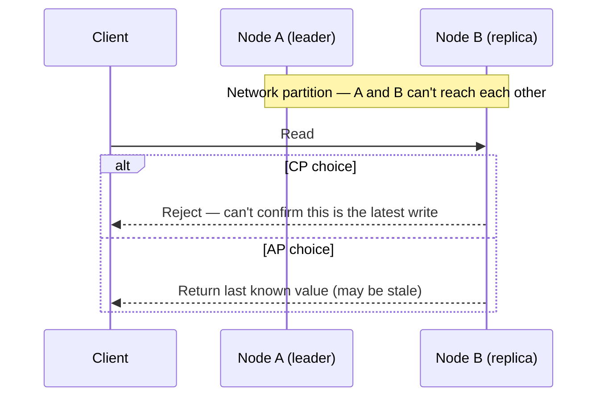

# CAP theorem

## Problem

CAP gets quoted as "pick two of three" as if it were a one-time architecture label a system earns
at design time. That framing is wrong in a way that matters: partitions are not optional in a
distributed system — the network *will* drop or delay messages between nodes eventually — so "CA"
was never a real option. The actual decision CAP forces is what a system does *during* a partition,
and that decision can, and often should, differ per operation within the same system.

## Key concepts

- **Consistency** here means linearizability: every read sees the most recent write, as if there
  were only one copy of the data.
- **Availability**: every request to a non-failing node receives a response (not necessarily the
  latest data).
- **Partition tolerance**: the system keeps operating despite dropped or delayed messages between
  nodes. Not a choice — networks partition regardless of what the system wants.
- Since P isn't optional, the real trade-off is **CP vs AP**: when a partition happens, does the
  system reject requests it can't guarantee are consistent (CP), or does it keep answering with
  potentially stale data (AP)?
- **PACELC** extends this: *even without* a partition, there's still a latency-vs-consistency
  trade-off (Else, Latency vs Consistency) — a system that's CP during a partition can still choose
  to trade latency for consistency in the normal case, by waiting for a quorum acknowledgment
  instead of answering from the nearest replica.

## Design



This diagram answers: *what does CAP actually force a node to decide, in the moment?* Node B has
exactly two options once it can't reach A — refuse to answer (protecting consistency) or answer
with what it has (protecting availability). There is no third option that gives both, and "the
system supports CAP" is meaningless without saying which of these two branches it takes, and for
which operation.

The reason this is a per-operation decision, not a per-system one: a payment balance check and a
"like" counter have very different costs for each branch. Returning a stale balance risks a real
financial error; returning a stale like count risks nothing worse than a number being off by a
few. A well-designed system picks CP for the former and AP for the latter, in the same deployment.

## Trade-offs

- **CP** (e.g., a system requiring a majority quorum for every read and write, like etcd or a
  properly configured relational cluster): correct data, at the cost of rejecting requests during a
  partition — the operation that hits the minority side gets an error, not a stale answer.
- **AP** (e.g., DNS, Cassandra in its default configuration, most CDNs): the system never refuses to
  answer, but a client can observe stale or conflicting data that has to be reconciled later (last-
  write-wins, CRDTs, or application-level conflict resolution).
- The signal I use to decide per operation: **is a stale answer safe to act on?** If acting on stale
  data is reversible and low-cost (serving a cached product description), default AP. If it isn't
  (approving a duplicate payment, granting a lock two nodes both think they hold), default CP —
  and see [leader election](leader-election.md) for what CP coordination actually costs.

## Failure modes

- **Assuming "CA" is achievable.** Any system with more than one node reachable over an unreliable
  network must tolerate partitions or it isn't actually distributed — a "CA" system is really a CP
  system that hasn't been tested under partition yet.
- **Split-brain**: both sides of a partition believe they're authoritative and both accept writes,
  because the system was configured (or misconfigured) to prioritize availability for an operation
  that actually needed consistency. Reconciling two divergent write histories after the fact is
  often worse than the availability loss a CP choice would have caused.

## Operational considerations

Quorum systems (`N` replicas, `W` write acknowledgments required, `R` read acknowledgments
required) let a team tune the CP/AP trade-off numerically instead of picking a library's default: if
`W + R > N`, every read overlaps with the most recent write's acknowledgment set and the system
behaves CP for reads; if not, reads can return stale data (AP) but stay available with fewer nodes
reachable. This needs to be a monitored, deliberate configuration per data type, not a default left
unexamined.

## Example

Quorum math for `N=3` replicas:

```text
W=2, R=2  -> W + R = 4 > N=3  -> strongly consistent reads, tolerates 1 node down
W=1, R=1  -> W + R = 2 = N    -> fast, available, but reads can be stale
```

## Interview questions

- Why is "CA" not a real option for a distributed system?
- Give an example of an operation in the same system that should be CP, and one that should be AP.
- What does PACELC add that CAP doesn't capture?
- How would you detect split-brain in production before it corrupts data?

## Further experiments

Compare this against [replication](replication.md) — CAP describes the trade-off in the abstract;
replication strategy (sync vs async, quorum size) is the concrete mechanism that implements one side
of it.
