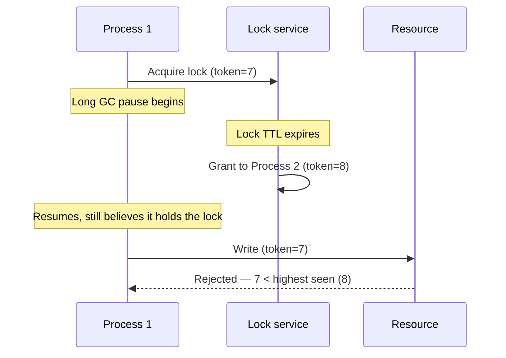

# Distributed locks

## Problem

[Leader election](leader-election.md) covers assigning a long-running role to exactly one node. A
distributed lock is the shorter-lived cousin: protecting a single critical section — "only one
process should run this batch job right now," "only one worker should touch this row while
updating it" — from being entered by more than one process at once, across machines. It looks like a
direct translation of a single-process mutex, and that resemblance is exactly what makes it
dangerous: a single-process mutex's correctness relies on assumptions (a thread holding it can't be
arbitrarily paused for an unbounded time relative to the lock's lifetime) that simply don't hold once
the "thread" is a process on a different machine, subject to GC pauses, VM suspension, and clock
drift no local mutex ever had to account for.

## Key concepts

- **Lock as mutual exclusion, not leadership.** A distributed lock protects a short critical section
  and is expected to be acquired and released frequently by different processes over time — different
  in shape from leader election's single, long-held role, even though both rely on similar
  underlying mechanisms (a lease with a TTL, a quorum).
- **The pause-then-resume problem.** A process can be correctly holding a lock, then experience an
  arbitrarily long pause (garbage collection, VM suspend, scheduler starvation) during which the lock
  expires and is granted to another process — then resume, still believing it holds the lock, and act
  on that belief. The lock service did nothing wrong; the holder's own assumption about elapsed time
  was simply false.
- **Fencing tokens, again.** The same mechanism [leader election](leader-election.md) uses to survive
  a deposed leader resuming unexpectedly applies identically here: a monotonically increasing token
  issued with each lock grant, checked and enforced at the resource being protected — not by the lock
  holder trusting its own state, but by whatever the lock is protecting refusing any write carrying a
  stale token.
- **Redlock and its critique.** A widely used algorithm (acquire the lock on a majority of independent
  Redis instances) that improves availability over a single-instance lock, but Martin Kleppmann's
  well-known critique demonstrates it still doesn't solve the pause-then-resume problem without
  fencing tokens — the algorithm's safety argument relies on real-time bounds (clock behavior, GC
  pause duration) that distributed systems can't actually guarantee.

## Design



This diagram answers: *what actually prevents the paused process from causing damage, given that it
genuinely doesn't know it lost the lock?* Not anything Process 1 does — it can't know, from inside
its own pause, how long it's been gone. The fencing token check at the resource is what makes this
safe: the resource enforces token order unconditionally, regardless of what either process believes
about who currently holds the lock. A distributed lock without this check at the protected resource
only prevents concurrent access in the case where no process ever pauses longer than the lock's
TTL — which is exactly the assumption a real-world GC pause or VM suspend can violate.

## Trade-offs

- **A simple single-instance lock (e.g., one Redis `SET NX`) vs a quorum-based scheme (Redlock or
  equivalent).** A single-instance lock is trivial to implement and fast, but that one instance is a
  single point of failure — if it goes down, every lock it held is gone and nothing prevents a new
  acquisition while the old holder still thinks it has the lock. A quorum-based scheme improves
  availability (tolerates some instances failing) at real implementation and operational complexity
  cost, and — per Kleppmann's critique — still needs fencing tokens at the protected resource to be
  genuinely safe, so it doesn't eliminate the need for the harder fix, only makes the lock service
  itself more available.
- **Trusting lock-holder self-discipline vs enforcing fencing at the resource.** Relying on the lock
  holder to check its own lease validity before acting is cheaper to build but unsafe under the
  pause-then-resume scenario, since the holder's own check happens *before* the pause that
  invalidates it. Enforcing fencing tokens at the resource being protected is the only version that
  stays correct regardless of what the (possibly stale) holder believes — real added engineering
  effort (every write path needs the check), but it's what actually closes the gap.

## Failure modes

- **A distributed lock with no fencing enforced at the resource.** The most common real-world
  mistake: treating a distributed lock as a drop-in replacement for a single-process mutex, without
  realizing the resource itself needs to independently reject stale-token writes — this "works" in
  testing (no pauses long enough to trigger the failure) and fails exactly once, in production, under
  a GC pause or scheduler stall nobody planned for.
  See [leader election](leader-election.md)'s fencing-token example for the same mechanism applied
  to a longer-lived role.
- **Assuming a quorum-based lock service alone is sufficient.** Redlock-style quorum acquisition
  improves the lock service's own availability but, per Kleppmann's critique, doesn't by itself solve
  the pause-then-resume problem — a team that adopts a quorum lock service and stops there still has
  the same unsafe gap a single-instance lock has, just with a more available (and more complex) front
  end to it.
- **Lock TTL mismatched to the actual critical section's worst-case duration.** A TTL set from the
  typical case, not the worst case, expires mid-critical-section under any unusually slow execution,
  granting the lock to a second process while the first is still legitimately working — without
  fencing at the resource, this produces exactly the concurrent-access bug the lock existed to
  prevent.

## Operational considerations

Track lock-hold duration against the configured TTL as an explicit metric — a hold time approaching
or exceeding the TTL under normal operation is the leading indicator that the TTL is mis-tuned for
the real critical section, well before it manifests as the harder-to-diagnose symptom of two
processes both believing they hold the same lock.

## Example

A resource enforcing a fencing token, independent of what the lock holder itself believes:

```java
if (incomingToken < resource.highestTokenSeen()) {
    throw new StaleLockHolderException(); // rejected even if the caller believes it holds the lock
}
resource.write(data, incomingToken);
```

## Interview questions

- Why can a process holding a distributed lock still cause damage after its lock has expired, even
  if it hasn't done anything wrong?
- What does a fencing token protect against that the lock service itself, no matter how available,
  can't?
- What's the core argument in Kleppmann's critique of Redlock, and why does a quorum of lock
  instances not resolve it on its own?
- How would you set a distributed lock's TTL, and what's the risk of getting it too short versus too
  long?

## Further experiments

Compare against [leader election](leader-election.md) — the same fencing-token mechanism, applied to
a longer-held role rather than a short critical section; the underlying correctness argument (the
resource enforces order, not the holder's self-awareness) is identical in both.
