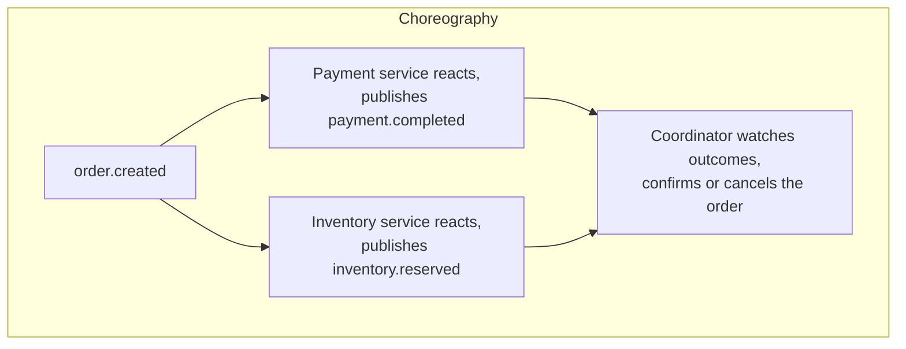

# Event-driven architecture

## Problem

Coordinating a multi-step business process across services that each own their own data — an order
that needs payment and inventory to both succeed or both compensate — has no distributed transaction
to fall back on without coupling every participant to a shared transactional resource (see
[eventual consistency](eventual-consistency.md)). Event-driven architecture solves the coordination
problem itself, but "publish events and react to them" isn't one design — the real decision is
*where the process's logic actually lives*: distributed across every participant reacting
independently, or concentrated in one place that explicitly tells each participant what to do.

## Key concepts

- **Choreography**: every participant subscribes to the events relevant to it and reacts
  independently, publishing its own outcome events in turn — no component knows the full process,
  each only knows "when X happens, I do Y and announce Z."
- **Orchestration**: a central coordinator explicitly calls each participant (or sends it a command)
  and decides what happens next based on the response — one place holds the process's logic, and
  participants respond to direct instruction rather than reacting to ambient events.
- **Saga**: the pattern name for a multi-step process with no distributed transaction, where each
  step either succeeds or triggers a compensating action for whatever already succeeded — both
  choreography and orchestration are ways of *implementing* a saga, not alternatives to it.
- **Coupling shape, not coupling amount.** Choreography doesn't eliminate coupling — participants are
  still coupled to the event schemas they subscribe to — it just relocates the coupling from "who
  calls whom" to "who understands what event means." Orchestration concentrates the coupling to
  process-knowledge in one place instead.

## Design



This diagram answers: *if a coordinator still exists in choreography, what actually makes it
choreography and not orchestration?* The direction of control. The coordinator here never calls
payment or inventory — it only watches for their independently-published outcomes and, once both are
known, publishes its own decision as an event. Payment and inventory never receive an instruction
from the coordinator; they only ever react to `order.created`, which they'd still be able to do even
if the coordinator didn't exist. Swap the arrows the other way — coordinator explicitly invoking
each participant and telling it whether to compensate — and it's orchestration, with the same
number of components but a fundamentally different dependency direction.

## Trade-offs

- **Choreography vs orchestration, as the process grows.** With few participants and simple
  branching, choreography keeps every component genuinely independent — adding a new participant
  means adding one more listener, with zero changes to existing ones. As the number of participants
  and the branching complexity of "what happens next" grows, choreography's advantage inverts:
  understanding the full process means reading every participant and the events between them, with
  no single place that shows the whole flow top to bottom. Orchestration's coordinator becomes the
  one place the whole process reads legibly, at the cost of it needing to know every participant's
  API and being the thing that has to change whenever the process itself changes.
- **Reusing already-reactive components vs building command handlers.** If participants already
  exist as event-reactive services (built for a different, simpler event flow), choreography reuses
  them as-is — each just gets one more subscription. Orchestration would need those same components
  rewritten to accept explicit commands instead of reacting to events, real rework for components
  that already worked the other way.

## Failure modes

- **No single place to observe the process's actual state, under choreography.** Each participant
  only ever knows its own slice — a support engineer debugging a stuck order has to reconstruct the
  full picture from multiple services' logs, unless something (a saga-state table, a coordinator)
  explicitly tracks the aggregate state across all participants.
- **A coordinator that reaches into participants' data directly**, instead of only ever learning
  what happened through their published events — this blurs the choreography boundary specifically:
  the coordinator starts depending on internal state it wasn't meant to know about, coupling it to
  implementation details instead of the public event contract.
- **Choreography scaled past the point where it stays legible.** Adding participants and branches one
  at a time, each individually reasonable, can accumulate into a process no single person can trace
  without reading every component — the failure isn't any one addition, it's not noticing the
  cumulative complexity crossed a threshold that should have triggered a move toward orchestration.

## Operational considerations

Under choreography, an aggregate state table (one row per process instance, updated as each
participant's outcome arrives) is worth building even though it's not strictly required for the
happy path — it's the only place an operator can answer "is this order's saga still in flight, or
genuinely stuck" without querying every participant independently.

## Example

A coordinator that only ever learns outcomes through events, never by calling a participant
directly:

```java
@KafkaListener(topics = {"payment.completed.v1", "payment.failed.v1",
                          "inventory.reserved.v1", "inventory.rejected.v1"})
void onOutcome(OutcomeEvent event) {
    SagaState state = sagaRepository.updateLeg(event.orderId(), event);
    if (state.bothLegsReported()) {
        publish(state.succeeded() ? new OrderConfirmed(state.orderId())
                                   : new OrderCancelled(state.orderId()));
    }
}
```

## Interview questions

- What actually distinguishes choreography from orchestration, beyond "one has a coordinator and one
  doesn't"?
- Why does choreography's advantage tend to invert as a process grows more participants and
  branches?
- What does an event-driven system lose in observability that a coordinator or saga-state table
  restores?
- How would you decide, for a new multi-step process, whether to start with choreography or
  orchestration?

## Further experiments

`distributed-systems-playground`'s `saga-order-fulfillment` example implements exactly this
choice:
[ADR-0008](https://github.com/Fragudev/distributed-systems-playground/blob/f893b1568b28f1ecab1babdc35292dcdfb0f49b0/docs/adr/0008-choreography-vs-orchestration.md)
covers choosing choreography specifically because it reuses the existing `kafka-order-processing`
consumers as independent, already-reactive components, and names the trade-off honestly: adding a
third participant costs one listener, but there's no single place that reads top-to-bottom as "the
saga's steps."
