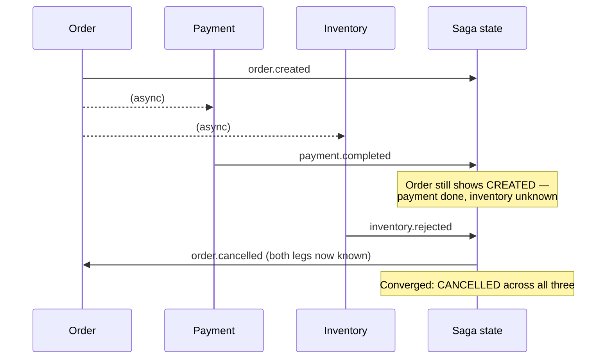

# Eventual consistency

## Problem

"Eventually consistent" gets used as a hand-wave that means "it'll sort itself out," without saying
what guarantee actually holds in the meantime or what "eventually" is bounded by. That vagueness is
where real bugs live: a caller that reads its own write a moment later and sees stale data isn't
necessarily hitting a bug — it might be exactly what the system promised — but without a precise
statement of the guarantee, there's no way to tell "working as designed" from "actually broken"
either during development or during an incident.

## Key concepts

- **Convergence, not synchronization.** The actual guarantee eventual consistency provides: given no
  further writes and no further failures, every replica or every participant's view of the data
  reaches the same final state. It says nothing about *when* that happens along the way, or in what
  order intermediate states are observed — only that there's a stable end state everything converges
  toward.
- **No mid-flight consistency guarantee.** Between a write and full convergence, different parts of
  the system can legitimately disagree — one participant's view can be ahead of another's, and
  there's no promise they're ever simultaneously consistent during that window, only that the window
  eventually closes.
- **Bounded vs unbounded convergence time.** A useful eventual-consistency guarantee names an actual
  bound (or at least a monitored expectation) on how long convergence normally takes — "eventually"
  with no bound and no monitoring is indistinguishable from "maybe never" the moment something goes
  wrong.
- **Permanent non-convergence is a real failure mode, not a contradiction.** If a participant needed
  for convergence is down indefinitely, or a coordinating record has no timeout/reaper, the system
  can get stuck in a non-terminal state forever — this doesn't violate the eventual-consistency
  contract by definition, but it's exactly the gap a real design needs to name and handle.

## Design



This diagram answers: *what does a reader see if they check the order's state right after payment
completes, but before inventory has answered?* Payment shows complete, but the order itself still
shows `CREATED` — not a bug, exactly the mid-flight disagreement the guarantee allows. Only once
*both* legs have reported does the saga state reach a terminal, converged value across all three
models. A caller reading during that window and expecting all three to already agree is expecting a
stronger guarantee than eventual consistency ever promised — the fix isn't to "speed up" convergence,
it's to make the caller's expectation match the actual contract, either by polling for the terminal
state or subscribing to the order's own state changes.

## Trade-offs

- **Eventual consistency vs a distributed transaction.** A synchronous distributed transaction (two-
  phase commit or equivalent) gives real atomicity — every participant either commits or rolls back
  together — at the cost of coupling every participant to the same transaction coordinator and
  blocking all of them for the transaction's duration. Eventual consistency avoids that coupling and
  blocking entirely, at the cost of a real window where the system's state is legitimately
  inconsistent across participants — worth it whenever the participants need to stay independently
  deployable and available, which is most of why event-driven architectures exist in the first place.
- **Naming the convergence bound vs leaving it implicit.** An explicit, monitored bound ("this
  process converges within N seconds under normal conditions") turns "still converging" into a
  distinguishable, alertable state from "stuck." Leaving it implicit is less upfront work but means
  the first time convergence takes unusually long, there's no way to tell whether that's normal
  variance or a real problem without manual investigation.

## Failure modes

- **Treating a mid-flight read as a bug.** A caller reading a not-yet-converged state and reporting
  it as broken, when it's exactly what the eventual-consistency contract allows, wastes investigation
  time on working-as-designed behavior — the actual problem, if there is one, is that the caller
  needed a stronger guarantee than what was actually provided.
- **No timeout or reaper for permanently stuck state.** A coordinating record (a saga-state row)
  waiting on a participant that never responds — because that participant is down indefinitely, not
  transiently slow — stays in a non-terminal state forever with nothing to notice or resolve it,
  unless something explicitly watches for and handles that case.
- **Reconciling divergent state without understanding which side is authoritative.** Once
  non-convergence is detected, "fixing" it by picking a side without understanding why they diverged
  can silently discard the correct outcome — reconciliation needs the same rigor as the original
  convergence logic, not an ad hoc patch applied under incident pressure.

## Operational considerations

Convergence time, from initial write to terminal converged state, should be tracked as its own
distribution — a rising p99 is an early signal that some participant in the process is slowing down,
often before that participant's own health metrics move enough to page anyone on their own team.

## Example

Awaiting convergence in a test, rather than asserting a specific ordering of intermediate states:

```java
await().atMost(Duration.ofSeconds(5)).untilAsserted(() -> {
    SagaState state = sagaRepository.findByOrderId(orderId);
    assertThat(state.isTerminal()).isTrue();
    // Doesn't assert which leg reported first — only that convergence happened.
});
```

## Interview questions

- What does "eventually consistent" actually guarantee, and what does it explicitly not guarantee
  about the time in between?
- Why is a caller observing mid-flight disagreement between two parts of a system not necessarily a
  bug?
- What happens to a system's eventual-consistency guarantee if a required participant is down
  indefinitely, and how should that be handled?
- How would you decide whether a given process needs a distributed transaction instead of eventual
  consistency?

## Further experiments

`distributed-systems-playground`'s `saga-order-fulfillment` example states this precisely rather
than leaving it as a slogan:
[ADR-0009](https://github.com/Fragudev/distributed-systems-playground/blob/f893b1568b28f1ecab1babdc35292dcdfb0f49b0/docs/adr/0009-eventual-consistency.md)
defines the exact two terminal states the saga converges to, proves convergence with `Awaitility`
against the specific ordering most likely to look like a bug (inventory rejecting *after* payment
already completed), and names permanently-missing-outcome as a real, un-built limitation rather than
an edge case papered over.
