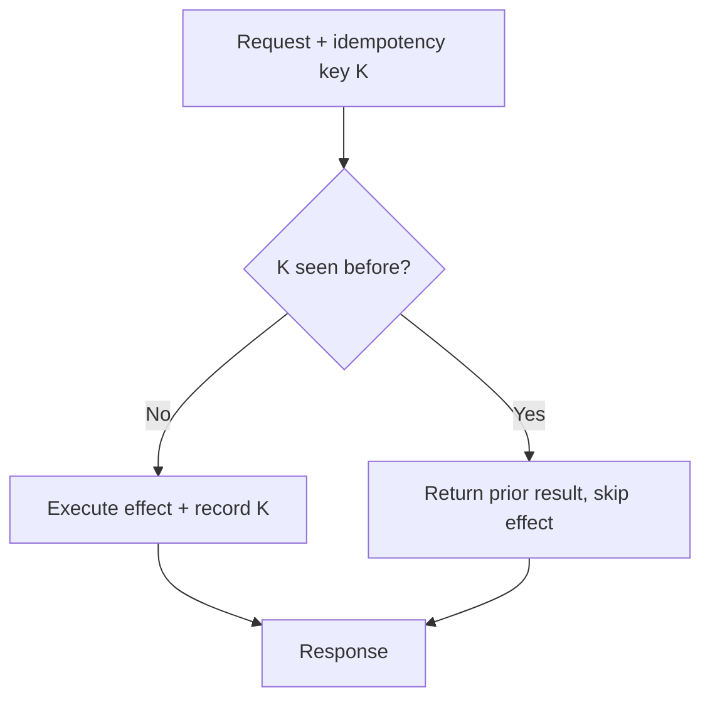

# Idempotency

## Problem

At-least-once delivery is the practical default for distributed messaging (see
[delivery semantics](../messaging/delivery-semantics.md)) — a producer that wants a guarantee a
message was processed will retry on any doubt, including cases where the message actually was
processed and only the acknowledgment was lost. Over a long enough time, every consumer of an
at-least-once system *will* see the same message more than once. The question isn't how to prevent
that — it can't be fully prevented without giving up availability — it's how to make processing the
same message twice produce the same result as processing it once.

## Key concepts

- **Idempotent operation**: applying it N times has the same effect as applying it once. `SET x = 5`
  is naturally idempotent. `x += 5` is not.
- **Idempotency key**: a value that identifies a specific logical operation (a client-generated
  request ID, an order ID) so the system can recognize "I've already done this" independent of
  whether the operation itself is naturally idempotent.
- **Natural idempotency vs enforced idempotency**: some operations are idempotent by construction
  (a `PUT` that sets an absolute value); others (charging a card, sending an email) are not, and
  need an explicit dedup mechanism keyed on the idempotency key.
- **Dedup window**: how long the system remembers a key has already been processed. Not infinite —
  a storage and lookup cost trade-off.

## Design



This diagram answers: *where does the safety actually come from?* Not from the effect itself being
safe to repeat — from the check happening *before* the effect, and the check-and-record step being
atomic with the effect. If those two steps aren't atomic, a retry landing in the gap between "check"
and "record" executes the effect twice anyway — the diagram's box order is the whole point, not just
documentation of the flow.

The most common real implementation: a dedup table with a `UNIQUE` constraint on the idempotency
key, and the effect performed in the *same database transaction* as the insert into that table. If
the insert fails on the uniqueness constraint, the transaction rolls back, the effect never
committed, and the caller gets the prior result.

## Trade-offs

- **Client-generated vs server-generated idempotency key.** A client-generated key (a UUID the
  client creates once and reuses on every retry of the *same logical request*) survives client
  crashes and retried HTTP calls correctly. A server-generated key (from request content hashing)
  avoids trusting the client to reuse the key correctly, but can't distinguish "the same request
  retried" from "a different request that happens to have identical content" — the wrong choice for
  operations where two identical-looking requests are legitimately different (two separate $10
  charges to the same card on the same day).
- **Dedup window length vs storage cost.** A short window (minutes) is cheap but doesn't protect
  against a retry that arrives after the window expired — which happens more than intuition suggests
  when a client backs off with long delays. A long or unbounded window is safer but means the dedup
  store grows without bound unless actively archived.

## Failure modes

- **Non-atomic check-then-act.** Checking "have I seen this key" in one step and executing the effect
  in a separate, non-transactional step leaves a race window where two concurrent retries both pass
  the check before either records the key — the exact bug idempotency was supposed to prevent, now
  reintroduced by an implementation that only looks idempotent.
- **Idempotency key scoped too broadly or too narrowly.** Too broad (the same key reused across
  genuinely different operations) silently drops operations that should have happened. Too narrow
  (a new key generated on every client retry instead of reused) provides no protection at all — the
  dedup check always sees a "new" key.
- **Confusing idempotent delivery with idempotent processing.** A message broker offering
  "exactly-once delivery" for the hop between broker and consumer doesn't make the consumer's side
  effects idempotent if the consumer's logic itself isn't — the guarantee only covers what's inside
  the broker's control.

## Operational considerations

The dedup store's size and cleanup policy need explicit ownership — an idempotency table with no TTL
or archiving strategy is a slow, silent storage leak until someone notices it during a capacity
review. Track the "duplicate detected" rate as a metric: a value near zero most of the time with
spikes correlated to known retry storms confirms the mechanism is protecting the system, not just
adding overhead nobody exercises.

## Example

Idempotent write via a unique-constraint dedup table, in one transaction:

```sql
BEGIN;
INSERT INTO processed_requests (idempotency_key) VALUES ($1); -- fails on duplicate key
UPDATE accounts SET balance = balance - 100 WHERE id = $2;
COMMIT;
-- If the INSERT violates the unique constraint, the whole transaction rolls back
-- and the caller is told "already processed" instead of double-charging.
```

## Interview questions

- Why isn't at-least-once delivery + a retry-happy client enough to guarantee correctness on its own?
- What breaks if the idempotency check and the side effect aren't in the same transaction?
- How would you choose an idempotency key for a payment API versus a log-ingestion API?
- What happens when the dedup window expires before a legitimately delayed retry arrives?

## Further experiments

See [outbox pattern](../messaging/outbox-pattern.md) for the write-side half of this problem — the
outbox pattern makes the *publish* atomic with the business write; idempotent consumption is what
makes the *redelivery* of that same event safe on the other end.
