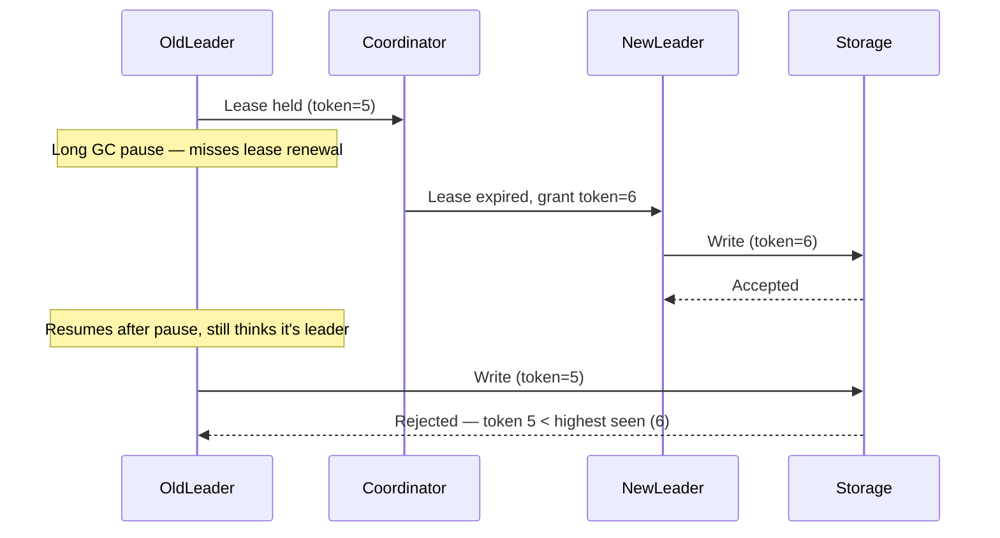

# Leader election

## Problem

Some coordination tasks are only correct if exactly one node performs them at a time — assigning
work ranges (see the [URL shortener](../system-design/url-shortener.md)'s ID allocator), running a
scheduled job once, or acting as the single writer in a leader-follower replication scheme. A static
config value naming "the leader" doesn't survive that node failing; the system needs a mechanism to
detect the failure and safely hand the role to another node.

## Key concepts

- **Quorum-based election** (Raft, Paxos): nodes vote, and a candidate becomes leader only with
  votes from a majority — which guarantees at most one leader can win an election in a given term,
  because two disjoint majorities can't both exist among the same set of nodes.
- **Lease-based election**: a simpler alternative where a node acquires a time-bounded lease (e.g., a
  row in a database with a TTL) and must renew it before expiry to remain leader. Simpler to
  implement than a consensus protocol, but the correctness now depends on clock behavior and timely
  renewal.
- **Fencing token**: a monotonically increasing number issued with each leadership grant. Downstream
  systems reject any write carrying a lower fencing token than the highest one they've already seen
  — this is what actually prevents a deposed leader from causing damage, not the leader "knowing" it
  lost its lease.

## Design



This diagram answers: *what actually stops the old leader from causing damage after it's been
replaced?* Not the old leader's own awareness — it paused before it could learn anything, and
resumes still believing it holds the lease. The fencing token check at the storage layer is what
enforces correctness, because it doesn't depend on the deposed leader behaving well; it depends on
every downstream system checking token order, unconditionally. Leader election without fencing
tokens only prevents split-brain in the happy case where a deposed leader notices its own demotion
in time — the GC-pause scenario above is exactly the case where it can't.

## Trade-offs

- **Quorum consensus (Raft/etcd/ZooKeeper) vs a simple database lease.** Consensus protocols handle
  network partitions and node failures with a proven correctness guarantee, at the cost of running
  (or depending on) a consensus system with its own operational surface. A database row with a TTL
  is far simpler to reason about and operate, but its correctness leans on the database's own
  consistency guarantees and on fencing tokens being enforced everywhere the leader acts — it's a
  reasonable choice for lower-stakes leadership (a background job scheduler) and a risky one for
  anything where a split-brain write is expensive.
- **Lease duration.** Short leases mean fast failover when a leader actually dies, but risk
  unnecessary re-elections under normal jitter (a slow GC pause, a network blip) — this is election
  thrashing (below). Long leases reduce thrashing but mean a real failure takes longer to be
  detected and handed off.

## Failure modes

- **Split-brain without fencing**: two nodes both believe they're the leader — most commonly because
  one paused (GC, VM suspend) long enough for its lease to expire and a new leader to be elected,
  then resumed and kept acting as if nothing happened. Without fencing tokens enforced downstream,
  both leaders can write, and reconciling the result afterward is often harder than the outage a
  fenced rejection would have caused.
- **Election thrashing**: lease timeouts set too aggressively relative to normal latency variance
  cause repeated unnecessary re-elections, each one pausing whatever coordination-dependent work was
  in flight — a system that "works" but spends a meaningful fraction of its time re-electing instead
  of doing work.

## Operational considerations

Leadership changes should be a monitored event, not a silent one — a spike in election frequency is
an early signal of either a real infrastructure problem (network flakiness, GC pressure) or a
timeout misconfiguration, and it's much cheaper to catch from a metric than from the downstream
symptom of duplicated work.

## Example

Fencing token check on the write path, independent of leader self-awareness:

```java
if (incomingToken < storage.highestTokenSeen()) {
    throw new StaleLeaderException(); // reject regardless of what the caller believes
}
storage.write(data, incomingToken);
```

## Interview questions

- Why doesn't a deposed leader reliably know it's been deposed, and what actually protects the
  system from it acting anyway?
- What's the difference in guarantees between a Raft-based election and a database-lease-based one?
- How would you tune lease duration, and what's the cost of getting it too short versus too long?
- What's a concrete scenario where split-brain happens even with correct lease logic?

## Further experiments

The [URL shortener](../system-design/url-shortener.md)'s ID range allocator sidesteps needing full
leader election by handing out non-overlapping ranges instead of requiring exclusive write access —
worth comparing why that design choice was available there and isn't for every coordination problem.
