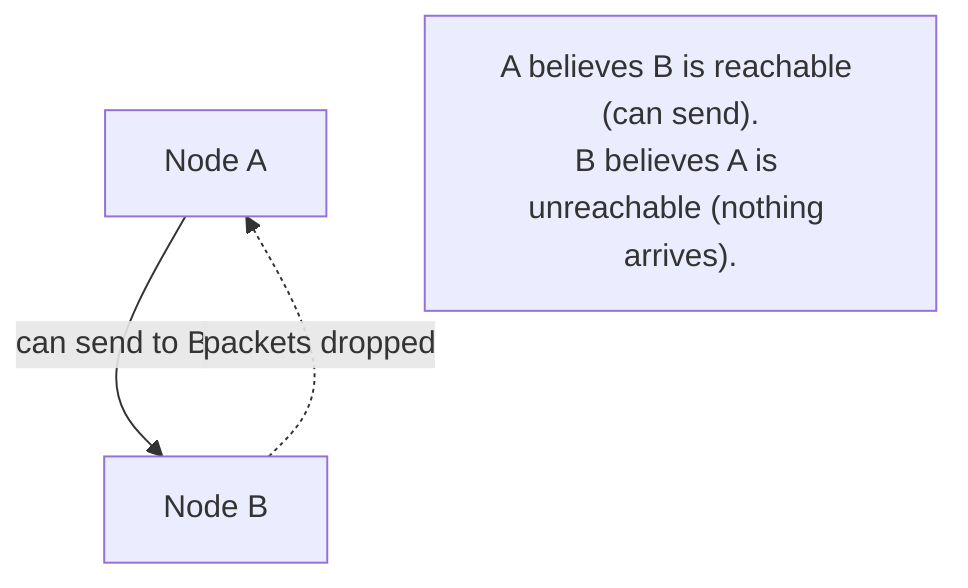

# Partitioning

## Problem

[CAP theorem](cap-theorem.md) treats a network partition as a binary event a system either
experiences or doesn't, and asks what the system does once it's happening. This topic is one level
earlier: how does a system actually *know* it's partitioned, as opposed to just talking to a slow or
temporarily unresponsive peer — and what happens when the partition isn't the clean, symmetric split
most explanations assume, but an asymmetric one where node A can reach node B, but B can't reach A?
Getting this detection step wrong undermines every CP/AP decision built on top of it, because that
decision only fires correctly if "we are partitioned" is actually true when the system believes it.

## Key concepts

- **A partition is inferred, never directly observed.** No node gets a signal that says "you are now
  partitioned" — it only observes the absence of expected responses, and has to infer partition from
  that absence, which is indistinguishable, from the inside, from the peer being slow, overloaded, or
  simply crashed.
- **Timeout-based failure detection.** The practical mechanism almost every system uses: no response
  within a bound is treated as "unreachable," whether the true cause is a partition, a crash, or
  extreme slowness. The timeout value is a direct trade-off between false positives (treating a
  merely-slow peer as partitioned) and detection latency (how long a real partition goes unnoticed).
- **Asymmetric partitions.** The clean mental model — two groups of nodes, each internally connected,
  cut off from each other — is a special case. Real network failures can be asymmetric: A's packets
  to B are dropped, but B's packets to A arrive fine. This breaks any protocol that assumes "if I
  can't reach you, you can't reach me" — the two sides can reach different, contradictory conclusions
  about who's still around.
- **Quorum as partition tolerance's actual mechanism.** A quorum-based system doesn't detect a
  partition explicitly — it requires a majority for any decision, which structurally guarantees at
  most one side of any partition can ever have a majority, so at most one side can make progress.
  This is what turns "we might be partitioned" into a safe default (refuse to act) without needing to
  correctly diagnose the partition first.

## Design



This diagram answers: *why can't a node simply ask "am I partitioned" and get a reliable answer?*
Because reachability, under an asymmetric failure, isn't even a shared fact between the two nodes —
A's evidence (its sends appear to succeed) and B's evidence (nothing arrives) point to different
conclusions, and neither node has visibility into the other's side of the picture. Any protocol that
assumes symmetric reachability — "if I haven't heard from you, you haven't heard from me either" —
is making an assumption this diagram directly violates, and a leader-election or replication scheme
built on that assumption can end up with both sides believing they're in charge.

## Trade-offs

- **Aggressive timeout vs conservative timeout.** A short timeout detects a real partition (or node
  failure) fast, minimizing how long the system operates on a stale assumption — at the cost of
  treating ordinary network jitter or a briefly overloaded peer as a full partition, triggering
  unnecessary failovers or rejected requests. A longer timeout avoids false positives but means a
  genuine partition goes undetected, and potentially unsafe, for longer. The signal: what's the cost
  of a false positive (an unnecessary failover) relative to the cost of slow detection (continuing to
  operate under a stale, possibly unsafe assumption)?
- **Quorum-based safety vs explicit partition detection.** Requiring a majority for every decision
  sidesteps the detection problem entirely — it's safe regardless of whether the system correctly
  diagnoses *why* it can't reach a majority, asymmetric or not. Explicit partition detection (trying
  to determine which nodes are on which side) can enable smarter recovery decisions but has to
  correctly handle the asymmetric case above to be trustworthy, which is a genuinely harder problem
  than "did we get a majority of votes."

## Failure modes

- **Assuming symmetric partitions.** A protocol built on "if A can't reach B, B can't reach A" breaks
  under a real asymmetric network failure — both sides can end up believing contradictory things
  about who's reachable, which is exactly the precondition for split-brain.
  See [leader election](leader-election.md)'s fencing-token mitigation for what actually protects
  against the consequence, independent of correctly diagnosing the partition's shape.
- **Timeout too short for the actual network's tail latency.** A timeout tuned against typical
  latency, without accounting for the real p99/p999 tail, treats normal-but-slow responses as
  partition, causing unnecessary failovers under ordinary load spikes — this shows up as intermittent
  instability that looks like flaky infrastructure rather than a tuning problem.
- **No quorum requirement, relying purely on detection.** A system that acts unilaterally based on
  its own partition-detection conclusion, without requiring agreement from a majority, can act
  incorrectly the moment its own detection is wrong (including under the asymmetric case) — quorum is
  what makes the system's behavior safe even when detection itself is imperfect.

## Operational considerations

Partition or unreachability events, even brief ones that resolve on their own, are worth logging and
trending — a rising rate of transient unreachability between specific node pairs is often an early
signal of a real, worsening network problem well before it manifests as a full, sustained partition
serious enough to page anyone.

## Example

A quorum check that stays safe without needing to correctly diagnose the partition's shape:

```java
int reachable = countReachablePeers();
if (reachable < (totalNodes / 2) + 1) {
    throw new NoQuorumException(); // refuse to act — safe regardless of *why* peers are unreachable
}
```

## Interview questions

- Why can a node never directly observe that it's partitioned, only infer it from missing responses?
- What's an asymmetric network partition, and why does it break protocols that assume mutual
  reachability?
- Why does requiring a quorum make a system safe even when its own partition detection might be
  wrong?
- How would you tune a failure-detection timeout, and what's the cost of getting it too aggressive
  versus too conservative?

## Further experiments

Compare against [CAP theorem](cap-theorem.md) (what a system does once it believes it's partitioned)
and [leader election](leader-election.md) (fencing tokens as the mechanism that stays safe even when
partition detection itself gets the topology wrong).
