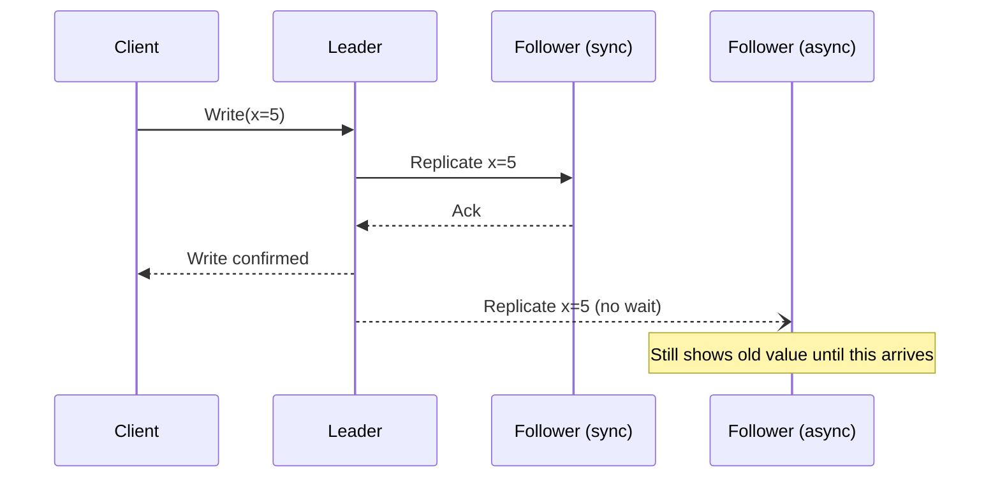

# Replication

## Problem

A single copy of data is both a durability risk (one disk failure loses it) and a throughput
ceiling (one node's IOPS is the system's IOPS). Replication solves both, but the moment there's more
than one copy, the system has to answer a question it didn't have before: what happens when the
copies briefly disagree?

## Key concepts

- **Single-leader (leader-follower)**: all writes go through one node; followers apply the same
  writes in order. Simple to reason about — there's one source of truth for write order.
- **Multi-leader**: more than one node accepts writes (often one per region), and changes are
  merged. Needed when writes must be accepted close to users in multiple locations, at the cost of
  a real conflict-resolution problem.
- **Leaderless (quorum-based)**: any replica can accept a write; a read or write is only considered
  successful once a quorum of replicas acknowledges it (see the quorum math in
  [CAP theorem](cap-theorem.md)).
- **Synchronous vs asynchronous replication**: does the leader wait for a follower's acknowledgment
  before confirming the write to the client, or confirm immediately and replicate in the
  background?
- **Replication lag**: how far behind a follower is. Not a bug — an inherent property of
  asynchronous replication that has to be designed around, not eliminated.

## Design



This diagram answers: *what does "durable" actually mean once there's more than one node?* The
write is confirmed to the client the instant the synchronous follower acks — a leader crash after
that point still has the data on at least two nodes. The asynchronous follower, by design, might
still be serving the old value at that exact moment: a read routed there right after the write is a
stale read, not a bug in the replication mechanism.

## Trade-offs

- **Durability vs write latency.** Synchronous replication to at least one follower guarantees a
  confirmed write survives a single node failure, at the cost of write latency bounded by the
  slowest synchronous follower. Fully asynchronous replication is fast but can lose the last few
  writes if the leader dies before they propagate — acceptable for data where losing the last few
  seconds is tolerable (analytics events), not for anything where "the client was told it
  succeeded" has to be true (a financial transaction).
- **Replica count vs cost and write overhead.** Each additional synchronous replica adds
  acknowledgment latency and infrastructure cost for each additional node tolerated as a simultaneous
  failure. Beyond 3 replicas the marginal durability gain rarely justifies the marginal write-latency
  cost for most systems — the jump from 1 to 3 nodes matters far more than 3 to 5.
- **Single-leader simplicity vs multi-leader write locality.** Single-leader avoids conflict
  resolution entirely but forces every write through one region, adding latency for users far from
  the leader. Multi-leader fixes that latency at the cost of a real merge problem the moment two
  regions write to the same record concurrently.

## Failure modes

- **Read-your-writes violation**: a client writes through the leader, then reads from a lagging
  follower and doesn't see its own write. This looks like a bug to users even though the replication
  system is working exactly as configured — the fix is routing a client's own reads to the leader
  (or a replica known to be caught up) for some window after their write, not "fixing" the lag.
- **Data loss on leader failover with async replication**: writes acknowledged by the leader but not
  yet replicated are gone if the leader crashes before propagating them and a follower is promoted.
  This is the concrete cost of choosing availability/latency over durability in PACELC terms (see
  [CAP theorem](cap-theorem.md)) — it needs to be a stated, accepted risk, not a surprise.
- **Replication lag spiral**: a follower falls behind under load, and the growing backlog itself
  slows down its ability to catch up (more writes queued, more contention), turning a temporary lag
  into a permanently diverging replica that eventually needs a full resync.

## Operational considerations

Replication lag (seconds behind leader) needs to be a first-class monitored metric, not an
afterthought — it's the number that tells an operator whether a follower is safe to read from right
now, and it's the leading indicator of a follower about to fall so far behind it needs a resync.
Failover time (how long between leader failure and a follower being promoted and accepting writes)
directly bounds the system's write-availability during that failure.

## Example

A synchronous-replication write acknowledgment policy expressed the way most relational systems
configure it:

```text
synchronous_commit = on
synchronous_standby_names = 'follower-1'
-- Write only confirmed to client after follower-1 acknowledges it.
-- All other followers replicate asynchronously.
```

## Interview questions

- What's the concrete difference between "the write succeeded" under synchronous vs asynchronous
  replication?
- How would you fix a read-your-writes violation without making every read synchronous?
- What happens to unacknowledged writes when a leader crashes under asynchronous replication?
- When would multi-leader replication be worth its conflict-resolution cost?

## Further experiments

`distributed-systems-playground` (pending — not yet created) is planned to include a
failure-injection example that kills a leader mid-write and shows exactly which writes survive
under sync vs async replication.
