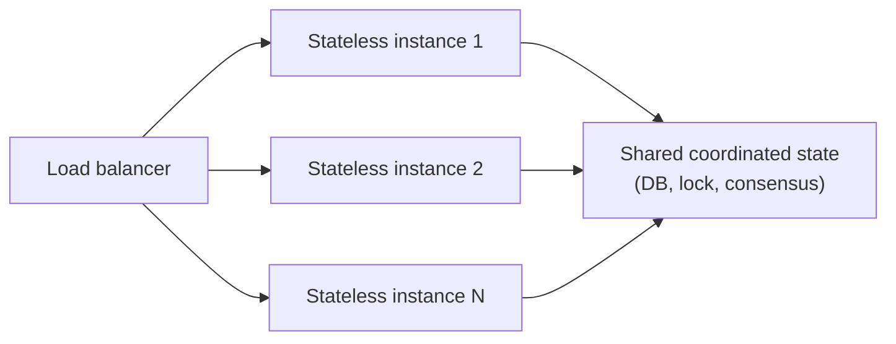

# Scalability

## Problem

"Add more servers" is the reflexive answer to a capacity problem, but it only works cleanly for a
narrow class of workloads — anything with shared, coordinated state (a shared database, a lock, a
consensus round) doesn't get faster proportionally as nodes are added, and past a certain point can
actually get *slower* as the coordination overhead between nodes grows faster than the useful work
they're doing. The design problem isn't "can this scale horizontally" — almost anything technically
can — it's identifying exactly which part of the system is stateless and trivially parallel, and
which part carries the coordination cost that caps how far adding nodes actually helps.

## Key concepts

- **Horizontal vs vertical scaling.** Vertical scaling (a bigger machine) is simple — no
  distribution problem to solve — but hits a hard ceiling and a single point of failure. Horizontal
  scaling (more machines) has no hard ceiling but only works cleanly for workloads that don't need
  the machines to coordinate tightly with each other.
- **Stateless vs stateful scaling.** A stateless service scales close to linearly — each new instance
  handles its share of requests independently, with a load balancer as the only coordination point.
  A stateful service (anything owning data that has to stay consistent across instances) needs
  [replication](replication.md) or partitioning to scale at all, and that coordination is exactly
  where the linear scaling stops.
- **Amdahl's law**: the speedup from parallelizing work is capped by the fraction of the work that
  *can't* be parallelized — a workload that's 90% parallelizable can never go faster than 10x, no
  matter how many nodes are added, because the serial 10% dominates once the parallel part is fast
  enough.
- **Coordination overhead growing with node count.** Beyond Amdahl's static bound, some systems get
  actively worse with more nodes: a consensus protocol's message complexity, a shared lock's
  contention, or a cache's invalidation traffic can all grow faster than linearly with node count,
  eventually making the marginal node a net negative rather than a diminishing positive.

## Design



This diagram answers: *why does adding instances 1 through N scale the top half almost linearly, but
not the bottom?* The stateless layer genuinely has no coordination cost between instances — each one
independently does its share of work, and the load balancer is the only shared resource, cheap to
scale itself. Everything below the line converges on the same shared state, and that convergence is
exactly the coordination cost Amdahl's law and quorum overhead are about — no amount of adding
stateless instances above the line changes how much coordination the shared state below it needs,
which is why scaling the stateless tier is easy and scaling the stateful tier is the actual hard
problem.

## Trade-offs

- **Scale the stateless tier first vs invest in the stateful tier's scaling.** Scaling stateless
  instances is cheap and close to risk-free — it's usually the first lever pulled under load, and
  correctly so. But if the bottleneck is actually the shared state (a single database being hit
  harder as more stateless instances generate more load against it), adding more stateless instances
  doesn't fix the bottleneck, it just moves more concurrent pressure onto it faster. The signal:
  profile where the actual saturation is before assuming more instances of the layer that's easy to
  scale will help — it might just move the same ceiling closer, faster.
- **Partition the stateful tier vs accept its coordination ceiling.** Partitioning shared state
  (sharding, see [databases](../databases/README.md)) breaks the single-coordination-point bottleneck
  into independent slices that can each scale on their own, at the cost of losing cross-partition
  transactions and queries becoming genuinely harder. Accepting the ceiling (a single, well-tuned
  database) is simpler and correct until the actual measured load exceeds what that ceiling allows —
  partitioning before that point is complexity paid for a problem that doesn't exist yet.

## Failure modes

- **Assuming linear scaling for a workload with real coordination cost.** Adding nodes to a workload
  whose bottleneck is shared-state coordination (a database, a distributed lock) produces
  diminishing, then negative, returns — more nodes means more coordination traffic contending for
  the same shared resource, not more independent throughput.
- **Scaling the wrong tier.** Adding stateless application instances when the actual saturation point
  is the database those instances all call doesn't relieve pressure — it can make it worse, by
  generating more concurrent load against the same bottleneck faster than before.
- **Ignoring Amdahl's law's static bound.** Investing heavily in parallelizing a workload's already-
  parallel 90% while its serial 10% goes untouched hits a real, calculable ceiling no amount of
  additional parallel capacity crosses — the serial portion needs its own optimization, not more
  nodes.

## Operational considerations

Track saturation (CPU, connection pool, lock contention — whatever the actual limiting resource is)
per tier separately, not just aggregate request latency — aggregate latency going up tells you
something is saturated, but only per-tier saturation data tells you *which* tier to actually scale,
and scaling the wrong one wastes real cost while the actual bottleneck stays untouched.

## Example

Amdahl's law's speedup ceiling, made concrete:

```text
Parallelizable fraction: 0.9 (90% of the work can be parallelized)
Serial fraction: 0.1

Max speedup as nodes -> infinity: 1 / 0.1 = 10x
-- No number of additional nodes crosses this ceiling; only reducing
-- the serial fraction itself (the coordination-bound 10%) does.
```

## Interview questions

- Why does a stateless service scale close to linearly while a stateful one generally doesn't?
- What does Amdahl's law say about the limit of adding more nodes to a workload with a fixed serial
  fraction, and why is that limit not about hardware at all?
- How would you diagnose whether adding more application instances will actually help under load, or
  just move the same bottleneck closer, faster?
- When does adding more nodes to a distributed system start making it *slower*, not just have
  diminishing returns?

## Further experiments

Compare against [replication](replication.md) (the concrete mechanism for scaling a stateful tier's
read capacity) and [CAP theorem](cap-theorem.md) (the trade-off that shows up the moment that
stateful tier is partitioned or replicated to scale further).
