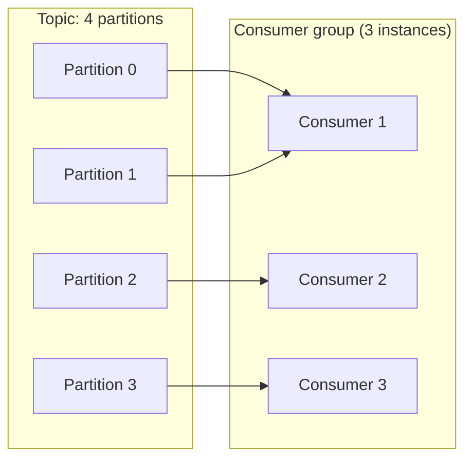

# Consumer groups

## Problem

A single consumer reading a message stream is both a throughput ceiling (it can only process as
fast as one process can) and a single point of failure for processing (if it dies, nothing consumes
until it's restarted). Consumer groups let multiple consumer instances share the work, but that
raises the question every parallelism scheme has to answer: what ordering guarantee, if any,
survives the parallelization?

## Key concepts

- **Partition**: a stream (a Kafka topic, for instance) is split into ordered partitions. Order is
  guaranteed *within* a partition, never *across* partitions.
- **Consumer group**: a set of consumer instances that split a topic's partitions among themselves —
  each partition is read by exactly one consumer in the group at a time, so the group as a whole
  processes the full topic while no two consumers double-process the same partition.
- **Rebalancing**: when a consumer joins or leaves the group (deploy, crash, scale event), partitions
  are reassigned among the remaining consumers. Correct, but not free — it's a stop-the-world pause
  for the affected partitions while reassignment happens.
- **Partition key**: the value used to decide which partition a message goes to (often an entity ID —
  `order_id`). All messages with the same key land on the same partition, which is what makes
  per-entity ordering achievable at all.

## Design



This diagram answers: *what is the actual unit of parallelism and ordering here?* It's the
partition, not the message and not the topic. Consumer 1 handling two partitions processes them
independently — there's no ordering guarantee between P0 and P1 even though the same consumer
instance reads both. Order is only guaranteed among messages that share a partition, which is why
the partition key choice (not the consumer count) is what determines whether "process this entity's
events in order" is actually true.

## Trade-offs

- **Partition count vs parallelism and rebalance cost.** More partitions allow more consumers to run
  in parallel (parallelism is capped at partition count — a 4th consumer in the diagram above would
  sit idle), but each rebalance has more state to reassign, and partition count can't be decreased
  later on most brokers without recreating the topic — better to slightly over-provision partitions
  upfront than under-provision and hit a ceiling.
- **Partition key choice vs load skew.** Keying by an entity ID gives per-entity ordering, but if
  one entity is disproportionately active (a celebrity account, a top-selling product) its partition
  becomes a hot spot no amount of adding consumers can relieve, because that partition is still read
  by exactly one consumer. A key with more even cardinality trades away per-entity ordering for
  better load distribution — the choice depends on whether ordering or balanced load matters more
  for that stream.

## Failure modes

- **Rebalance storms**: a consumer that crash-loops (bad deploy, resource exhaustion) triggers a
  rebalance on every join and leave, each one pausing processing on the affected partitions — a
  single flapping instance can degrade the whole group's throughput far more than its own share of
  the work would suggest.
- **Hot partition from a skewed key**: symptomatically looks like "the consumer group needs to scale
  up" but doesn't respond to adding consumers, because the bottleneck is the one partition's single
  consumer, not the group's total capacity — the fix is a better partition key or splitting that
  entity's traffic, not more instances.
- **Assuming cross-partition ordering**: code that processes events from multiple partitions and
  assumes they arrive in the order they were produced across the whole topic will intermittently
  reorder — this only ever shows up under real concurrent load, not in a single-partition local test.

## Operational considerations

**Consumer lag** (how far a consumer is behind the latest offset), tracked per partition, is the
primary health signal for a consumer group — lag concentrated on one partition points at skew or a
poison message on that partition specifically; lag spread evenly across all partitions points at
the group being under-provisioned overall.

## Example

Choosing a partition key that preserves per-entity ordering without picking a globally hot key:

```java
producer.send(new ProducerRecord<>("orders", order.getOrderId(), event));
// Same order_id -> same partition -> ordered processing per order.
// Not order.getCustomerId() if a small number of customers
// generate a disproportionate share of orders.
```

## Interview questions

- What ordering guarantee does a consumer group actually provide, and at what granularity?
- Why can adding more consumers fail to fix a lag problem?
- What causes a rebalance, and why is it not free?
- How would you choose a partition key differently for an ordering-sensitive stream versus a
  load-balancing-sensitive one?

## Further experiments

Cross-reference with [outbox pattern](outbox-pattern.md): the outbox's `event_type` plus entity ID
is a natural partition key candidate, since it's usually the same entity whose ordering matters on
the consuming side.
