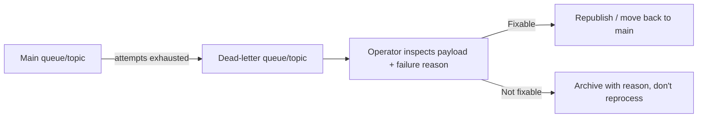

# Dead-letter queues

## Problem

Once [retries](retries.md) are exhausted, a message still exists — it didn't vanish, it just failed
every attempt to process it. Dropping it silently is rarely acceptable (that message represented a
real event: an order, a payment, a state change), but leaving it in the main queue for infinite
retry blocks every message behind it, including ones that would process fine. A dead-letter queue
solves the immediate blocking problem — get the poison message out of the way — but only solves it
completely if what lands there is actually inspectable and actionable, not just a place messages go
to be forgotten.

## Key concepts

- **Isolation, not disposal.** A DLQ's core job is separating "this specific message can't be
  processed right now" from "the rest of the stream is fine" — moving a failed message out of the
  main queue's path so it stops blocking everything after it, without deciding the message doesn't
  matter.
- **Broker-native vs application-managed DLQs.** Some brokers move a message to a dead-letter
  destination as pure configuration once retries are exhausted (RabbitMQ's DLX chain); others need
  application code to explicitly publish to a separate destination on final failure (a Kafka
  `DeadLetterPublishingRecoverer` writing to a `.DLT` topic). Both end at the same place — a
  message somewhere other than the main stream — by different mechanisms with different operational
  properties.
- **Replay vs move.** Getting a message out of a DLQ and back into processing means different things
  depending on the broker: republishing a DLT record to its original topic (Kafka) versus a broker-
  native "move messages" action back to the main queue (RabbitMQ's Management UI) — there's no
  general concept of "replay from the DLQ" that applies identically everywhere.
- **A DLQ without inspection is a silent failure with extra steps.** A message sitting in a DLQ that
  nobody looks at has the same practical effect as one that was dropped — the failure was caught, but
  nothing about the DLQ's existence guarantees anyone acts on what's in it.

## Design



This diagram answers: *what actually has to be true for a DLQ to prevent data loss, as opposed to
just delaying it?* Every arrow after "Dead-letter queue/topic" — inspection has to actually happen,
and the two outcomes (replay or archive) both have to be deliberate decisions someone made after
looking at the payload and the failure reason, not defaults nobody chose. A DLQ that receives
messages but has no process behind the "Inspect" step is functionally the same as dropping them, just
with a longer delay before the data is effectively lost to inattention instead of to code.

## Trade-offs

- **A single shared DLQ vs one per failure category.** A single DLQ is simple to set up and monitor
  (one queue, one alert threshold) but mixes genuinely different problems together — a malformed
  payload, a downstream outage, and a bug in the consumer all land in the same place, making triage
  slower. Splitting by failure category (or at minimum, tagging the failure reason on the message)
  costs more setup but makes "what's actually going wrong" answerable at a glance instead of requiring
  someone to open every message.
- **Replay tooling built in advance vs built when first needed.** Building replay tooling (a script,
  a UI action) before it's ever needed is speculative effort for a capability that might not match
  the actual shape of the first real failure. Building it reactively, the first time a DLQ actually
  needs to be drained, risks that first incident taking longer than it should — a reasonable middle
  ground is having *a* replay path (even a manual one) decided in advance, without over-engineering
  its tooling before a real failure shows what's actually needed.

## Failure modes

- **A DLQ nobody monitors.** The most common failure: the DLQ correctly isolates poison messages from
  blocking the main queue, but nothing alerts on its size or age, so messages accumulate
  indefinitely without anyone noticing — the isolation worked exactly as designed and the outcome is
  still silent, permanent data loss in practice.
- **Replaying without fixing the underlying cause.** Republishing a dead-lettered message without
  first understanding why it failed just moves the same failure back into the main queue's retry
  cycle — if the root cause (a bug, a permanently missing downstream) hasn't changed, the message
  ends up right back in the DLQ, having consumed another full retry cycle for nothing.
- **No failure reason attached to the dead-lettered message.** A DLQ that holds only the original
  payload, with no record of why it failed or which attempt it failed on, forces whoever investigates
  it to reproduce the failure from scratch instead of reading what already happened.

## Operational considerations

DLQ depth (message count) and age of the oldest message are the two numbers that matter — depth
alone can look stable while individual messages silently age past any reasonable window for action;
tracking both catches a DLQ that's technically not growing but is quietly accumulating messages
nobody has looked at in weeks.

## Example

Attaching a failure reason when dead-lettering, so the DLQ is inspectable without reproducing the
failure:

```java
DeadLetterPublishingRecoverer recoverer = new DeadLetterPublishingRecoverer(kafkaTemplate,
    (record, exception) -> new TopicPartition(record.topic() + ".DLT", record.partition()));
recoverer.setHeadersFunction((record, exception) ->
    new RecordHeaders().add("x-failure-reason", exception.getMessage().getBytes()));
```

## Interview questions

- What does a dead-letter queue actually solve — the failure itself, or something else?
- Why is a DLQ that nobody monitors functionally equivalent to dropping the message outright?
- What's the difference between "replay" on a Kafka DLT and on a RabbitMQ dead-letter queue, and why
  isn't there one universal replay mechanism?
- What information does a dead-lettered message need to carry, beyond the original payload, to be
  actually actionable?

## Further experiments

`distributed-systems-playground` implements dead-lettering natively on both brokers and ships a
replay script for the Kafka side:
[ADR-0006](https://github.com/Fragudev/distributed-systems-playground/blob/f893b1568b28f1ecab1babdc35292dcdfb0f49b0/docs/adr/0006-retry-dlq-strategy.md)
covers both mechanisms, and `scripts/replay-dlq.sh` is the real, working replay tool for the Kafka
`.DLT` topic — the RabbitMQ side needs no equivalent script, since its DLQ is browsable and
replayable directly from the Management UI.
