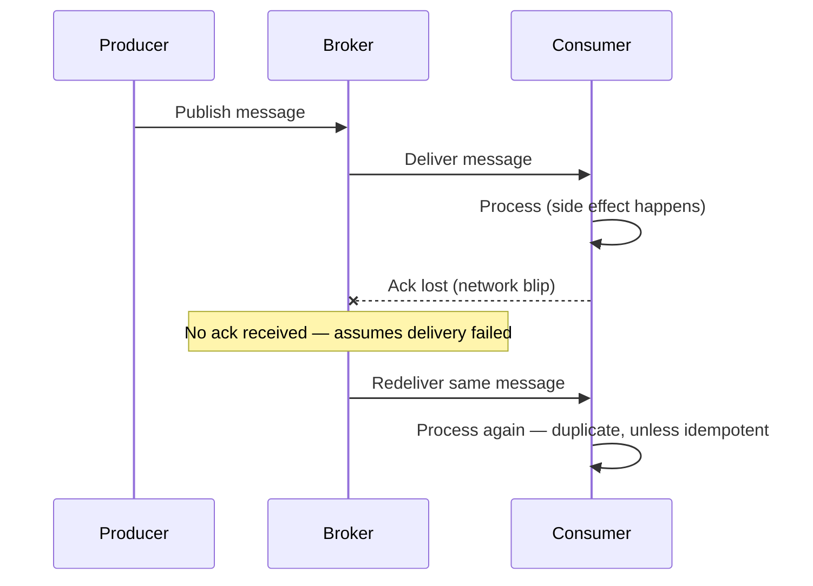

# Delivery semantics

## Problem

"We use exactly-once delivery" is a common claim that's almost never literally true across
independent processes connected by an unreliable network — a message can always be sent, the
acknowledgment lost, and the sender retry, and there's no way for the sender to distinguish "it
never arrived" from "it arrived but the ack didn't." What's achievable, and what actually matters,
is being precise about which of the three real semantics a system provides, and pairing it with the
right consumer design.

## Key concepts

- **At-most-once**: a message is sent without retry. It's either processed once or lost — never
  duplicated. Cheapest, and the right default only when losing a message is cheaper than handling a
  duplicate (a non-critical metric, a UI toast notification).
- **At-least-once**: the sender retries until it receives an acknowledgment. Guarantees the message
  isn't silently lost, at the cost of possible duplicates when an ack is lost after the message was
  actually processed. This is the practical default for anything where losing data isn't acceptable.
- **Exactly-once**: unattainable as a *delivery* guarantee between independent processes in general
  (this follows from the same reasoning as the [Two Generals' Problem](https://en.wikipedia.org/wiki/Two_Generals%27_Problem)).
  What's actually achievable is **effectively-once processing**: at-least-once delivery combined
  with an [idempotent consumer](../distributed-systems/idempotency.md), so duplicates are delivered
  but have no additional effect.

## Design



This diagram answers: *where exactly does a duplicate come from, if both broker and consumer are
working correctly?* Not from a bug — from the ack being the only signal the broker has, and that
signal being just as vulnerable to loss as any other message on the network. The broker's only safe
assumption when an ack doesn't arrive is "maybe it wasn't processed," which forces redelivery, which
is indistinguishable on the consumer's side from a message being sent twice on purpose.

## Trade-offs

- **At-least-once + idempotent consumer (my default) vs at-most-once.** At-least-once puts the
  correctness burden on the consumer (it must be idempotent, per
  [idempotency](../distributed-systems/idempotency.md)), which is a one-time design cost that then
  applies to every message. At-most-once has zero consumer-side burden but a permanent, silent risk
  of data loss — I only reach for it when the cost of losing an occasional message is provably lower
  than the cost of building idempotency (high-volume telemetry where 99.9% delivery is fine).
- **Ack-before-process vs ack-after-process.** Acking before processing (removing the message from
  the queue immediately) risks losing it if the consumer crashes mid-processing — effectively
  at-most-once in practice, regardless of what the broker advertises. Acking after processing
  completes is what actually delivers at-least-once semantics, at the cost of possible redelivery if
  the crash happens *after* processing but *before* the ack — which is exactly the duplicate case
  the design above illustrates, and exactly why the consumer still needs to be idempotent even with
  the "correct" ack ordering.

## Failure modes

- **Silent at-most-once dressed up as at-least-once.** A consumer that acks immediately on receipt,
  before processing, gets all the code complexity of an at-least-once system with none of its
  guarantee — a crash between ack and processing loses the message with no retry, because the broker
  was already told it succeeded.
- **At-least-once without an idempotent consumer.** The most common source of real production bugs
  in this area: a team picks at-least-once for its durability guarantee, correctly, but doesn't
  design the consumer to tolerate duplicates — a redelivered message doubles an effect (double
  email, double charge) instead of being a no-op.

## Operational considerations

Track redelivery/duplicate rate as an explicit metric, separate from error rate — a low, steady rate
is expected and healthy under at-least-once; a rising rate usually means growing ack latency or
consumer slowness, not a broker problem, and is an early warning before consumer lag itself becomes
visible.

## Example

Ack-after-process, the ordering that actually yields at-least-once:

```java
Message msg = consumer.poll();
process(msg);            // side effect happens first
consumer.commitSync();   // ack only after processing succeeds
// A crash between process() and commitSync() causes redelivery —
// safe only because process() is idempotent.
```

## Interview questions

- Why is true exactly-once delivery not achievable between independent processes over a network?
- What's the practical difference between "exactly-once delivery" and "effectively-once processing"?
- What ack ordering mistake silently turns an at-least-once system into at-most-once?
- When is at-most-once the right choice, and what makes it acceptable there but not elsewhere?

## Further experiments

Pairs directly with [idempotency](../distributed-systems/idempotency.md) (the consumer-side half of
this) and [outbox pattern](outbox-pattern.md) (the producer-side half — making the publish itself
reliable in the first place).
