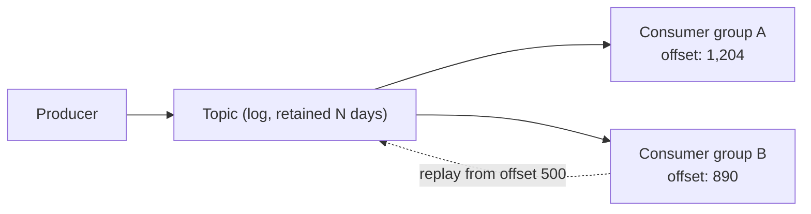

# Kafka

## Problem

Kafka is often reached for by default because it's the most widely known broker, without asking
what specifically it's buying over a simpler queue — a log-structured broker makes a different set
of guarantees than a traditional message queue, at the cost of upfront decisions (partition count,
key choice) that are expensive to change later. The design problem is knowing which of Kafka's
specific properties — replay, partition-scoped ordering with real parallelism, durable retention —
the workload actually needs, because if none of them do, Kafka's operational cost buys nothing a
simpler broker wouldn't have given more cheaply.

## Key concepts

- **Log, not queue**: a Kafka topic is an append-only, ordered log with configurable retention — a
  message isn't removed on consumption, so any consumer group can replay from an arbitrary offset,
  independent of what other consumer groups have already read.
- **Partition**: the unit of both ordering and parallelism (see
  [consumer groups](consumer-groups.md)) — order is guaranteed within a partition, never across
  partitions, and partition count sets a hard ceiling on how many consumers in one group can process
  in parallel.
- **Consumer-tracked offsets**: each consumer group tracks its own read position per partition;
  nothing about this is broker-enforced delivery state the way a traditional queue tracks per-message
  acknowledgment — replay is just "reset the offset," not a special operation.
- **Rebalancing cost**: adding or removing a consumer reassigns partitions among the group, pausing
  processing on the affected partitions while it happens — a real, non-free operational cost that a
  competing-consumers model (see [RabbitMQ](rabbitmq.md)) doesn't have.

## Design



This diagram answers: *what does "replay" actually mean, mechanically, and why can two consumer
groups be at different points in the same topic without conflict?* Because the log isn't consumed
away — group A and group B each hold their own offset into the same retained data, so B can rewind
to an earlier point without affecting A at all. That's structurally different from a queue, where a
message leaving the queue is a single, shared event every consumer has to agree happened. Replay
isn't a special recovery feature bolted on; it's just what reading a log from an earlier position
already means.

## Trade-offs

- **Kafka vs a traditional queue, generally.** Kafka's replay and partition-scoped ordering-with-
  parallelism are real advantages when the workload needs to reprocess history, feed multiple
  independent readers over time, or needs both ordering and throughput on the same stream. Both come
  with real upfront cost: partition count has to be chosen ahead of time and is expensive to shrink,
  and topic/consumer-group/error-handler wiring reads as more moving parts than a queue's declare-
  and-consume model. The signal: does anything downstream actually need to replay history or reread
  the stream from a different starting point? If not, Kafka's core differentiator is unused.
- **More partitions vs rebalance cost.** More partitions raise the parallelism ceiling but make every
  rebalance larger, and partition count generally can't be decreased without recreating the topic —
  slight over-provisioning upfront is usually cheaper than hitting a parallelism ceiling and having
  no way to raise it without a migration.

## Failure modes

- **Choosing Kafka for its popularity, not its properties.** Adopting Kafka without a concrete need
  for replay or partition-scoped ordering-with-parallelism means carrying its operational cost
  (partition planning, rebalance behavior, offset management) for guarantees a simpler broker would
  have provided for less.
- **A skewed partition key.** A key with uneven cardinality (one dominant entity) concentrates load
  on one partition that no amount of adding consumers relieves, because that partition still has
  exactly one consumer in the group — see [consumer groups](consumer-groups.md) for the full failure
  mode.
- **Treating retry state as durable.** Kafka's redelivery retry (see [Retries](retries.md)) typically
  lives in the consuming process's memory during an in-process backoff — a crash mid-backoff resets
  the attempt count on redelivery, unlike a broker that stamps attempt count on the message itself.

## Operational considerations

Consumer lag, tracked per partition, is the primary Kafka-specific health signal — see
[consumer groups](consumer-groups.md#operational-considerations) for how to read it. Beyond lag,
retention configuration is worth alerting on directly: a topic approaching its retention window with
a consumer group meaningfully behind is a silent data-loss risk that won't show up as an error
anywhere until a replay is actually needed and the data is already gone.

## Example

Resetting a consumer group's offset to replay from an earlier point — the mechanism, not a special
API:

```bash
kafka-consumer-groups.sh --bootstrap-server localhost:9092 \
  --group order-analytics --topic orders \
  --reset-offsets --to-offset 500 --execute
```

## Interview questions

- What does Kafka's log-based model let you do that a traditional queue's consume-and-remove model
  doesn't?
- Why does replaying a topic not require any special broker feature beyond what offset tracking
  already provides?
- What's the real cost of over- versus under-provisioning partition count, and why is it asymmetric?
- When would you choose Kafka specifically over RabbitMQ for a given workload, and vice versa?

## Further experiments

`distributed-systems-playground` builds the same order-processing scenario on both Kafka and
RabbitMQ to make the comparison concrete rather than assumed:
[ADR-0007](https://github.com/Fragudev/distributed-systems-playground/blob/f893b1568b28f1ecab1babdc35292dcdfb0f49b0/docs/adr/0007-kafka-vs-rabbitmq.md)
lays out the comparison table (retention, ordering vs. parallelism, retry mechanics, routing model)
built from actually implementing the identical scenario on both brokers, not from a general
comparison written in the abstract.
