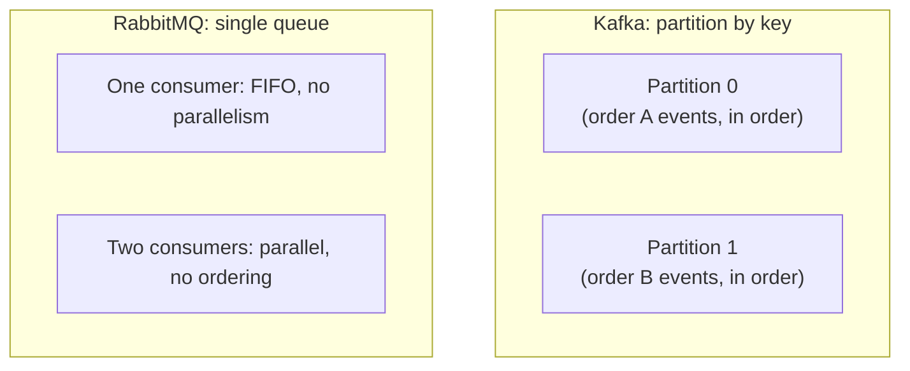

# Ordering

## Problem

Most messaging systems force a trade between ordering and parallelism: guaranteeing a strict
processing order for a stream generally means one consumer handling it serially, and adding
consumers to go faster generally means giving up that guarantee. Teams often assume "ordering" is
one property a broker either has or doesn't, when in practice it's always scoped to something —
per-partition, per-queue, per-key — and the real design question is choosing the right scope for
what actually needs to stay ordered, rather than either assuming global ordering exists or giving up
on ordering entirely because a naive setup can't provide it for free.

## Key concepts

- **Total order vs partial order.** Total order means every message across an entire stream is
  processed in the sequence it was produced — expensive, because it forces full serialization.
  Partial order (ordered *within* some scope: a partition, an entity ID, a queue) is what real
  systems actually provide and actually need — most workloads only care that events for the *same*
  entity arrive in order, not that unrelated entities' events do too.
  See [consumer groups](consumer-groups.md) for how a partition key defines that scope in Kafka.
- **Ordering-preserving parallelism vs order-discarding parallelism.** Kafka's partition-plus-key
  model gets both: parallel consumption across partitions, strict order within one. A RabbitMQ queue
  with competing consumers gets only one or the other — a single consumer preserves the whole queue's
  FIFO order but doesn't parallelize; multiple consumers parallelize but the moment more than one is
  active, ordering is gone, full stop, not degraded.
- **Sequence numbers as an ordering check, not an ordering guarantee.** Attaching a monotonic
  sequence number to each message lets a consumer *detect* out-of-order or missing delivery after the
  fact, even when the transport itself makes no ordering promise — useful when the broker can't
  provide ordering but silently processing events out of order would be worse than an observable gap.

## Design



This diagram answers: *why can Kafka give ordering and parallelism together when RabbitMQ's plain
queue model can't?* Because Kafka's unit of parallelism (the partition) is also the unit of ordering
— every consumer works on a *different* ordered sequence, so no two consumers ever race over the
same order's events. RabbitMQ's competing-consumers model has no equivalent second dimension: all
consumers pull from the same single ordered sequence, so parallelizing necessarily means multiple
consumers racing to process messages that were adjacent in that one sequence, destroying the order
between them. The fix isn't a RabbitMQ limitation to work around — it's routing entity-scoped streams
to entity-scoped queues (or a Kafka-style partitioned topic) when both properties are actually
needed together.

## Trade-offs

- **Scoping ordering to an entity vs accepting a global bottleneck.** Ordering everything (one queue,
  one consumer) is simple to reason about but caps throughput at whatever one consumer can do.
  Scoping ordering to the entity that actually needs it (per-order, per-user) and accepting no
  ordering guarantee across different entities recovers real parallelism — the signal is whether
  anything downstream genuinely depends on cross-entity ordering, which is rare; most systems only
  need "this order's events arrive in the sequence they happened," not "every order's events
  everywhere arrive in the sequence they happened relative to each other."
- **Detect-and-reject vs silently-accept out-of-order delivery.** A consumer that checks a sequence
  number and rejects (or reorders/buffers) an out-of-order message catches a real bug or transport
  anomaly before it corrupts downstream state, at the cost of extra per-message bookkeeping. A
  consumer that processes whatever arrives, in arrival order, is simpler but silently accepts
  whatever ordering violations the transport allows — acceptable only when the processing itself is
  order-insensitive (each message is independently idempotent and complete).

## Failure modes

- **Assuming ordering that the transport doesn't actually provide.** The most common version:
  processing events from multiple Kafka partitions, or from a RabbitMQ queue with more than one
  consumer, as if they arrive in global produce order — this passes every test written against a
  single-partition or single-consumer local setup and only shows up as intermittent reordering under
  real concurrent load.
- **A partition or routing key that doesn't match the actual ordering requirement.** Ordering by the
  wrong dimension (e.g., keying by a timestamp bucket instead of the entity ID) gives ordering
  guarantees for a grouping nobody needed, while leaving the grouping that actually matters (the
  entity) unordered.
- **Treating a sequence-number check as a substitute for actual ordering.** Detecting an
  out-of-order message after the fact tells you something went wrong; it doesn't undo the effects of
  having already processed events in the wrong order if the consumer wasn't also built to buffer or
  reorder before acting on them.

## Operational considerations

Track out-of-order or gap detections (from sequence-number checks) as an explicit metric, separate
from error rate — a rising rate points at a transport or partitioning problem worth investigating on
its own, even if every individual message still eventually gets processed correctly once reordering
logic catches it.

## Example

A consumer detecting a gap using a per-entity sequence number, independent of what ordering
guarantee the transport itself provides:

```java
long lastSeen = lastSequenceByEntity.getOrDefault(event.entityId(), -1L);
if (event.sequence() <= lastSeen) {
    log.warn("Out-of-order or duplicate event for {}: seq={}, lastSeen={}",
        event.entityId(), event.sequence(), lastSeen);
    return; // buffered/reordered elsewhere, or explicitly dropped — never silently processed
}
lastSequenceByEntity.put(event.entityId(), event.sequence());
process(event);
```

## Interview questions

- Why does most real-world ordering only need to be scoped to an entity, rather than global across
  an entire stream?
- Why can Kafka provide ordering and parallelism together, while a plain RabbitMQ queue with
  competing consumers structurally can't?
- What does a sequence-number check actually protect against, and what doesn't it protect against?
- How would you choose the right ordering scope (partition key, routing key) for a given stream?

## Further experiments

`distributed-systems-playground`'s
[ADR-0007](https://github.com/Fragudev/distributed-systems-playground/blob/f893b1568b28f1ecab1babdc35292dcdfb0f49b0/docs/adr/0007-kafka-vs-rabbitmq.md)
"Ordering vs. parallelism" row is built from a real test proving same-key-same-partition ordering on
the Kafka side, with the explicit note that the RabbitMQ example has no equivalent test because the
guarantee itself doesn't exist for a queue with competing consumers — the comparison is empirical,
not assumed.
