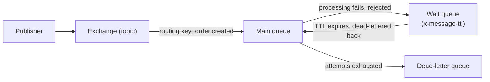

# RabbitMQ

## Problem

RabbitMQ gets picked either out of familiarity or dismissed as "the old one" next to Kafka, both
for reasons that skip past what it actually does differently: routing is a first-class, expressive
concern (exchange types, routing keys, dynamic topology) rather than a flat topic name, and broker-
tracked per-message state means retry and dead-lettering are queue configuration, not application
code. The design problem is the same one Kafka poses from the other direction — knowing which of
RabbitMQ's specific properties a workload actually needs before reaching for it by default.

## Key concepts

- **Exchange and routing key**: a publisher sends to an exchange, not directly to a queue; the
  exchange type (direct, topic, fanout) and the message's routing key determine which bound queues
  receive it — a more expressive routing model than a flat topic name, at the cost of a topology
  that has to be understood to trace where a message actually goes.
- **Competing consumers**: multiple consumers can read from the same queue, each grabbing the next
  available message (prefetch-based) — this parallelizes work but, unlike Kafka's partitions, gives
  up ordering entirely once more than one consumer is active on a queue.
- **Broker-tracked delivery state**: RabbitMQ stamps per-message state (like retry attempt count, via
  the `x-death` header) on the message itself, not in a consumer process's memory — that state
  survives a consumer restart, unlike an in-process retry counter.
- **DLX + TTL as native retry/dead-lettering**: a dead-letter exchange and a queue's message-TTL
  property compose into a retry-with-delay mechanism and a final dead-letter queue, entirely as
  broker configuration — no application code holds a thread open during the wait.

## Design



This diagram answers: *where does the retry delay actually live, if no application code is holding a
thread for it?* In the wait queue's TTL — a message rejected from the main queue is routed by DLX
configuration to a queue whose only job is to hold it for a fixed time, then dead-letter it back to
the main queue automatically once that time elapses. The broker does the waiting; the consumer only
sees the message again once it's due for another attempt. This is a genuinely different mechanism
from an application holding a consumer thread through a backoff sleep, not just a different way of
writing the same thing.

## Trade-offs

- **RabbitMQ vs Kafka, generally.** RabbitMQ's routing expressiveness and native, code-free retry/
  delay are real wins when the routing logic itself is the interesting part of the system, or when
  operational simplicity ("it's just a queue, inspectable in the Management UI") matters more than
  Kafka's replay guarantee. It gives up log retention — once a message is consumed, it's gone, with
  nothing to independently replay from — and gives up partition-scoped ordering-with-parallelism: a
  single queue is FIFO for one consumer, or parallel-but-unordered for competing consumers, never
  both at once the way a keyed Kafka partition can be.
- **Fixed-delay retry (native DLX+TTL) vs exponential backoff.** RabbitMQ's queue-property retry
  delay is fixed per hop by default — simple to configure and entirely broker-managed, but not
  exponential the way an application-level backoff naturally is. Matching Kafka's growing delay needs
  multiple wait queues with increasing TTLs chained together, which is real added topology, not a
  config flag — worth it only if a fixed delay genuinely doesn't fit the failure the retry is meant
  to ride out (e.g. a downstream outage that clears faster than a fixed short delay assumes, or
  slower than it allows for).

## Failure modes

- **Assuming ordering under competing consumers.** A queue read by more than one consumer gives up
  strict ordering the moment a second consumer is active — code that assumes messages are processed
  in publish order will intermittently reorder under real concurrent consumption, the same class of
  mistake Kafka's cross-partition ordering assumption is (see [consumer groups](consumer-groups.md)),
  just triggered by a different mechanism.
- **A DLX/TTL topology nobody diagrammed.** Because retry and dead-lettering live entirely in queue
  configuration rather than application code, the actual retry behavior of a system can become
  invisible to anyone reading the codebase — the topology (which exchange dead-letters to which wait
  queue, with what TTL) needs to be documented somewhere a reader can find it, or it's effectively
  undocumented behavior.
- **Losing messages already consumed, assuming they're replayable.** Unlike Kafka, a message gone
  from a RabbitMQ queue is gone — there's no "reset and reread from an earlier point" the way there
  is for a Kafka consumer group; recovery after a bug that mis-processed already-consumed messages
  needs a different strategy (reprocessing from a source of truth, not the broker).

## Operational considerations

RabbitMQ's dead-letter queue is directly browsable and replayable from the Management UI with no
extra tooling — a real operational advantage over a Kafka DLT, which needs a consumer or a script to
read and republish. Worth building the habit of checking the DLQ's message count as a standing
health signal, the same way Kafka consumer lag is checked, since nothing pages on a growing DLQ by
default.

## Example

A queue declared with its dead-letter exchange and TTL — the retry mechanism as pure configuration:

```java
@Bean
Queue mainQueue() {
    return QueueBuilder.durable("order.created")
        .withArgument("x-dead-letter-exchange", "order.created.retry")
        .build();
}

@Bean
Queue waitQueue() {
    return QueueBuilder.durable("order.created.wait")
        .withArgument("x-message-ttl", 5000)
        .withArgument("x-dead-letter-exchange", "") // routes back to the main queue on expiry
        .withArgument("x-dead-letter-routing-key", "order.created")
        .build();
}
```

## Interview questions

- How does RabbitMQ's DLX+TTL retry mechanism differ from an application-level backoff loop, in
  terms of where the delay and the retry-attempt state actually live?
- Why does ordering break down the moment a RabbitMQ queue has more than one active consumer?
- What can Kafka's consumer groups do that RabbitMQ's competing consumers structurally can't, and
  why?
- When would RabbitMQ's routing model (exchanges, routing keys) be the deciding factor over Kafka's
  flat topic model?

## Further experiments

`distributed-systems-playground` builds the identical order-processing scenario on both brokers:
[ADR-0006](https://github.com/Fragudev/distributed-systems-playground/blob/f893b1568b28f1ecab1babdc35292dcdfb0f49b0/docs/adr/0006-retry-dlq-strategy.md)
covers the DLX+TTL retry mechanism in detail, built and compared against Kafka's in-process backoff
on the same underlying scenario, and
[ADR-0007](https://github.com/Fragudev/distributed-systems-playground/blob/f893b1568b28f1ecab1babdc35292dcdfb0f49b0/docs/adr/0007-kafka-vs-rabbitmq.md)
has the full comparison table.
