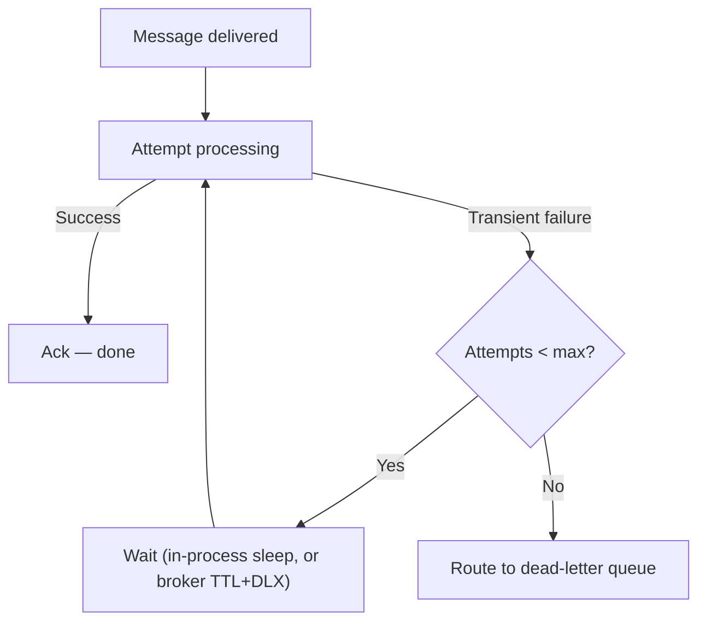

# Retries

## Problem

[Timeout and retry budgets](../resilience/timeout-and-retry-budgets.md) covers retrying a
synchronous call — bounded by an amplification risk across a call chain. A message consumer's retry
is a different shape of problem: the message already exists, durably, on a broker, so the question
isn't "should this call be attempted again" but "where does the retry delay live, where does the
attempt count live, and what happens once attempts are genuinely exhausted." Two brokers answer this
differently enough that treating "retry" as one universal mechanism, rather than a broker-specific
design decision, produces a strategy that doesn't match what the underlying infrastructure actually
does.

## Key concepts

- **In-process backoff vs broker-native delay.** A consumer can hold its own thread through a sleep
  between attempts (Kafka's typical pattern: `DefaultErrorHandler` with an `ExponentialBackOff`), or
  the broker itself can enforce the delay as queue configuration — a message routed to a wait queue
  with a TTL, dead-lettered back to the main queue once the TTL expires (RabbitMQ's native DLX+TTL
  pattern). The first ties up a consumer thread for the wait; the second doesn't involve application
  code at all during the wait.
- **Where attempt count lives.** In-process backoff typically holds the attempt counter in the
  consumer's own memory — a process crash mid-backoff loses that count, and redelivery starts the
  count over. A broker that stamps attempt state on the message itself (RabbitMQ's `x-death` header)
  keeps that count durable across a consumer restart, because it isn't held anywhere the consumer
  controls.
- **Fixed delay vs exponential delay, and what it costs to change.** An in-process backoff loop grows
  its delay each attempt for free — it's just a variable in application code. A broker-native TTL
  delay is a queue property, fixed per hop by default; matching exponential growth needs multiple
  wait queues with increasing TTLs chained together, real added topology rather than a config value.
- **Exhaustion is a decision, not an accident.** A retry strategy is only complete once it names what
  happens after the last attempt fails — silently dropping the message is rarely acceptable; routing
  it somewhere inspectable (see [Dead-letter queues](dead-letter-queues.md)) is what turns "we gave
  up" into a recoverable, visible state instead of silent data loss.

## Design



This diagram answers: *does it matter, from the message's perspective, whether the "Delay" box is an
application thread sleeping or a broker holding the message in a wait queue?* Functionally the
retry loop looks the same either way — the difference only shows up in what survives a crash and
what resources are held during the wait. An in-process delay ties up a consumer thread and loses its
attempt count on a crash; a broker-native delay holds nothing in the consumer and keeps its count
durable on the message itself. Choosing between them is choosing which of those two properties
matters more for a given workload, not a stylistic preference.

## Trade-offs

- **In-process backoff vs broker-native TTL+DLX.** In-process backoff is simpler to reason about (it's
  application code, growing the delay is a one-line change) and works identically regardless of
  broker, but holds a consumer thread through every wait and loses attempt state on a crash. Broker-
  native delay frees the consumer thread during the wait and survives a consumer restart, at the cost
  of real added queue topology to get anything beyond a fixed delay. The signal: does the broker in
  use actually support native delayed redelivery? If it does (RabbitMQ), and the workload has long
  or many retry delays, tying up consumer threads for all of them is real, avoidable cost.
- **Exponential vs fixed delay.** Exponential delay backs off harder the more a dependency struggles,
  which is usually the right shape for a transient outage — but it's nearly free in-process and
  genuinely expensive to build as broker-native queue topology. A fixed delay is simpler to configure
  natively but doesn't adapt to how long the underlying failure is actually lasting — acceptable when
  the expected failure duration is roughly known and short.

## Failure modes

- **Retrying a non-idempotent handler.** The same failure mode as any retry
  ([timeout and retry budgets](../resilience/timeout-and-retry-budgets.md)) — redelivering a message
  to a handler that isn't idempotent duplicates its side effect on every retry, not just on the rare
  broker-level duplicate delivery.
- **Assuming attempt count survives a crash when it doesn't.** A team that designs around in-process
  backoff's attempt counter, then experiences a consumer restart mid-backoff, gets more total
  attempts than intended — the count silently resets instead of continuing, because nothing durable
  was tracking it.
- **No cap at all.** A retry loop with no maximum attempt count turns a message that genuinely can't
  be processed (a malformed payload, a downstream permanently returning an error) into an infinite
  loop that never frees the consumer to make progress on anything behind it in the same partition or
  queue.

## Operational considerations

Track retry attempts per message as a distribution, not just a total count — a workload where most
messages succeed on the first attempt but a long tail needs every retry before succeeding is telling
you something different (a specific downstream flakiness) than one where retries are evenly spread
across most messages (a systemic, ongoing problem worth investigating on its own).

## Example

In-process exponential backoff holding the consumer thread through the wait — the pattern to compare
against a broker-native TTL+DLX chain when deciding which fits a given broker and workload:

```java
@Bean
DefaultErrorHandler errorHandler() {
    ExponentialBackOff backOff = new ExponentialBackOff(500L, 2.0);
    backOff.setMaxAttempts(3);
    return new DefaultErrorHandler(deadLetterRecoverer, backOff);
}
```

## Interview questions

- What's the functional difference between an in-process retry backoff and a broker-native TTL+DLX
  retry chain, beyond where the code lives?
- Why does a consumer crash mid-backoff behave differently under each mechanism?
- Why is exponential delay nearly free in-process but genuinely expensive to build as broker-native
  queue topology?
- What should happen once a message's retry attempts are genuinely exhausted, and why is that a
  design decision rather than an edge case to leave unhandled?

## Further experiments

`distributed-systems-playground`'s
[ADR-0006](https://github.com/Fragudev/distributed-systems-playground/blob/f893b1568b28f1ecab1babdc35292dcdfb0f49b0/docs/adr/0006-retry-dlq-strategy.md)
implements both mechanisms on the identical order-processing scenario — Kafka's in-process
`ExponentialBackOff` and RabbitMQ's native DLX+TTL wait-queue chain — and names the real,
not-papered-over differences: fixed-per-hop delay on the RabbitMQ side, and in-memory-vs-durable
attempt count on each.
