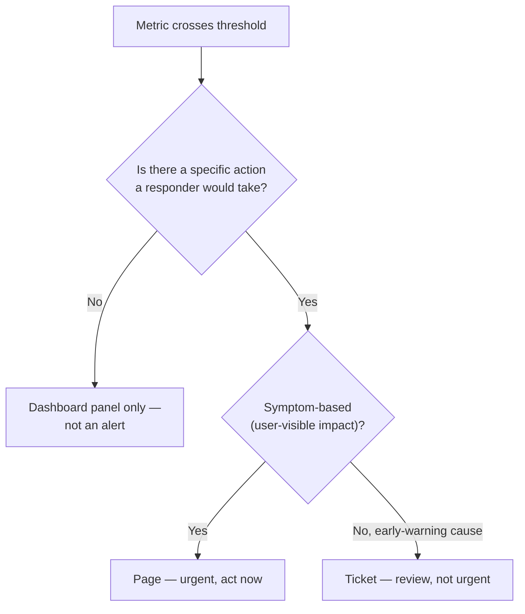

# Alerting

## Problem

[SLOs vs SLIs](slos-vs-slis.md) covers alerting on error-budget burn rate rather than a raw
threshold — that's a decision about *when* to alert. This is the decision underneath it: *which*
metrics deserve an alert at all, and what makes an alert something a responder can actually act on
versus noise that trains them to stop looking. A metric existing is not a reason to alert on it — an
alert that fires with no clear action attached teaches whoever receives it to start ignoring alerts
generally, which is a far more expensive failure than the one specific alert being wrong.

## Key concepts

- **An alert needs a consumer, the same way a metric does.** A metric worth building has a dashboard
  panel or an alert threshold already in mind (see [Metrics](metrics.md)); an alert worth building
  needs a specific action someone would actually take on receiving it. "This might be worth knowing"
  is a dashboard's job — an alert is a claim that something needs a human's attention *now*, and
  that claim needs to be true often enough that the alert stays trustworthy.
- **Symptom-based vs cause-based alerting.** A symptom-based alert fires on user-visible impact
  (elevated error rate, high latency) — it's actionable because it directly reflects something a
  responder should investigate, regardless of the underlying cause. A cause-based alert fires on an
  internal condition (CPU usage, queue depth) that *might* lead to a symptom — useful for early
  warning, but risks paging on a condition that never actually affects anything user-facing, training
  responders to distrust the alert.
- **Alert severity as a routing decision, not a label.** A paging alert (wakes someone up) and a
  ticketing alert (reviewed during business hours) are different operational commitments — treating
  every alert as page-worthy either exhausts on-call responders with things that could have waited, or
  under-signals genuine urgency by burying it among routine ones.
- **Alert fatigue is a real, measurable failure mode, not a complaint about volume.** Once responders
  learn that a meaningful fraction of alerts don't correspond to real, actionable problems, they start
  responding slower or acknowledging without investigating — the alerting system's actual reliability
  (not its configured thresholds) degrades the moment that trust is lost, and it's slow and costly to
  rebuild.

## Design



This diagram answers: *why doesn't every metric with a sensible threshold deserve to become an
alert?* Because the threshold crossing being measurable doesn't mean crossing it is actionable — a
metric can be real and worth tracking on a dashboard without ever justifying interrupting someone.
The two questions the diagram asks in sequence — is there an action, and is it urgent — are what
actually determine whether something becomes noise (a metric alerted on with no real action),
misrouted urgency (a genuine problem ticketed instead of paged, or vice versa), or a well-targeted
alert that a responder trusts enough to act on immediately when it fires.

## Trade-offs

- **Symptom-based alerting vs cause-based alerting.** Symptom-based alerts are directly tied to user
  impact, which keeps their signal-to-noise ratio high — if it fires, something real is happening.
  Cause-based alerts catch problems earlier, before they become user-visible, at the cost of a real
  false-positive rate: an internal condition crossing a threshold without ever producing real impact.
  Most mature alerting setups use both, but page only on symptom-based alerts and route cause-based
  ones to a lower-urgency channel — reserving paging for the signal that's actually reliable.
- **More alerts (finer coverage) vs fewer, broader ones.** More, finer-grained alerts catch more
  specific failure modes precisely, at the cost of more individual thresholds to tune and maintain,
  and more surface area for alert fatigue if several fire together for one underlying incident. Fewer,
  broader alerts (aggregate error rate, aggregate latency) are simpler to maintain and less prone to
  fatigue, at the cost of less precision about exactly what's wrong when one does fire — usually the
  right trade is broad symptom-based alerts as the primary signal, with finer cause-based ones feeding
  a dashboard a responder consults once paged, not each independently paging on its own.

## Failure modes

- **An alert with no corresponding action.** Fires reliably, correctly reflects a real condition, but
  nobody knows what to do about it when it fires — over time this teaches responders to acknowledge
  and move on without investigating, which is functionally identical to not having the alert, just
  with extra interruption cost.
- **Paging on cause-based signals with a high false-positive rate.** A responder paged repeatedly for
  conditions that never turn into real impact stops trusting pages generally — the next genuine,
  symptom-based page gets the same skeptical, slower response the false-positive cause-based ones
  trained into them.
- **No alert on the thing that actually caused the last incident.** The inverse failure: a real gap
  in coverage, discovered only after an incident that nothing paged on — worth treating every
  post-incident review as an explicit prompt to ask "would an alert have caught this earlier," not
  just "how do we fix the immediate cause."

## Operational considerations

Alert-to-action ratio (what fraction of firings led to a real action, versus an acknowledge-and-
ignore) is worth tracking per alert — an alert with a low ratio over time is either miscalibrated
(threshold too sensitive) or fundamentally the wrong kind of signal to page on, and both are worth
fixing before the alert erodes trust in the rest of the paging system.

## Example

Routing by both actionability and urgency, rather than treating every threshold crossing as
page-worthy:

```yaml
alerts:
  - name: high-error-rate          # symptom-based, user-visible
    condition: error_rate > 0.05
    route: page
  - name: circuit-breaker-open     # symptom-adjacent: a real, specific, actionable failure
    condition: resilience4j_circuitbreaker_state{state="open"} == 1
    route: page
  - name: queue-depth-rising       # cause-based, early warning, not yet user-visible
    condition: queue_depth > 1000
    route: ticket
```

## Interview questions

- Why isn't a metric crossing a sensible threshold sufficient justification for turning it into an
  alert?
- What's the difference between symptom-based and cause-based alerting, and why should paging
  usually favor the former?
- How does alert fatigue actually degrade a system's reliability, beyond being annoying to
  responders?
- How would you decide, after an incident with no alert firing, whether the gap is worth a new alert
  versus accepting it as a rare, one-off case?

## Further experiments

`distributed-systems-playground`'s resilience example names a concrete, real symptom-based alert
target directly:
[its README](https://github.com/Fragudev/distributed-systems-playground/blob/f893b1568b28f1ecab1babdc35292dcdfb0f49b0/examples/resilience/README.md)
calls out `resilience4j_circuitbreaker_state{name="shipping", state="open"}` as the metric to alert
on, specifically because an open circuit breaker is both directly actionable and reliably tied to
real, user-visible degradation — not a cause-based proxy that might resolve on its own. Compare
against [Metrics](metrics.md)'s "no metric without a real consumer" principle, applied here one step
further: no alert without a real action.
