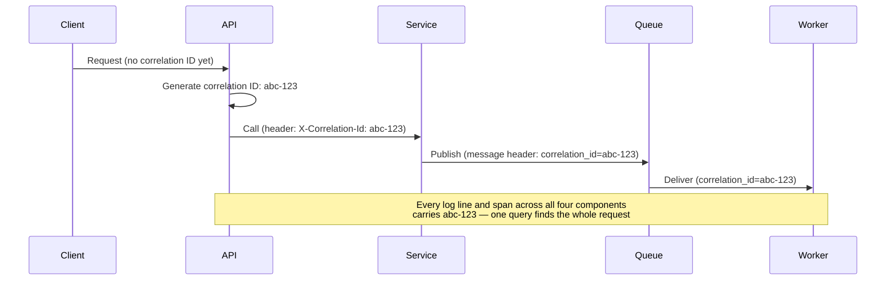

# Correlation IDs

## Problem

A single user-facing request in a distributed system often fans out into calls across several
services, queues, and databases. When something goes wrong, the logs for that one request are
scattered across every component it touched, each with its own timestamp and no shared key — without
something that ties them together, debugging a single failed request means guessing which log lines
across a dozen services belong to it, from timing alone.

## Key concepts

- **Correlation ID**: an identifier generated once, at the system's entry point, and propagated
  unchanged through every downstream call the original request causes — every log line, trace span,
  and message emitted while handling it carries the same value.
- **Trace ID vs span ID**: in distributed tracing (OpenTelemetry, Jaeger), the trace ID is the
  correlation ID for the whole request; each individual hop (a service call, a DB query) gets its own
  span ID, nested under the trace, so the full call tree — not just "these logs are related" — is
  reconstructable.
- **Propagation**: the correlation ID has to cross every boundary the request crosses — an HTTP
  header on synchronous calls, a message header on asynchronous ones — or the chain breaks at that
  hop and everything downstream of it becomes unlinkable to everything upstream.

## Design



This diagram answers: *what would break if the ID were only generated at the API layer and not
explicitly forwarded past it?* Nothing downstream of the point where propagation stops would carry
it — the Worker's logs would be just as disconnected from the original request as if no correlation
ID existed at all. The ID isn't useful because it was generated; it's useful because every hop
*deliberately* forwards it, including across the asynchronous queue boundary, which is the hop most
often forgotten because it isn't a direct call the developer is looking at when writing that code.

## Trade-offs

- **Generate at the true entry point vs at each service.** Generating once at the system's edge (API
  gateway, load balancer) and propagating it gives one ID per logical request end-to-end. Letting
  each service generate its own ID when it doesn't see one incoming is a reasonable fallback for
  requests that somehow arrive without one, but if it becomes the norm rather than the exception, it
  silently fragments the trace back into per-service islands — worth alerting on requests reaching
  internal services without a correlation ID already set, as a sign propagation is broken somewhere
  upstream.
- **Correlation ID alone vs full distributed tracing.** A correlation ID threaded through logs is
  enough to find every log line for one request — cheap to add, works with any logging setup. Full
  tracing (parent/child spans, per-hop timing) additionally reconstructs the call tree and shows
  where time was spent, at the cost of adopting a tracing SDK and, usually, a trace backend
  (Tempo, Jaeger) to query it. I'd start with correlation IDs in logs as the minimum bar for any
  service with more than one downstream dependency, and add full tracing once "which log lines
  belong together" stops being enough and "where did the latency go" becomes the actual question.

## Failure modes

- **Broken propagation across async boundaries.** The most common gap: a service correctly forwards
  the correlation ID on synchronous HTTP calls but forgets to attach it as a message header when
  publishing to a queue — everything on the consuming side of that queue becomes untraceable back to
  the original request, exactly the "Worker" case in the diagram above.
- **Regenerating instead of propagating.** A service that generates a *new* ID instead of checking
  for and reusing an incoming one silently starts a new "request" from the trace's perspective at
  that hop — logs before and after that point never join up, even though nothing crashed and no error
  was logged anywhere.
- **PII or sensitive data encoded into the correlation ID itself** (an email address, a session
  token) turns every log line and every system the ID touches into a place that sensitive data now
  lives — the ID should be an opaque, random identifier with no decodable meaning.

## Operational considerations

Once correlation IDs (or full trace IDs) are in place, they become the primary tool for a specific,
common on-call action: given one user's bug report and an approximate time, find every system this
one request touched and reconstruct exactly what happened — this is usually far faster than
searching each service's logs independently by timestamp and guessing.

## Example

Propagating a correlation ID across an HTTP call using a standard header:

```java
String correlationId = MDC.get("correlationId"); // set once at the entry point
httpRequest.header("X-Correlation-Id", correlationId);
// Downstream service reads this header and puts it back into its own MDC
// before logging anything for this request.
```

## Interview questions

- What specifically breaks if a correlation ID isn't propagated across an asynchronous queue hop?
- What's the difference in what a correlation ID and a full distributed trace each let you answer?
- Why is regenerating a correlation ID at a downstream service worse than not having one at all?
- What data should never be encoded directly into a correlation ID?

## Further experiments

`ai-engineering-lab` runs end-to-end OpenTelemetry tracing across its modules (Prometheus, Tempo,
Loki, Grafana) — a working example of correlation IDs extended into full distributed tracing across
a real request path, including through its Kafka-based ingestion pipeline.
