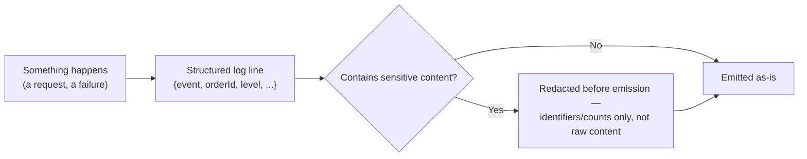

# Logs

## Problem

A log line is the easiest observability signal to add — one `log.info()` call — which is exactly
why logging tends to accumulate without much design thought: what gets logged, at what level, and in
what shape drifts toward whatever was convenient to write in the moment. Two costs compound quietly
from that drift: a log that captures sensitive content (a user's prompt, a payment detail) becomes a
standing data-exposure risk the moment anyone with log access shouldn't see that content, and a log
whose format varies line to line becomes expensive or impossible to query at the exact moment
someone needs it most, during an incident.

## Key concepts

- **Structured logging over free-text.** A log line emitted as structured fields (a JSON object with
  named keys) rather than an interpolated sentence is queryable and aggregable — "show me every log
  with `orderId=X`" is a real query against structured fields, and only a fragile string-match against
  free text.
- **Log level as an operational contract, not a suggestion.** `ERROR` should mean something requires
  attention; `WARN`, something unusual but not yet broken; `INFO`, notable state changes; `DEBUG`,
  detail only useful with debugging explicitly enabled. A codebase where `ERROR` is used for routine,
  expected conditions trains whoever watches logs to stop trusting the level, which defeats using
  level as a filter at all.
- **What never belongs in a log, by default.** Prompt content, tokens, passwords, payment details,
  and other sensitive user data shouldn't be logged verbatim by default — not because logging is
  inherently unsafe, but because a log's retention, access, and export paths are rarely reviewed with
  the same rigor as the primary datastore's, making it an easy place for sensitive data to end up
  somewhere it was never meant to be retained.
- **"No leak today" is not the same as "nothing enforces no leak."** A codebase that happens not to
  log sensitive content right now, verified by inspection, still has a real gap if nothing structural
  prevents a future change from introducing that logging — the absence of a current leak and the
  absence of a control that would catch a future one are different claims, and conflating them is how
  a real gap gets treated as already closed.

## Design



This diagram answers: *why does redaction need to happen before emission, rather than being a
policy applied to logs after they're written?* Because once sensitive content reaches a log
aggregator, it's copied into a system with its own retention, access, and export behavior — a
after-the-fact redaction policy can't undo that a raw value was already durably stored somewhere.
The check has to sit on the emission path itself, structurally preventing sensitive fields from ever
reaching the log line, not applied as cleanup after the fact.

## Trade-offs

- **Structured logging vs free-text messages.** Structured logs are queryable and aggregable at the
  cost of being less immediately human-readable in a raw terminal — a developer tailing logs directly
  reads a JSON blob instead of a sentence. Free-text is easier to read at a glance but nearly
  impossible to query reliably once volume grows past what a human can scan — the trade tips toward
  structured almost universally once a system has more than a handful of log lines to search through
  during an incident.
- **Logging generously vs logging minimally by default.** Logging generously (every request, every
  branch) gives maximum after-the-fact visibility but multiplies both storage cost and the sensitive-
  content exposure surface — every additional field logged is one more thing that has to be reviewed
  for whether it's safe to retain. Logging minimally by default, with a deliberate, reviewed decision
  for what's worth adding, costs some visibility a generous approach would have had for free, but
  keeps the sensitive-content review surface proportional to what's actually logged rather than
  growing unbounded by default.

## Failure modes

- **Logging user-supplied content verbatim, by default.** The single most common real-world data
  leak: a prompt, a form field, an error message echoing user input, logged without a redaction step —
  looks harmless in development and becomes a standing exposure the moment production logs are
  accessible to anyone beyond the smallest necessary set of people.
- **Log level inflation.** Routine, expected conditions logged at `ERROR` train responders to
  associate the level with noise rather than urgency — by the time a genuine error occurs, it's one
  more line in a stream nobody's actually watching closely because the level stopped being a
  reliable signal.
- **Inconsistent structure across log lines for the same event type.** The same logical event logged
  with different field names or shapes in different code paths breaks any query or dashboard built
  assuming a consistent schema — this tends to happen quietly as different contributors add logging
  independently, with nothing enforcing a shared shape.
- **Treating "verified no current leak" as "leak-proof."** Confirming by inspection that nothing
  currently logs sensitive content is a real, worthwhile check — but without something structural
  (a redaction layer, a lint rule) preventing a *future* change from introducing that logging, the
  gap remains real and just hasn't been exercised yet.

## Operational considerations

Log volume and cost per service is worth tracking on its own — a service whose log volume grows
disproportionately to its request volume is often logging something routine at too high a level or
too high a granularity, a cheap, mechanical signal that catches log-noise growth before it becomes
either a real cost problem or a needle-in-haystack problem during the next incident.

## Example

Redaction applied structurally, before content ever reaches the log sink:

```java
log.info("chat.message.received", kv("conversationId", conversationId), kv("messageLength", content.length()));
// Never: log.info("chat.message.received: {}", content) — content itself never reaches the logger.
```

## Interview questions

- Why does structured logging matter more as log volume grows, rather than being a stylistic
  preference?
- What's the risk of log level inflation, and how does it undermine using level as an operational
  signal?
- Why does sensitive-content redaction need to happen at the point of emission, not as a policy
  applied to logs afterward?
- Why is "we verified nothing currently logs sensitive content" a different, weaker claim than
  "nothing can"?

## Further experiments

`ai-engineering-lab`'s
[threat model](https://github.com/Fragudev/ai-engineering-lab/blob/ec822bca9df3aee3dc6857705dcddd171a669211/docs/threat-model.md)
documents T7 (sensitive data disclosure through logs) exactly this way: verified today that no
prompt or completion content is logged, named honestly as a real, unenforced gap rather than a
solved problem, with the actual planned fix (redaction by default, identifiers and counts instead of
content) named explicitly rather than assumed already built — a documented correction after an
earlier version of the same document had claimed it was live.
