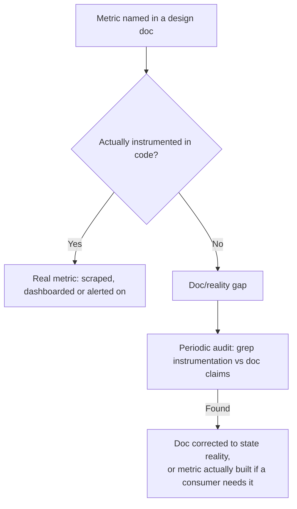

# Metrics

## Problem

A metric costs almost nothing to name in a design document and real, ongoing effort to actually
instrument, wire into a scrape target, and keep correct as the code around it changes — which means
architecture docs quietly drift toward listing metrics that were planned, sound reasonable, and were
simply never built. Nobody notices until an on-call engineer goes looking for a metric the docs
promise exists, finds nothing in the dashboard, and now has to debug the incident *and* figure out
which parts of the observability story are real. The problem isn't picking good metric names — it's
keeping the set of metrics a system claims to have in sync with the set it actually emits.

## Key concepts

- **Metric-per-consumer, not metric-per-possibility.** A metric worth building has a concrete
  consumer already lined up — a dashboard panel, an alert threshold — not just plausible future
  usefulness. Instrumenting a module "in case someone wants it later" is how a system accumulates
  metrics nobody queries and nobody notices when they silently stop reporting.
- **Naming convention as a shared contract.** A consistent shape — `<module>_<noun>_total` for
  counters, `<module>_<noun>_duration_seconds` for time histograms — costs nothing to follow and
  means anyone who has used the underlying metrics system before can read a new metric's name and
  correctly guess its type and unit without opening the code that emits it.
- **Doc/reality drift.** The specific failure where an architecture document lists a metric as if it
  exists — because it was planned in an earlier design pass — when nothing in the codebase actually
  emits it. Left uncorrected, this is worse than having no documentation at all, because it actively
  misdirects whoever trusts it during an incident.
- **Auditing against the code, not against the last doc revision.** The only reliable way to catch
  drift is grepping the actual instrumentation calls in the codebase and checking each claimed metric
  against what's really there — trusting that a document was accurate when written and has stayed
  accurate since is exactly the assumption that lets drift accumulate unnoticed.

## Design



This diagram answers: *what actually closes a doc/reality gap once it exists — better documentation
discipline, or something mechanical?* Discipline alone doesn't scale: a design doc's claims accrete
across many phases of work, and nobody reviewing a new feature is naturally prompted to re-verify
every metric a much earlier phase promised. The audit step — grepping real instrumentation and
metric names across the codebase and diffing that against the doc's claims — is what actually finds
the gap, because it doesn't depend on anyone remembering what was aspirational versus shipped.

## Trade-offs

- **Build every claimed metric to close the gap vs correct the doc to state reality.** Building out
  every previously-claimed metric closes the gap in one pass but means instrumenting modules for
  numbers nothing currently reads — real engineering effort spent on a consumer that doesn't exist
  yet. Correcting the doc to name only what's real is cheaper and more honest, and treats the
  unbuilt metrics as a legitimate, explicitly deferred backlog item rather than a silently abandoned
  promise — the right default unless a specific dashboard or alert is already waiting on one of them.
- **A rigid naming convention vs per-module freedom.** Letting each module name its metrics however
  fits its own domain avoids convention overhead, but means every new metric requires the reader to
  learn its shape from scratch. A shared, boring naming pattern costs a small amount of upfront
  agreement and pays it back every time someone reads a metric name cold and correctly infers its
  type and unit without checking the code.

## Failure modes

- **Naming a metric in a doc before it's built, and never correcting the doc if it stays unbuilt.**
  This is the exact failure mode described above — the record becomes actively misleading, not just
  incomplete, because a reader can't distinguish an aspirational claim from a real one without
  independently checking the code.
- **Instrumenting for coverage instead of for a consumer.** A metric added because a module "should
  probably have some observability" rather than because a dashboard or alert needs it adds ongoing
  maintenance cost (it has to keep working as the code around it changes) for a benefit nobody is
  currently using.
- **Treating the last doc revision as the source of truth during an audit.** An audit that compares
  the doc against an earlier doc, or against memory of what was built, instead of the actual running
  code, will confirm whatever assumptions it started with rather than catch real drift.

## Operational considerations

Run the doc/code metric audit on a cadence tied to major phases of work, not once at project start —
drift accumulates exactly because each individual phase's change looks small in isolation; it's the
sum across many phases that produces a doc nobody can trust without re-verifying it from scratch.

## Example

The naming pattern applied consistently across unrelated modules, readable without opening either:

```text
tool_invocation_total                 # counter — tool module
tool_duration_seconds                 # histogram — tool module
workflow_run_total                    # counter — workflow module
workflow_step_duration_seconds        # histogram — workflow module
```

## Interview questions

- Why does architecture documentation tend to drift toward claiming metrics that were never actually
  built, and what specifically catches that drift?
- What's the argument for correcting a doc to state reality rather than building out every metric it
  already claims?
- Why does a consistent naming convention matter more for metrics than it might for, say, internal
  variable names?
- How would you decide whether a proposed new metric is actually worth the ongoing cost of
  instrumenting and maintaining it?

## Further experiments

`ai-engineering-lab`'s
[ADR-0012](https://github.com/Fragudev/ai-engineering-lab/blob/ec822bca9df3aee3dc6857705dcddd171a669211/docs/adr/0012-observability-conventions.md)
documents exactly this: an audit found an architecture doc claiming ten Prometheus metrics when only
two existed, plus two real ones the doc never listed — corrected by stating reality plainly and
naming the eight unbuilt metrics as a real, deferred gap rather than building them speculatively.
