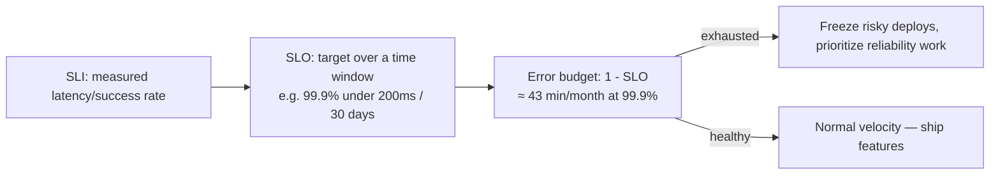

# SLOs vs SLIs

## Problem

Teams often monitor dozens of technical metrics (CPU, memory, request rate, error count) with no
declared target for any of them, so an on-call engineer has no principled way to decide whether a
given number is "fine" or "an incident" — every judgment call is ad hoc, made under pressure, and
inconsistent between engineers. SLIs and SLOs exist to make "is this bad enough to act on" a decision
made in advance, deliberately, instead of improvised at 3 a.m.

## Key concepts

- **SLI (Service Level Indicator)**: a specific, measured metric of user-experienced behavior — e.g.,
  "the proportion of requests served in under 200ms," "the proportion of requests that return a
  successful status code." An SLI is a *measurement*, not a target.
- **SLO (Service Level Objective)**: a target value for an SLI over a time window — e.g., "99.9% of
  requests succeed in under 200ms, measured over a rolling 30 days." The SLO is the line that turns
  the SLI's raw number into a pass/fail signal.
- **Error budget**: `1 - SLO` over the measurement window. A 99.9% SLO over 30 days allows roughly 43
  minutes of budget to be "spent" on failures or slow responses before the SLO is breached — framing
  reliability as a budget to spend, not an absolute zero-tolerance bar, is what makes the SLO
  actionable for trade-off decisions (ship a risky change now, or protect the remaining budget).
- **SLA (Service Level Agreement)**: a contractual commitment to a customer, usually with a financial
  penalty for missing it — typically set looser than the internal SLO, so the SLO gets breached (and
  triggers an internal response) before the SLA, which would trigger an external one, ever would.

## Design



This diagram answers: *what does an SLO actually change about day-to-day engineering decisions, as
opposed to just being a dashboard number?* It converts a reliability target into an explicit,
pre-agreed policy: when the error budget is healthy, the team ships at normal velocity, accepting
the risk that comes with it; when the budget is exhausted, that's the pre-agreed trigger to slow down
and prioritize reliability work — without an error budget, that trade-off gets negotiated freshly,
and inconsistently, every time reliability and velocity conflict.

## Trade-offs

- **How many SLIs to define.** A handful of well-chosen, user-facing SLIs (latency, availability,
  correctness for the operations users actually care about) are far more useful than dozens of
  infrastructure metrics with targets bolted on — a CPU utilization "SLO" doesn't map to anything a
  user experiences, and having too many diluted SLOs means none of them drive a real decision when
  breached. Pick SLIs that answer "would a user notice this was wrong," not "can we measure this."
- **SLO tightness vs achievable engineering cost.** A 99.99% SLO ("four nines") costs meaningfully
  more engineering effort than 99.9% ("three nines") to sustain — each additional nine typically
  requires categorically more resilience investment (multi-region failover, more aggressive circuit
  breaking), not just more effort of the same kind. The target should be set from what actually
  matters to users and the business, not rounded up to look impressive on a dashboard.

## Failure modes

- **SLOs with no consequence.** An SLO that's breached repeatedly with no actual change in behavior
  (no deploy freeze, no reprioritization) isn't an SLO — it's a number nobody acts on, and the team
  learns to ignore it, which defeats the entire purpose described in the diagram above.
- **Measuring infrastructure health instead of user experience.** An SLI defined as "the API server
  process is running" or "CPU is under 80%" can be perfectly healthy while users experience timeouts
  from an overloaded downstream dependency — the SLI has to be measured from something close to what
  the user actually experiences (request success/latency at the edge), not a proxy that can diverge
  from it.
- **Alerting directly on the SLO threshold instead of on burn rate.** Paging only when the SLO is
  already breached means the response starts after the damage is done. The practical fix is alerting
  on error-budget *burn rate* — if the budget is being consumed fast enough to exhaust it well before
  the window ends, that's the earlier, actionable signal, not the breach itself.

## Operational considerations

Error budget burn rate, not the raw SLI value, should drive paging severity — a slow, steady burn
that would exhaust the budget in three weeks is a planning conversation; a burn rate that would
exhaust a 30-day budget in the next two hours is a page, regardless of how far from the SLO threshold
the raw SLI currently sits.

## Example

Expressing an SLO with its error budget over a fixed window:

```text
SLI:    proportion of HTTP requests completing in <200ms
SLO:    99.9% over a rolling 30-day window
Budget: 0.1% of requests, ≈ 43 minutes-equivalent of full downtime per month
Policy: error budget < 10% remaining -> freeze non-essential deploys
```

## Interview questions

- What's the practical difference between an SLI and an SLO, and why does neither one alone drive a
  decision?
- Why is alerting on error-budget burn rate better than alerting only when the SLO is already
  breached?
- How would you choose which few SLIs actually matter for a given service, out of everything you
  could measure?
- What goes wrong when an SLO is defined but has no agreed consequence for being breached?

## Further experiments

Compare against [circuit breaker](../resilience/circuit-breaker.md) and
[timeout/retry budgets](../resilience/timeout-and-retry-budgets.md) — the resilience patterns are
often exactly what a team invests in once error-budget burn rate identifies where reliability effort
is actually needed, rather than guessing.
