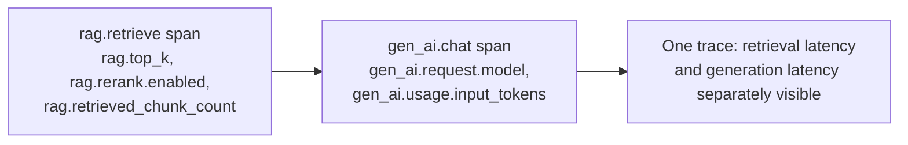

# Traces

## Problem

[Correlation IDs](correlation-ids.md) cover *that* a trace ties related work together across a
request; the harder design problem starts once you decide to actually instrument spans: what
attributes belong on them, under what names, and where does one span end and the next begin. Get
this wrong and a trace still technically "works" — the spans connect — but it stops answering the
questions it exists for: an LLM-calling system with no standard attribute names is unreadable to
anyone who didn't write it, and a single span covering two genuinely different systems' work makes
"where did the time go" impossible to answer even though the trace itself renders fine.

## Key concepts

- **Semantic conventions**: a standardized attribute vocabulary (OpenTelemetry's GenAI semantic
  conventions, for anything model-calling) that lets a trace be read by tooling and engineers who
  never saw the code that produced it — a span with `gen_ai.request.model` means the same thing in
  every system that follows the convention, unlike an ad hoc `model_name`.
- **Following a moving spec vs freezing to what shipped first.** A semantic convention still marked
  "Development" status will rename or restructure attributes over time. Tracking the spec's current
  names costs a small, occasional migration; freezing to whatever was current when a span was first
  written means every dashboard or query eventually has to account for two generations of names for
  the same concept.
- **Domain-specific namespacing**: for concepts a semantic convention doesn't cover — retrieval,
  tool execution, workflow steps — a project's own short domain prefix (`rag.*`, `tool.*`,
  `workflow.*`) keeps custom attributes namespaced and unambiguous, without needing a longer,
  defensive prefix against a low-probability future collision.
- **Attribute cardinality**: a span attribute with a small, bounded set of values (a feature flag, a
  retrieval profile name) is cheap for a trace backend to index and query; one with effectively
  unbounded values (a per-request count, a raw ID) is still useful on an individual span but shouldn't
  be treated the same way when deciding what to build dashboards or alerts around.
- **Span boundaries by concern.** Where one span ends and the next begins should track which distinct
  system did the work, not just which function call happened to wrap it — the boundary is what makes
  "which part of this request was slow" answerable from the trace alone.

## Design



This diagram answers: *why not wrap retrieval and generation in a single span, since they're both
"part of answering the query"?* Because they're latency-wise two unrelated systems: retrieval latency
is this application's own database/index performance; generation latency is a model server's response
time, usually the larger and more variable of the two. A single combined span reports one number that
conflates both — a reader can't tell whether a slow request was this application's fault or the
model server's without separate spans to compare. Keeping them distinct, each carrying only the
attributes relevant to what it actually measures, is what makes the trace answer "where did the time
go" instead of just "how long did the whole thing take."

## Trade-offs

- **Following the current semantic-convention spec vs freezing to first-shipped names.** Tracking
  the spec's current attribute names keeps every dashboard and trace query assuming "the current spec
  applies" — true and reliable. It costs a migration each time the spec changes, which for a
  "Development" status convention isn't rare. Freezing avoids that migration cost but guarantees the
  span's names silently diverge from what anyone reading the *current* spec would expect, without any
  error surfacing to say so.
- **A short domain prefix (`rag.*`) vs a defensive project-wide namespace (`ai_lab.rag.*`).** A
  longer, project-specific prefix makes every custom attribute unambiguously distinguishable from a
  future official convention that happens to reuse the same short name. A short prefix is more
  readable and matches how official conventions themselves are named (`gen_ai.*`, `db.*`, `http.*`)
  — worth the small, low-probability collision risk for the readability gained on every attribute,
  unless the project genuinely expects to embed telemetry from many unrelated sources that could
  collide.
- **One span per distinct system vs one span per logical operation.** Splitting spans by system
  (retrieval vs generation) makes latency attribution precise but means an operation that spans both
  requires reading two spans together to get the full picture. A single combined span is simpler to
  read as "one thing happened" but hides which part of it was actually slow — worth the split
  whenever the two systems' latency characteristics differ enough that conflating them would mislead
  whoever's debugging.

## Failure modes

- **Ad hoc attribute names instead of a standard convention.** A span carrying `model_name` instead
  of `gen_ai.request.model` still works for the team that wrote it, but is unreadable to any tooling
  or engineer expecting the standard names — the entire value of a semantic convention is lost the
  moment a project invents its own variant instead of adopting the real one.
- **A combined span across two systems with different latency profiles.** Reports one latency number
  for "retrieval + generation" when the two are governed by entirely different systems — a spike in
  generation latency (the model server having a bad day) becomes indistinguishable from a spike in
  retrieval latency (this application's own index degrading), even though the right response to each
  is completely different.
- **Aspirational span attributes that don't match what's actually emitted.** The same doc/reality
  drift that affects metrics (see [Metrics](metrics.md)) applies to traces too — a document claiming
  a span carries an attribute that the code never actually sets sends whoever trusts it looking for
  data that isn't there.

## Operational considerations

When a semantic convention moves, audit which of a system's spans still use the old attribute names
before assuming a migration is complete — a partial rename (only the highest-traffic path updated,
say) leaves a trace backend with two names meaning the same thing, silently splitting what should be
one queryable dimension into two.

## Example

Two spans, each carrying only the attributes relevant to what it actually measures:

```java
Observation.createNotStarted("rag.retrieve", registry)
    .lowCardinalityKeyValue("rag.rerank.enabled", String.valueOf(rerankEnabled))
    .highCardinalityKeyValue("rag.retrieved_chunk_count", String.valueOf(chunks.size()))
    .observe(() -> ragPipeline.retrieve(query));
// Generation is a separate span, carrying gen_ai.* attributes — never merged with the one above.
```

## Interview questions

- Why does it matter whether a span uses a standard semantic convention's attribute names versus a
  project's own ad hoc names?
- What specifically goes wrong when a single span covers two systems with different latency
  characteristics, like retrieval and model generation?
- Why is tracking a "Development" status semantic convention's current names usually worth the
  occasional migration cost?
- How would you decide whether a custom span attribute needs a longer, defensive namespace versus a
  short domain prefix?

## Further experiments

`ai-engineering-lab`'s
[ADR-0012](https://github.com/Fragudev/ai-engineering-lab/blob/ec822bca9df3aee3dc6857705dcddd171a669211/docs/adr/0012-observability-conventions.md)
covers exactly this: adopting the current `gen_ai.*` attribute names after finding a naming drift
from an earlier spec revision, introducing a real `rag.retrieve` span with explicit low/high
cardinality attributes, and the deliberate choice to keep it separate from the `gen_ai.chat`
generation span rather than merge the two.
