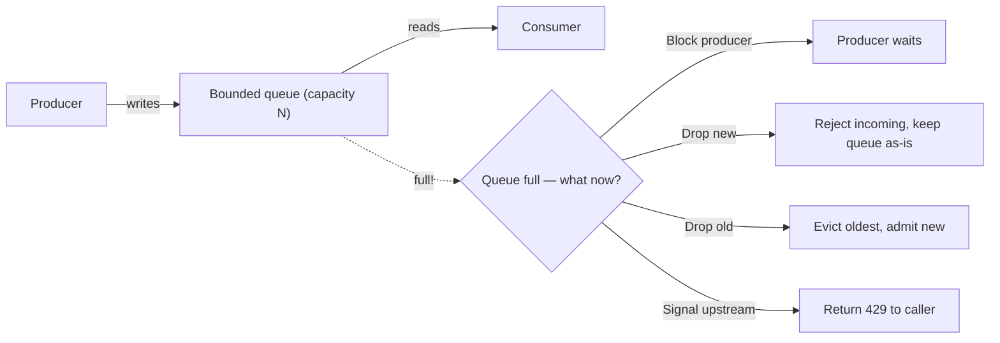

# Backpressure

## Problem

When a producer sends work faster than a consumer can process it, something has to give — the work
piles up somewhere. Without an explicit decision about where and how, it piles up in an unbounded
queue until the process runs out of memory, which turns a capacity mismatch into an outage at the
worst possible moment (under peak load, exactly when the system most needs to stay up).

## Key concepts

- **Bounded queue**: a queue with a fixed maximum size between producer and consumer. The bound is
  what forces the capacity mismatch to become visible and be handled, instead of silently absorbed
  until memory runs out.
- **Backpressure signal**: feedback from the consumer (or the queue) to the producer that it needs
  to slow down — a rejected write, a blocked call, or an explicit "request N more" protocol (as in
  Reactive Streams).
- **Load shedding**: deliberately dropping some units of work under overload, chosen by policy
  (drop newest, drop oldest, drop by priority) rather than by whatever the OS's memory allocator
  fails on first.
- **TCP backpressure**: a receiver's shrinking TCP window is itself a backpressure signal — the
  sender is told to slow down at the transport layer before either side does anything explicit.

## Design



This diagram answers: *what actually happens at the moment capacity is exceeded, and who decides?*
There is no default-safe answer here — each of the four branches has a different failure profile,
and picking one is the entire design decision. "Just add a bigger queue" isn't in the diagram on
purpose: it doesn't answer the question, it only delays the moment the question has to be answered,
usually until a bigger, more memory-pressured version of the same overload.

## Trade-offs

- **Block the producer.** Correct in the sense that no data is lost or dropped, but it couples the
  producer's throughput to the consumer's — under sustained overload, blocking the producer
  propagates the slowdown upstream, one hop at a time, until *something* upstream either has its own
  bound (good) or blocks indefinitely too (a cascading stall). Appropriate when upstream can
  legitimately absorb backpressure (an internal pipeline stage) and data loss is unacceptable.
- **Drop (newest or oldest).** Keeps the system responsive under overload at the cost of data loss —
  the right call when losing some units of work is cheaper than blocking (metrics, non-critical
  events) and wrong whenever every unit matters (an order, a payment event).
- **Reject with an explicit signal (e.g., HTTP 429).** Pushes the decision to the caller, who is
  often in a better position to decide whether to retry, back off, or surface an error to a human —
  the right default at a system's public boundary, where the caller isn't necessarily a component
  this system controls or wants to couple its capacity to.

## Failure modes

- **Unbounded queue as the "fix."** Removes the immediate symptom (rejected writes, blocked
  producers) without addressing the actual capacity mismatch — the queue just grows until the
  process runs out of memory, at which point the failure is worse (an OOM crash, losing everything
  in the queue) than any of the four bounded-queue outcomes would have been.
- **Backpressure that doesn't propagate.** A service correctly rejects requests when its own queue
  is full, but its caller retries immediately with no backoff — the rejection didn't actually reduce
  load, it just added a wasted round trip before the same overload hits again. Backpressure only
  works if the signal changes the sender's behavior (see
  [timeout and retry budgets](timeout-and-retry-budgets.md)), not just informs it.

## Operational considerations

**Queue depth** is the leading indicator to monitor — by the time consumer latency or error rate
moves, the queue has often already been growing for a while. Alerting on queue depth trending toward
its bound catches an overload before it becomes a user-visible failure.

## Example

A bounded queue with an explicit rejection policy instead of unbounded growth:

```java
BlockingQueue<Task> queue = new ArrayBlockingQueue<>(1000);
ThreadPoolExecutor executor = new ThreadPoolExecutor(
    4, 4, 0L, TimeUnit.MILLISECONDS, queue,
    new ThreadPoolExecutor.AbortPolicy() // reject new tasks when queue is full
);
```

## Interview questions

- Why is "just make the queue bigger" not a fix for a producer/consumer capacity mismatch?
- What determines whether blocking the producer or dropping work is the right response to overload?
- How does backpressure at one layer fail to help if it doesn't propagate to the caller?
- What's the difference between load shedding and a circuit breaker tripping — when would you use
  each?

## Further experiments

Compare with [circuit breaker](circuit-breaker.md): backpressure manages a producer/consumer rate
mismatch on a healthy system under high load; a circuit breaker manages calls to a dependency that
has actually started failing. They often appear together but solve different problems.
